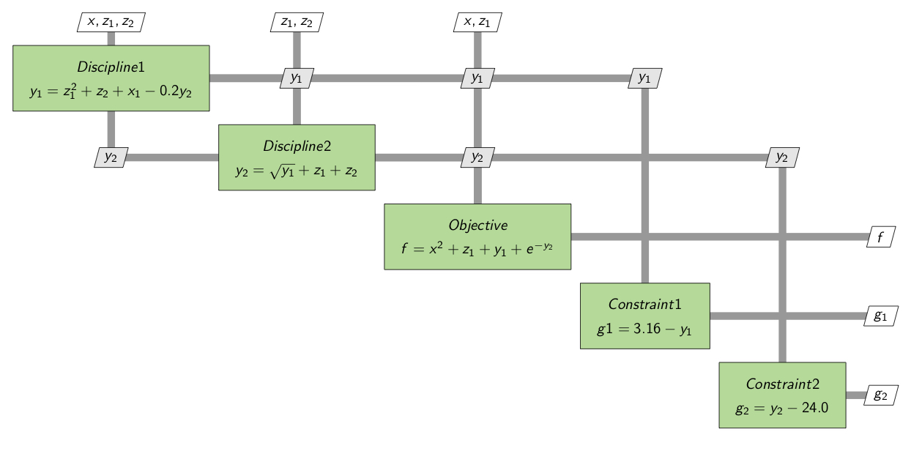
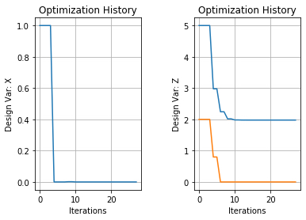

.. _advanced_case_recording:

***************************
Advanced Recording Example
***************************

Below we demonstrate a more advanced example of case recording including the four different objects
that a recorder can be attached to. We will then show how to extract various data from the model and finally,
relate that back to an XDSM for illustrative purposes.

.. embed-code::
    openmdao.recorders.tests.test_sqlite_recorder.TestFeatureAdvancedExample.setUpClass
    :layout: interleave

The following XDSM diagram shows the SellarMDA component equations and their inputs and outputs. Through
the different recorders we can access the different parts of the model. We'll take you through an
example of each object and relate it back to the diagram.

System
-------
First, we'll examine the `system` recorder. Suppose we want to know what the value of `y1` is going
into the objective function (obj_func). Using the `list_cases` method, we'll get the list of cases
that were recorded by the objective component `root.obj_comp`. You could also access the discipline equations
by swapping out the subsystem `root.obj_comp` for `root.con_cmp1`. Next we use `get_case` to
determine the input keys of the first case's dictionary. Here we find that `x, y1, y2, z` are returned.
Since we originally sought find the value of `y1` going into the objective function, we'll loop
through the 14 cases to find what the value is in each case.

.. embed-code::
    openmdao.recorders.tests.test_sqlite_recorder.TestFeatureAdvancedExample.test_feature_system_recorder
    :layout: interleave

Solver
------

Similar to the `system` recorder, we can query the cases recorded by the `solver`. You can also
access the values of inputs to the equation with the solver but in this case we'll focus on `y1`
and `y2` values from the discipline functions going into the objective function the `system` recorder.

We'll pass `'root.cycle'` to the method list_cases, find how many cases there are and
arbitrarily pick number 3.

.. embed-code::
    openmdao.recorders.tests.test_sqlite_recorder.TestFeatureAdvancedExample.test_feature_solver_recorder
    :layout: interleave

Driver
------
If we want to view the convergence of the model, the best place to find that by looking at the cases recorded by the `driver`. By
default, a recorder attached to a driver will record the design variables, constraints and
objectives, so we will print them for the model at the end of the optimization. We'll use the helper
methods like `get_objectives`, `get_design_vars`, `get_constraints` to return the info we're seeking.

.. embed-code::
    openmdao.recorders.tests.test_sqlite_recorder.TestFeatureAdvancedExample.test_feature_driver_recorder
    :layout: interleave

Problem
--------

A `Problem` recorder is best if you want to record an arbitrary case before or after a running the
model. In our case, we have placed our point at the end of the model.

.. embed-code::
    openmdao.recorders.tests.test_sqlite_recorder.TestFeatureAdvancedExample.test_feature_problem_recorder
    :layout: interleave

Plotting Design Variables
-------------------------

When inspecting or debugging a model, it can be helpful to visualize the path of the design
variables to their final values. To do this, we can list the cases of the driver and plot the data
with respect to the iteration number.

.. embed-code::
    openmdao.recorders.tests.test_sqlite_recorder.TestFeatureAdvancedExample.test_feature_plot_des_vars
    :layout: interleave

