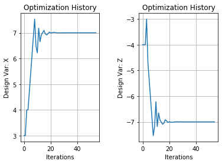

.. _basic_case_recording:

************************
Basic Recording Example
************************

Recording Terminology
---------------------

| **Case**: A Case stores a snapshopt of all the variable values, metadata, and options of a model, or a sub-set of a model, at a particular point in time
| **Case Recorder**: An OpenMDAO module used to store the state of a `Problem` before, during, or after execution in an SQL file.
| **Sources**: The OpenMDAO objects responsible for recording the case. `Problem`, `Driver`, and `System`.

Basic Recording Example
------------------------

Below is an basic example of how to create a recorder, attach it to a Problem, save the information,
and retrieve the data from the recorder. `list_outputs` is a quick way to show all of your outputs
and their values at the time the case was recorded, and should you need to isolate a single value OpenMDAO provides two ways to
retrieve them. To view all the design variables, constraints, and
objectives, you can use their methods like the example below.

.. embed-code::
    openmdao.recorders.tests.test_sqlite_recorder.TestFeatureSqliteRecorder.test_feature_basic_case_recording
    :layout: interleave

Generating a Plot with Case Recording Data From Driver Source
--------------------------------------------------------------

The `Driver` records information about the optimization of design variables, constraint variables,
and objectives. It can be useful to see your design variables' paths to convergence. Below we show how to extract the
data from the recorder data and create a basic plot.

.. embed-code::
    openmdao.recorders.tests.test_sqlite_recorder.TestFeatureSqliteRecorder.test_feature_basic_case_plot
    :layout: interleave

