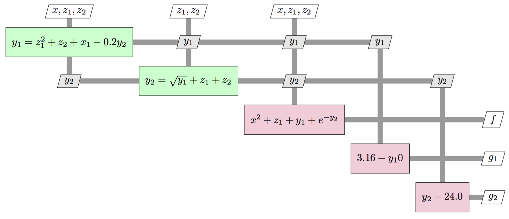
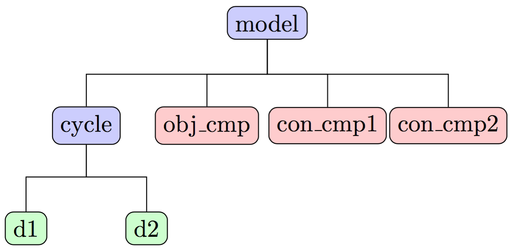

.. _sellar:

In previous tutorials, you built and optimized models comprised of only a single component.
Now, we'll work through a slightly more complex problem that involves two disciplines and hence two main components.
You'll learn how to group components together into a larger model and how to use
different kinds of nonlinear solvers to converge multidisciplinary models with coupling between components.

****************************************
Sellar - A Simple Two-Discipline Problem
****************************************

The Sellar problem is a simple two discipline toy problem with each discipline described by a single
equation. The output of each component feeds into the input of the other, which creates a coupled model that needs to
be converged in order for the outputs to be valid.
You can see the coupling between the two disciplines show up through the :math:`y_1` and :math:`y_2` variables in the XDSM diagram describing the problem structure below:

----

Building the Disciplinary Components
****************************************

In the component definitions, there is a call to :ref:`declare_partials <feature_delare_partials_approx>` in the setup method that looks like this:

.. code::

    self.declare_partials('*', '*', method='fd')

This tells OpenMDAO to approximate all the partial derivatives of that component using finite-difference.
The default settings will use forward difference with an absolute step size of 1e-6, but you can change the :ref:`FD settings <feature_delare_partials_approx>` to work well for your component.

.. embed-code::
    openmdao.test_suite.components.sellar_feature.SellarDis1

.. embed-code::
    openmdao.test_suite.components.sellar_feature.SellarDis2

Grouping and Connecting Components
**************************************************

We want to build the model represented by the XDSM diagram above.
We've defined the two disciplinary components, but there are still the three outputs of the model that need to be computed.
Additionally, since we have the computations split up into multiple components, we need to group them all together and tell
OpenMDAO how to pass data between them.

.. embed-code::
    openmdao.test_suite.components.sellar_feature.SellarMDA

We're working with a new type of class: :ref:`Group <feature_grouping_components>`.
This is the container that lets you build up complex model hierarchies.
Groups can contain other groups, components, or combinations of groups and components.

You can directly create instances of :code:`Group` to work with, or you can sub-class from it to define your own custom
groups. We're doing both things here. First, we define our own custom :code:`Group` sub-class called :code:`SellarMDA`.
In our run-script well create an instance of :code:`SellarMDA` to actually run it.
Then inside the :code:`setup` method of :code:`SellarMDA` we're also working directly with a group instance by doing this:

.. code::

    cycle = self.add_subsystem('cycle', Group(), promotes=['*'])
    d1 = cycle.add_subsystem('d1', SellarDis1(), promotes_inputs=['x', 'z', 'y2'], promotes_outputs=['y1'])
    d2 = cycle.add_subsystem('d2', SellarDis2(), promotes_inputs=['z', 'y1'], promotes_outputs=['y2'])

    # Nonlinear Block Gauss Seidel is a gradient-free solver
    cycle.nonlinear_solver = NonlinearBlockGS()

Our :code:`SellarMDA` Group, when instantiated, will have a three level hierarchy with itself as the top most level.

Why do we create the *cycle* sub-group?
-------------------------------------------
There is a circular data dependence between *d1* and *d2* that needs to be converged with a nonlinear solver in order to get a valid answer.
Its a bit more efficient to put these two components into their own sub-group, so that we can iteratively converge them by themselves,
before moving on to the rest of the calculations in the model.
Models with cycles in them are often referred to as Multidisciplinary Analyses or **MDA** for short.
You can pick which kind of solver you would like to use to converge the MDA. The most common choices are:

    #. :ref:`NonlinearBlockGaussSeidel <nlbgs>`
    #. :ref:`NewtonSolver <nlnewton>`

The :code:`NonlinearBlockGaussSeidel` solver, also sometimes called a "fixed-point iteration solver", is a gradient-free method
that works well in many situations.
More tightly coupled problems, or problems with instances of :ref:`ImplicitComponent <comp-type-3-implicitcomp>` that don't implement their own :code:'solve_nonlinear' method, will require the :code:`Newton` solver.

.. note::
    OpenMDAO comes with other nonlinear solvers you can use if they suit your problem.
    See the full list :ref:`here <feature_nonlinear_solvers>`

The sub-group, named :code:`cycle`, is useful here, because it contains the multidisciplinary coupling of the Sellar problem.
This allows us to assign the non-linear solver to :code:`cycle` to just converge those two components, before moving on to the final
calculations for the :code:`obj_cmp`, :code:`con_cmp1`, and :code:`con_cmp2` to compute the actual outputs of the problem.

Promoting variables with the same name connects them
-----------------------------------------------------

The data connections in this model are made via promotion.
OpenMDAO will look at each level of the hierarchy and find all the connect all output-input pairs with the same name.

ExecComp is a helper component for quickly defining components for simple equations
-------------------------------------------------------------------------------------

A lot of times in your models, you need to define a new variable as a simple function of other variables.
OpenMDAO provides a helper component to make this easier, called :code:`ExecComp`.
Its fairly flexible, allowing you to work with scalars or arrays, work with units, and call basic math funcsion (e.g. *sin* or *exp*).

.. note::
    For detailed docs on how to use :code:`ExecComp`, check out the :ref:`ExecComp feature doc <feature_exec_comp>`.
