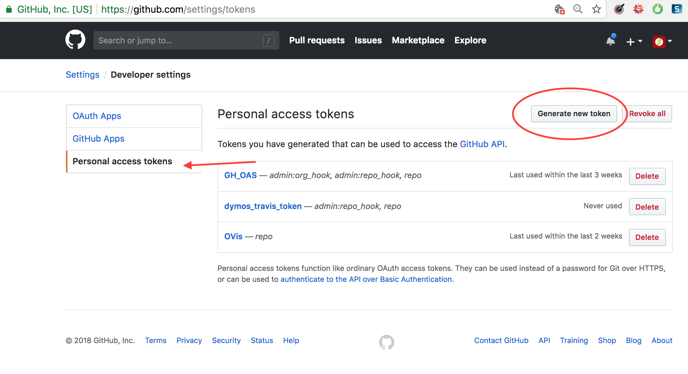
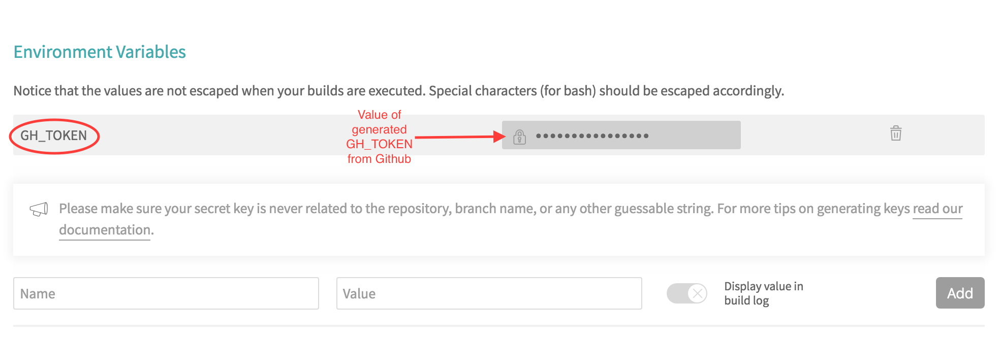
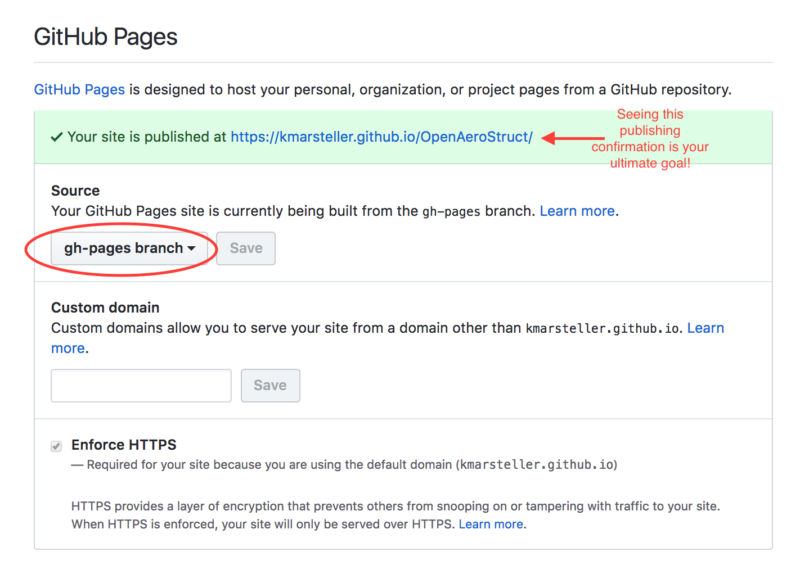

.. _`github_pages`:

github-pages Repository Setup
=============================

If you want to publish to github-pages, from your docs built on Travis CI, make sure your Github repository is set up to be public,
otherwise some of the instructions in this document may not work for you.

Personal Access Token
---------------------

A Personal Access Token is something created on Github, to allow another service (e.g. Travis) to access Github,
with a certain amount of permission.  Once you create a Personal Access Token, it will be visible for
one viewing, and you must copy it then use it immediately before you lose it (and then you have to make another one).

To create a Personal Access Token:
Log in to githb.com.  Go to Github *account* Settings (**not** Repo Settings)->Dev Settings->Personal Access Token
The menu will look like this:

Give the access token the name GH_TOKEN, and the permission "repo access," as pictured:

.. image::
    images/AccessToken2.png

You'll need this token to allow the transfer of your documents to github-pages, once they are built on Travis CI.

Then on Travis CI, you'll need to go to your Environment Variables section, and create a new env var, as shown here:

github-pages
------------

In order to have your documents build on Travis CI and then deploy to github-pages, you'll need to
make a branch called `gh-pages` in your Github repo. Then you will need to go into your Github Pages settings,
(which is located in your `organization/projectname` repository settings)
and set the repo to look at that branch, as illustrated here:

travis-sphinx Usage
-------------------

`travis-sphinx` is a standalone script for automated building and deploying of sphinx docs to github-pages
via TravisCI.

Once your personal access token is set up, you can begin using travis-sphinx within your Sphinx configuration file. (`docs/conf.py`)
The two calls that should be used are, in their respective doc sections:

.. code-block:: python

    script:
        - travis-sphinx build

    after_success:
        - travis-sphinx deploy

`build` will generate the actual documentation files, while `deploy` will move those files to gh-pages.

For further details of how Travis-Sphinx can be configured, see `this guide <https://github.com/Syntaf/travis-sphinx>`_
