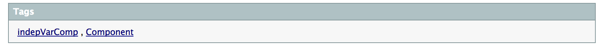

*************************
OpenMDAO Docs Style Guide
*************************

This document outlines OpenMDAO-v2 documentation conventions regarding
both content and formatting.

General Docstring Conventions
-----------------------------

General docstring rules:

- All docstrings should begin and end with triple double quotes (""").
- Modules, classes, methods, and functions must have docstrings
  whether the object is public or private.

Two types of docstrings:

1. One-line docstrings:

   ::

     """Do something."""

   - Phrase or sentence ended by a period.
   - No empty space between the text and the triple double quotes.

2. Multi-line docstrings:

   ::

     """Summary line.

     Paragraph 1.
     """

   - Summary line ended by a period.
   - No empty space between the summary line and
     the opening triple double quotes.
   - Paragraphs separated by blank lines.
   - Can contain a list of attributes/args/returns, explained below.
   - No empty line at the end, before closing triple double quotes.

Detailed docstring rules:

1. Modules:

   - Either one-line or multi-line.
   - No blank line after the docstring.
   - List the classes and functions inside (this can be automated).

2. Classes:

   - Either one-line or multi-line.
   - List the attributes, if any (then must be multi-line).
   - Blank line after the docstring.

   ::

     """Summary line.

     Paragraph 1.

     Attributes
     ----------
     attribute_name : Type
         description ending with a period.
     """

3. Methods or functions:

   - Either one-line or multi-line.
   - List the arguments (except for self) and the returned variables, if any.
   - The summary line/one-line docstring should be an imperative sentence,
     not a descriptive phrase:

     - Incorrect: ``"""Does something."""``

     - Correct: ``"""Do something."""``

   - No blank line after the docstring.

   ::

     """Do something.

     Paragraph 1.

     Parameters
     ----------
     argument_name : Type
         description ending with a period.

     Returns
     -------
     Type
         description ending with a period.
     """

   - Sphinx does not correctly handle decorated methods. To ensure a method's
     call signature appears correctly in the docs, put the call signature of the method
     into the first line of the docstring. (See :ref:`Sphinx and Decorated Methods <sphinx_decorators>` for more information.) For example:

   ::

     """
     method_name(self, arg1, arg2)
     Do something.

     Paragraph 1.

     Parameters
     ----------
     argument_name : Type
         description ending with a period.

     Returns
     -------
     Type
         description ending with a period.
     """

4. Auto-hyper-linking a class or a method to its source docs:

  ::

    """Summary line.

    To auto-link to the source docs of a <Class>, simply put its name in angle brackets,
    and the link to that page will be generated in the resulting docs.
    To auto-link to a method's docs, use <Class.method_name>.
    """

Embedding Autodocumentation Snippets into Documentation
-------------------------------------------------------

Sometimes in a feature doc, you want to reproduce a particular method or class or module
right there within the text.  The syntax to do this is provided by the `sphinx.ext.autodoc`
module, in three commands, `automodule`, `autoclass`, and `automethod`.  The syntax of these
is detailed in the following example code:

::

    **AUTOMODULE EXAMPLE:**

      .. automodule:: openmdao.core.group
        :noindex:

    **AUTOCLASS EXAMPLE:**

      .. autoclass:: openmdao.core.group.Group
        :noindex:

    **AUTOMETHOD EXAMPLE:**

      .. automethod:: openmdao.core.group.Group.add
        :noindex:

The `:noindex:` argument is needed to prevent unwanted replication interactions with the OpenMDAO
source documentation.  The above syntax will pull docstring info and produce the following output:

**AUTOMODULE EXAMPLE:**

  .. automodule:: openmdao.core.group
    :noindex:

**AUTOCLASS EXAMPLE:**

  .. autoclass:: openmdao.core.group.Group
    :noindex:

**AUTOMETHOD EXAMPLE:**
  .. automethod:: openmdao.core.group.Group.add
    :noindex:

Adding a Link to an Autodoc Class in a `.rst` File
--------------------------------------------------

Sometimes in a document, you don't want or need to embed/display the entire
autodoc of a class to make your point. At these times, you want to just provide
the user with an easy way to link to the autodoc for quick reference.

We'll do this with a `:ref:` tag.  The basic syntax looks like this:

  .. code-block:: rst

    :ref:`LinkText <openmdao.path.to.file.py>`

note the path to the file in which the class lives. Here's a specific, working example:

  .. code-block:: rst

    :ref:`Direct <openmdao.solvers.linear.direct.py>`

which makes a link like this, that leads to the Direct solver's user docs:

    :ref:`Direct <openmdao.solvers.linear.direct.py>`

.. _`custom_directives`:

Custom Directives for Embedding Items into OpenMDAO Documentation
-----------------------------------------------------------------

embed-code
++++++++++

        `embed-code` is a custom directive that takes one argument, which can be:
            * A class, test, or method's full, dotted path (e.g. "openmdao.core.tests.test_expl_comp.RectangleComp").
            * The path to a file (e.g. "experimental_guide/examples/bezier_plot.py").

        The syntax for invoking the directive within an .rst file looks like this:

        .. code-block:: rst

            .. embed-code::
                openmdao.core.tests.test_expl_comp.RectangleComp

        What the above directive will do is replace the directive and its arg with the class
        definition for `openmdao.core.tests.test_expl_comp.RectangleComp`.
        The resulting output will look like this:

        .. embed-code::
            openmdao.core.tests.test_expl_comp.RectangleComp

        Embedding in this fashion has the benefit of allowing you to drop entire code blocks into
        a feature doc that may, for example, illustrate a usage example. Another great benefit of this
        method is that now your embedded example changes along with the code, so the docs maintain themselves.

        By default, docstrings will be kept in the embedded code. There is an option
        to the directive to strip the docstrings:

        .. code-block:: rst

          .. embed-code::
              openmdao.core.tests.test_expl_comp.RectangleComp
              :strip-docstrings:

        The resulting output without the docstring looks like this:

        .. embed-code::
            openmdao.core.tests.test_expl_comp.RectangleComp
            :strip-docstrings:

Embedding More Than Just Code
*****************************

    Sometimes developers will want to embed code, code output, or even plots into a document.  `embed-code` provides
    a :code:`layout` option for an author, which has several options to provide maximum flexibility in formatting.

    The options that can be given to :code:`layout` are **code**, **output**, **interleave**, and **plot**, as described here:

    - **code**: A section of code, which will be just the code specified by the argument. This is the default layout if no layout is given.

    - **output**: The output of the script (or code, or test, etc.) given by the argument, all in one unified section by itself.

    - **interleave**: The section of code specified by the argument, interleaved with its output, displayed together as one combined block.

    - **plot**: A plot generated by running the code specified by the argument. (a matplotlib :code:`show()` command must be present).

    These options should be specified in the left-to-right order in which each embedded element is desired to appear from top to bottom. (e.g. :layout: code, output)

    Let's run through some examples of how the :code:`layout` option could be used:

1. Embed just a piece of code, just to show it, without running it for output or plots.
   In your .rst file, you'd insert this:

   .. code-block:: rst

       .. embed-code::
           ../devtools/docs_experiment/experimental_guide/examples/bezier_plot.py

   Note, that as mentioned above, the default value of :code:`layout` is just "code," so the
   layout is not specified here. The resulting embed looks like this:

   .. embed-code::
       ../devtools/docs_experiment/experimental_guide/examples/bezier_plot.py

2. Embed a piece of code, run it, show a single block of output afterwards.
   In your .rst file, you'd insert this:

   .. code-block:: rst

       .. embed-code::
           ../devtools/docs_experiment/experimental_guide/examples/bezier_plot.py
           :layout: code, output

   The resulting embed would look like this:

   .. embed-code::
       ../devtools/docs_experiment/experimental_guide/examples/bezier_plot.py
       :layout: code, output

3. Embed a piece of code, run it, show a single block of output afterwards, then show a plot after that.
   (Remember, that :code:`show()` function needs to be in there for this to work.)

   .. code-block:: rst

       .. embed-code::
           ../devtools/docs_experiment/experimental_guide/examples/bezier_plot.py
           :layout: code, output, plot

   The resulting embed would look like this:

   .. embed-code::
       ../devtools/docs_experiment/experimental_guide/examples/bezier_plot.py
       :layout: code, output, plot

4. Embed a piece of code, run it, plot it. Show the plot first, then show the code with interleaved output, after that.
   (Remember, that :code:`show()` function needs to be in the embedded code for a plot embed to work.)

   .. code-block:: rst

       .. embed-code::
           ../devtools/docs_experiment/experimental_guide/examples/sin_plot.py
           :layout: plot, interleave

   This should embed the plot, and then the code with its output nicely interleaved.

   .. embed-code::
       ../devtools/docs_experiment/experimental_guide/examples/sin_plot.py
       :layout: plot, interleave

5.  The way our plot embedding works, if you're embedding a layout that includes a plot, you can also give your
    `embed-code` directive any of the options that work with a Sphinx `image` or `figure` directive, since we inherit from those.
    Some of those options available are:

    **:width:** (in pixels),

    **:height:** (in pixels),

    **:scale:** (in percentage),

    **:align:** (left, right, center),

    And with a blank line after the options, you can put a line of text that will act as a caption.

    Let's do an example of the previous plot, with a few other options set:

    .. code-block:: rst

        .. embed-code::
            ../devtools/docs_experiment/experimental_guide/examples/bezier_plot.py
            :layout: plot
            :scale: 50
            :align: center

            This is where you would put a caption, after a blank line.

    This should embed the plot, scale it down by half, and align it center, with a caption.

    .. embed-code::
        ../devtools/docs_experiment/experimental_guide/examples/bezier_plot.py
        :layout: plot
        :scale: 50
        :align: center

        This is where you would put a caption, after a blank line.

6.  Use this directive to embed a test. Just use a dotted python path, as shown here:

    .. code-block:: rst

        .. embed-code::
            openmdao.core.tests.test_problem.TestProblem.test_feature_simple_run_once_input_input
            :layout: interleave

    This should embed the test with its output nicely interleaved.

    .. embed-code::
        openmdao.core.tests.test_problem.TestProblem.test_feature_simple_run_once_input_input
        :layout: interleave

There are many permutations of these four layout values that can help you customize the look of your code embedding to fit
your specific purposes.  While doing :code:`:layout: output` might not really make any sense to do, you have the power
to make nonsensical layouts, so use that power wisely.

embed-options
+++++++++++++

        `embed-options` is a custom directive that lets a developer display a set of options
        directly into a feature doc by including the module, classname, and the options dictionary name.
        The syntax for invoking the directive looks like this:

        .. code-block:: rst

            .. embed-options::
                openmdao.solvers.linear.linear_block_jac
                LinearBlockJac
                options

        The output from the above syntax should result in a neatly-formatted table of options like this:

        .. embed-options::
            openmdao.solvers.linear.linear_block_jac
            LinearBlockJac
            options

embed-shell-cmd
+++++++++++++++

    `embed-shell-cmd` is a custom directive that lets a developer insert a shell command and
    its corresponding console output into a doc.  The developer must supply the shell command
    and optionally the directory where the command will run.  Also, setting the `show_cmd`
    option to `false` will hide the shell command and show only the output resulting from it.

    .. code-block:: rst

        .. embed-shell-cmd::
            :cmd: openmdao tree circuit.py
            :dir: ../test_suite/scripts

    The output from the above syntax should look like this:

    .. embed-shell-cmd::
        :cmd: openmdao tree circuit.py
        :dir: ../test_suite/scripts

embed-bibtex
++++++++++++

    `embed-bibtex` is a custom directive that lets a developer insert a citation for a
    particular class into a doc.  The arguments are the module path and the name of the
    class (or the name of a function that returns an instance of the desired class when
    called with no arguments).

    .. code-block:: rst

        .. embed-bibtex::
            openmdao.drivers.scipy_optimizer
            ScipyOptimizeDriver

    The output from the above syntax should look like this:

    .. embed-bibtex::
        openmdao.drivers.scipy_optimizer
        ScipyOptimizeDriver

Tagging
-------

OpenMDAO docs support blog-like tagging.  What this means is that you can
associate words or terms with a document, with the aim of grouping like documents.
When a user clicks on a tag hyperlink, it takes her to a page that contains links to other documents that have been tagged
similarly. This makes it easier for users to find supplementary materials on a topic.

If you are writing a document, and you have a set of tags that you want to apply to a document, the syntax is easy.
One time, at the bottom of a document, you just need to invoke the `tags` directive, and then list any categories in which you'd
like the current document to be included.

::

  .. tags:: indepVarComp, Component

That syntax should generate a Tags box at the bottom of the document that contains
hyperlinks to each tag's index page:

Each tag hyperlink targets an index page that is a list of documents that all contain the same tag, e.g. `Component`.
