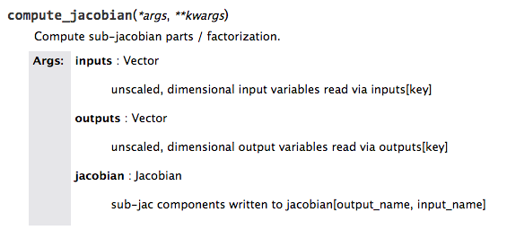

.. _`sphinx_decorators`:

****************************
Sphinx and Decorated Methods
****************************

Sphinx does not correctly handle decorated methods. To ensure a method's
call signature appears correctly in the docs, put the call signature of the method
into the first line of the docstring.

For example, if you have decorator that looks like this:

   ::

    from functools import wraps

    def mydecorator(f):
        @wraps(f)
        def wrapped(*args, **kwargs):
            print "Before decorated function"
            r = f(*args, **kwargs)
            print "After decorated function"
            return r
        return wrapped

and a method that looks like this and has the decorator applied to it:

   ::

    @mydecorator
    def compute_partials(self, inputs, partials):
        """
        Compute sub-jacobian parts / factorization.

        Parameters
        ----------
        inputs : Vector
            unscaled, dimensional input variables read via inputs[key]
        partials : Jacobian
            sub-jac components written to partials[output_name, input_name]
        """

        pass

The docs will look like this:

        the problem in the docstring.

But if we add the call signature of the method to the docstring as the first line like this:

   ::

    @mydecorator
    def compute_partials(self, inputs, partials):
        """
        Compute sub-jacobian parts / factorization.

        Parameters
        ----------
        inputs : Vector
            unscaled, dimensional input variables read via inputs[key]
        partials : Jacobian
            sub-jac components written to partials[output_name, input_name]
        """

        pass

The documentation that results shows the correct call signature:

.. figure:: images/decorated_method_correct_docs.png
   :alt: The Sphinx generated documentation for a method that is decorated and has the correct c
         all string in the docstring.
