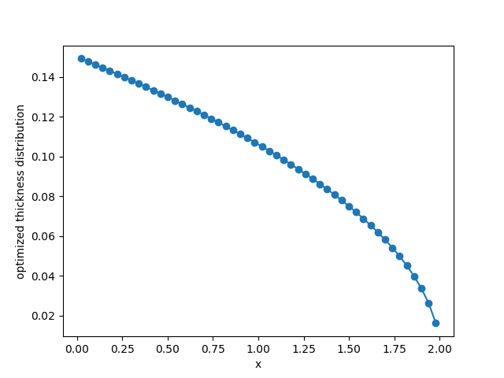

.. _`beam_optimization_example`:

Optimizing the Thickness Distribution of a Cantilever Beam Using the Adjoint Method
===================================================================================

In this example, we optimize the thickness (height) distribution of a cantilever beam
using the adjoint method to compute the gradient.
We use Euler--Bernoulli beam theory and assume a rectangular section.

Background
----------

The optimization problem is:

.. math ::

  \begin{array}{r c l}
    \text{minimize} & & f^T d \\
    \text{with respect to} & & h \\
    \text{subject to} & & \text{sum}(h) b L_0 = \text{volume} \\
  \end{array}

where :math:`f` is the vector of forces, :math:`h` is the vector of beam heights, and :math:`L_0` is the length of a single beam element.

The displacements vector :math:`d` is given by

.. math ::

  K d = f ,

where :math:`K` is the stiffness matrix. However, in practice, we augment the linear system with Lagrange multipliers to apply the boundary constraints at the first node.

Since our model contains a system of equations, we use the adjoint method to compute the gradient of the objective with respect to the beam height vector.
The model is shown below.

.. embed-n2::
    ../test_suite/scripts/beam_opt.py

Implementation: group
---------------------

We first show the Group that contains all the Component instances for the model.

.. embed-code::
    openmdao.test_suite.test_examples.beam_optimization.beam_group

Implementation: list of components
----------------------------------

There are 6 components that compute:

1. moment of inertia for each element
2. local stiffness matrix for each element
3. solution of the :math:`Kd=f` linear system augmented with the Lagrange multipliers
4. extraction of just the displacements in the :math:`d` vector
5. compliance
6. volume

.. embed-code::
    openmdao.test_suite.test_examples.beam_optimization.components.moment_comp

.. embed-code::
    openmdao.test_suite.test_examples.beam_optimization.components.local_stiffness_matrix_comp

.. embed-code::
    openmdao.test_suite.test_examples.beam_optimization.components.states_comp

.. embed-code::
    openmdao.test_suite.test_examples.beam_optimization.components.displacements_comp

.. embed-code::
    openmdao.test_suite.test_examples.beam_optimization.components.compliance_comp

.. embed-code::
    openmdao.test_suite.test_examples.beam_optimization.components.volume_comp

Implementation: optimization script
-----------------------------------

Here is the optimization script:

.. embed-code::
    openmdao.test_suite.test_examples.beam_optimization.test_beam_optimization.TestCase.test
    :layout: code, output

The optimized thickness distribution looks like this:

