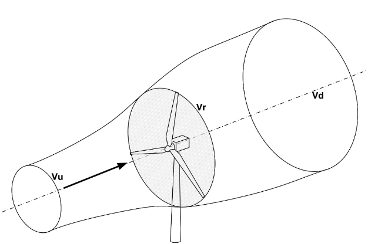

.. _`betz_limit_tutorial`:

Optimizing an Actuator Disk Model to Find Betz Limit for Wind Turbines
======================================================================

The Betz limit is the theoretical maximum amount of kinetic energy that a wind turbine can extract
from the flow.
This limit was derived analytically by Albert Betz in 1919, but it can also be found numerically using an optimizer and
a simple actuator disk model for a wind-turbine.

.. embed-test::
    openmdao.test_suite.test_examples.test_betz_limit.TestBetzLimit.test_betz
    :no-split:

