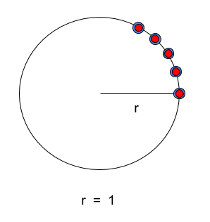

.. _`simul_deriv_example`:

**************************************************
Simple Optimization using Simultaneous Derivatives
**************************************************

Consider a set of points in 2-d space that are to be arranged along a circle such that the radius
of the circle is maximized, subject to constraints.  We start out with the points randomly
distributed within a unit circle centered about the origin.  The locations of our points are
determined by the values of the *x* and *y* arrays defined in our problem.

.. embed-code::
    openmdao.core.tests.test_coloring.SimulColoringTestCase.test_simul_coloring_example

Total derivatives with respect to *x* and *y* will be solved for simultaneously based on the
color of the points shown below.  Note that we have two colors and our *x* and *y* design
variables are of size 10. We have a third design variable, *r*, that is size 1.
This means that if we don't solve for derivatives simultaneously, we must
perform 21 linear solves (10 + 10 + 1) to solve for total derivatives with respect to
all of our design variables.  But, since each of our *x* and *y* design variables have only
two colors, we can solve for all of our total derivatives using only 5 linear solves (2 + 2 + 1).
This means that using simultaneous derivatives saves us 16 linear solves each time we compute our
total derivatives.

Here's our problem at the start of the optimization:

.. figure:: circle_example1.png
   :align: center
   :width: 50%
   :alt: our problem before optimization

After the optimization, all of our points lie along the unit circle.  The final radius is 1.0
(which corresponds to an area of PI) because we constrained our *x[0]* value to be 1.0.

