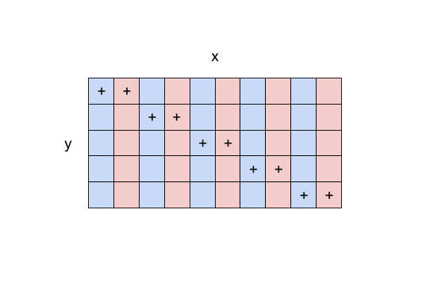

.. _simul-derivs-theory:

************************
Simultaneous Derivatives
************************

When OpenMDAO solves for total derivatives, it loops over either design variables in 'fwd' mode
or responses in 'rev' mode.  For each of those variables, it performs a linear solve for each
member of that variable, so for a scalar variable there would be only a single linear solve, and
there would be *N* solves for an array variable of size *N*.

Certain models have a special kind of sparsity structure in the total derivative Jacobian that
allows OpenMDAO to solve for multiple derivatives simultaneously. This results in far fewer linear
solves and much improved performance. For example, in 'fwd' mode, this requires that there is some
subset of the design variables that don't affect any of the same responses.  In other words, there
is some subset of columns of the total jacobian where none of those columns have nonzero values
in any of the same rows.

.. note::

   While it is possible for problems to exist where simultaneous reverse solves would be possible,
   OpenMDAO does not currently support simultaneous derivatives in reverse mode.

Consider, for example, a hypothetical optimization problem with a constraint that
:code:`y=10` where :math:`y` is defined by

.. math::

  y = 3*x[::2]^2 + 2*x[1::2]^2 ,

where :math:`x` is our design variable (size 10) and :math:`y` is our constraint (size 5).
Our derivative looks like this:

.. math::

  dy/dx = 6*x[::2] + 4*x[1::2] ,

We can see that each value of our :math:`dy/dx` derivative is determined by only one even
and one odd value of :math:`x`.  The following diagram shows which entries of :math:`x`
affect which entries of :math:`y`.

.. figure:: simple_coloring.png
   :align: center
   :width: 50%
   :alt: Dependency of y on x

Our total jacobian is shown below, with nonzero entries denoted by a :math:`+` and with
columns colored such that no columns of the same color share any nonzero rows.

Looking at the total jacobian above, it's clear that we can solve for all of the blue columns
at the same time because none of them affect the same entries of :math:`y`.  We can similarly
solve all of the red columns at the same time.  So instead of doing 10 linear solves to get
our total jacobian, we can do only 2 instead.

The way to tell OpenMDAO that you want to make use of simultaneous derivatives is to call the
`set_simul_deriv_color` method on the driver.

.. automethod:: openmdao.core.driver.Driver.set_simul_deriv_color
    :noindex:

`set_simul_deriv_color` is given a data structure that specifies the color
for each entry of the design variables (or the responses in 'rev' mode).  The structure also
specifies which rows and columns of the total jacobian corresponding to each color of each
design variable for each response.  For our problem above, our coloring structure would
look like this:

.. code-block:: python

    color_info = (
        # first our dictionary of design variables and their coloring array
        {
            # we split design variable x up using two colors, 0 and 1
            'x': [0, 1, 0, 1, 0, 1, 0, 1, 0, 1]
        },

        # next, our dictionary of response variables
        {
            # dictionary for our response variable y
            'y': {
                # dictionary for our design variable x
                'x': {
                    # first color: (rows of y, columns of x)
                    0: [[0, 1, 2, 3, 4], [0, 2, 4, 6, 8]],

                    # second color: (rows of y, columns of x)
                    1: [[0, 1, 2, 3, 4], [1, 3, 5, 7, 9]]
                }
            }
        }
    )

    # we would activate simultaneous derivatives by calling this on our driver
    prob.driver.set_simul_deriv_color(color_info)

You can see a more complete example of setting up an optimization with
simultaneous derivatives in the
:ref:`Simple Optimization using Simultaneous Derivatives <simul_deriv_example>`
example.

Automatic Generation of Coloring
################################
Although you can compute the coloring manually if you know enough information about your problem,
doing so can be challenging. Also, even small changes to your model,
e.g., adding new constraints or changing the sparsity of a sub-component, can change the
simultaneous coloring of your model. So care must be taken to keep the coloring up to date when
you change your model.

To streamline the process, OpenMDAO provides an automatic coloring algorithm.
OpenMDAO assigns random numbers to the non-zero entries of the partial derivative jacobian,
then solves for the total jacobian.  Given this total jacobian, the coloring algorithm examines
its sparsity and computes a coloring.

OpenMDAO finds the non-zero entries based on the :ref:`declare_partials<feature_sparse_partials>`
calls from all of the components in your model, so if you're not specifying the sparsity of the
partial derivatives of your components, then it won't be possible to find an automatic coloring
for your model.

The *color_info* data structure can be generated automatically using the following command:

.. code-block:: none

    openmdao simul_coloring <your_script_name>

The data structure will be written to the console and can be cut and pasted into your script
file and passed into the *set_simul_deriv_color* function.  For example, if we were to run
it on the example shown :ref:`here <simul_deriv_example>`, the output written to the console
would look like this:

.. code-block:: none

    ({
       'indeps.x': [0, 1, 0, 1, 0, 1, 0, 1, 0, 1],
       'indeps.y': [0, 1, 0, 1, 0, 1, 0, 1, 0, 1],
    },
    {
       'delta_theta_con.g': {
          'indeps.x': {
             0: [[0, 1, 2, 3, 4], [0, 2, 4, 6, 8]],
             1: [[0, 1, 2, 3, 4], [1, 3, 5, 7, 9]],
          },
          'indeps.y': {
             0: [[0, 1, 2, 3, 4], [0, 2, 4, 6, 8]],
             1: [[0, 1, 2, 3, 4], [1, 3, 5, 7, 9]],
          },
       },
       'l_conx.g': {
          'indeps.x': {
             0: [[0], [0]],
          },
       },
       'r_con.g': {
          'indeps.x': {
             0: [[0, 2, 4, 6, 8], [0, 2, 4, 6, 8]],
             1: [[1, 3, 5, 7, 9], [1, 3, 5, 7, 9]],
          },
          'indeps.y': {
             0: [[0, 2, 4, 6, 8], [0, 2, 4, 6, 8]],
             1: [[1, 3, 5, 7, 9], [1, 3, 5, 7, 9]],
          },
       },
       'theta_con.g': {
          'indeps.x': {
             0: [[0, 1, 2, 3, 4], [0, 2, 4, 6, 8]],
          },
          'indeps.y': {
             0: [[0, 1, 2, 3, 4], [0, 2, 4, 6, 8]],
          },
       },
    })

    Coloring Summary
    indeps.x num colors: 2   size: 10
    indeps.y num colors: 2   size: 10
    indeps.r num colors: 1   size: 1
    Total colors vs. total size: 5 vs 21

Note that only the first part of the console output should be cut and pasted into your script.
The Coloring Summary part is just for informational purposes to help give you an idea of what sort
of performance improvement you should see when computing your total derivatives.  For example, in
the output show above, the total number of linear solves to compute the total jacobian will drop
from 21 down to 5.

It may be more convenient, especially for larger colorings, to use the `-o` command line option
to output the coloring to a file as follows:

.. code-block:: none

    openmdao simul_coloring <your_script_name> -o my_coloring.json

The coloring will be written in json format to the given file and can be loaded using the
*set_simul_deriv_color* function like this:

.. code-block:: python

    prob.driver.set_simul_deriv_color('my_coloring.json')

If you run *openmdao simul_coloring* and it turns out there is no simultaneous coloring available,
don't be surprised.  Problems that have the necessary total jacobian sparsity to allow
simultaneous derivatives are relatively uncommon.  If you think that your total jacobian is sparse
enough that openmdao should be computing a smaller coloring than it gave you, then you can run
the coloring algorithm with a tolerance so that very small entries in the jacobian will be treated
as zeros.  You can set this tolerance using the *-t* command line option as follows:

.. code-block:: none

    openmdao simul_coloring <your_script_name> -o my_coloring.json -t 1e-15

Be careful when setting the tolerance however, because if you make it too large then you will be
zeroing out jacobian entries that should not be ignored and your optimization may not converge.

Checking that it works
######################

After activating simultaneous derivatives, you need to check your total
derivatives using the :ref:`check_totals<check-total-derivatives>` function.
If you provided a manually computed coloring, you need to be sure it was correct.
If you used the automatic coloring, the algorithm that we use still has a small chance of
computing an incorrect coloring due to the possibility that the total jacobian being analyzed
by the algorithm contained one or more zero values that are only incidentally zero.
Using :ref:`check_totals<check-total-derivatives>` is the way to be sure that something hasn't
gone wrong.

If you used the automatic coloring algorithm and you find that :ref:`check_totals<check-total-derivatives>`
is reporting incorrect total derivatives then you should try increasing the number of total derivative
computations that the algorithm uses to compute the total derivative sparsity pattern. The default
is 1, but you can increment that to 2 or higher if needed.

.. code-block:: none

    openmdao simul_coloring -n 2 <your_script_name>
