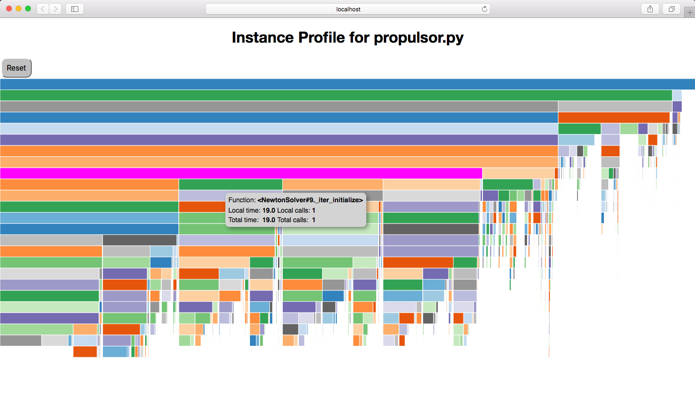

.. _instbasedprofile:

************************
Instance-based Profiling
************************

Python has several good profilers available for general python
code, and instance-based profiling is not meant to replace general profiling.
However, because the OpenMDAO profiler lets you view the profiled functions grouped
by the specific problem, system, group, driver, or solver that called them, it
can provide insight into which parts of your model are more expensive, even when
different parts of your model use many of the same underlying functions.

Instance-based profiling by default will record information for all calls to any of the main
OpenMDAO classes or their descendants, for example, :code:`System`, :code:`Problem`, :code:`Solver`,
:code:`Driver`, :code:`Matrix` and :code:`Jacobian`.

The simplest way to use instance-based profiling is via the command line using the :code:`openmdao iprof`
command.  For example:

.. code::

   openmdao iprof <your_python_script_here>

This will collect the profiling data, start a web server, and pop up an icicle viewer
in a web browser.

Generally it's best to just use all of the defaults, but if necessary you can change the
server port number using the `-p` option, or change the title of the displayed page
using the `-t` option, for example:

::

    openmdao iprof <your_python_script_here> -p 8801 -t "Instance Profile for propulsor.py"

You should then see something like this:

   An example of a profile icicle viewer.

In the viewer, hovering over a box will show the
function pathname, the local and total elapsed time for that function, and the
local and total number of calls for that function.  Clicking on a box will
collapse the view so that that box's function will become the top box
and only functions called by that function will be visible.  The top
box before any box has been collapsed is called `$total` and does not represent a
real function. Instead, it shows the total time that profiling was
active. If there are gaps below a parent block, i.e. its child blocks don't cover the entire
space below the parent, that gap represents the time exclusive to the parent or time
taken up by functions called by the parent that are not being profiled.

There is a *Reset* button that will take you back to the top level of the profile after
you have clicked down into a sub-call.

Documentation of options for all commands described here can be obtained by running the
command followed by the `-h` option.  For example:

.. embed-shell-cmd::
   :cmd: openmdao iprof -h

If you just want to see the timing totals for each method, you can call :code:`openmdao iprof_totals` instead
of :code:`openmdao iprof`.  For example:

.. code::

   openmdao iprof_totals <your_python_script_here>

:code:`openmdao iprof_totals` will write tabular output to the terminal containing total
runtime and total number of calls for each profiled function.  For example:

::

   Total     Total           Function
   Calls     Time (s)    %   Name
        1    0.000000   0.00 des_vars.<System.initialize>
        1    0.000000   0.00 <Solver#3._declare_options>
        1    0.000000   0.00 <Solver#6._declare_options>
        1    0.000000   0.00 <Solver#7._declare_options>
        1    0.000000   0.00 <Solver#9._declare_options>
        1    0.000000   0.00 <Solver#15._declare_options>
        1    0.000000   0.00 design.fc.ambient.<System.initialize>
        1    0.000000   0.00 <Solver#16._declare_options>
        1    0.000000   0.00 design.fc.conv.<System.initialize>
        1    0.000000   0.00 <Solver#20._declare_options>
        1    0.000000   0.00 <Solver#21._declare_options>
        1    0.000000   0.00 <Solver#25._declare_options>
        1    0.000000   0.00 design.fc.ambient.readAtmTable.<System.initialize>
      ...
        5    1.690505   8.06 <NonlinearRunOnce#5.solve>
        5    1.694799   8.08 design.fc.conv.fs.exit_static.<Group._solve_nonlinear>
        5    1.885014   8.99 <NonlinearRunOnce#6.solve>
        5    1.892510   9.02 design.fc.conv.fs.<Group._solve_nonlinear>
        1    1.934901   9.23 .<System._setup_scaling>
        1    2.053042   9.79 design.fan.<Group._setup_vars>
        5    2.549496  12.16 <NewtonSolver#2._iter_execute>
        2    2.609760  12.44 <Solver#22._run_iterator>
        2    2.609783  12.44 <NonlinearSolver#2.solve>
        2    2.613209  12.46 design.fc.conv.<Group._solve_nonlinear>
        2    2.615414  12.47 <NonlinearRunOnce#7.solve>
        2    2.619340  12.49 design.fc.<Group._solve_nonlinear>
        1    3.133403  14.94 design.nozz.<Group._setup_vars>
        2    7.319256  34.90 <NewtonSolver#1._iter_execute>
        1    7.608798  36.28 <Solver#13._run_iterator>
        1    7.608808  36.28 <NonlinearSolver#1.solve>
        1    7.617416  36.32 design.<Group._solve_nonlinear>
        1    7.617761  36.32 <NonlinearRunOnce#32.solve>
        1    7.627209  36.37 .<Group._solve_nonlinear>
        1    7.627431  36.37 .<System.run_solve_nonlinear>
        1    7.627438  36.37 <Problem#1.run_model>
        1    7.818091  37.28 design.<Group._setup_vars>
        1    7.863608  37.49 .<Group._setup_vars>
        1   12.812045  61.09 .<System._setup>
        1   12.826367  61.16 <Problem#1.setup>
        1   20.973087 100.00 $total

Note that the totals are sorted with the largest values at the end so that when
running :code:`openmdao iprof_totals` in a terminal the most important functions will show up without having to
scroll to the top of the output, which can be large. Also note that the function names are a
combination of the OpenMDAO pathname (when available) plus the function name qualified by the owning
class, or the class name followed by an instance id plus the function name.

.. note::

    Running either :code:`openmdao iprof` or :code:`openmdao iprof_totals` will generate by default a file called `iprof.0` in your
    current directory.  Either script can be run directly on the `iprof.0` file and will generate the
    same outputs as running your python script.

If you want more control over the profiling process, you can import :code:`openmdao.devtools.iprofile` and manually
call `setup()`, `start()` and `stop()`.  For example:

.. testcode:: profile_activate

    from openmdao.devtools import iprofile

    # we'll just use defaults here, but we could change the methods to profile in the call to setup()
    iprofile.setup()
    iprofile.start()

    # define my model and run it...

    iprofile.stop()

    # do some other stuff that I don't want to profile...

After your script is finished running, you should see a new file called
`iprof.0` in your current directory.  If you happen
to have activated profiling for an MPI run, then you'll have a copy of that
file for each MPI process, so `iprof.0`, `iprof.1`, etc.  As mentioned earlier, you can
run either :code:`openmdao iprof` or :code:`openmdao iprof_totals` directly on the :code:`iprof.*` data file(s).

.. warning::

   The timing numbers obtained from instance-based profiling will not be exact due to overhead
   introduced by the python function that collects timing data.

.. tags:: Tutorials, Profiling
