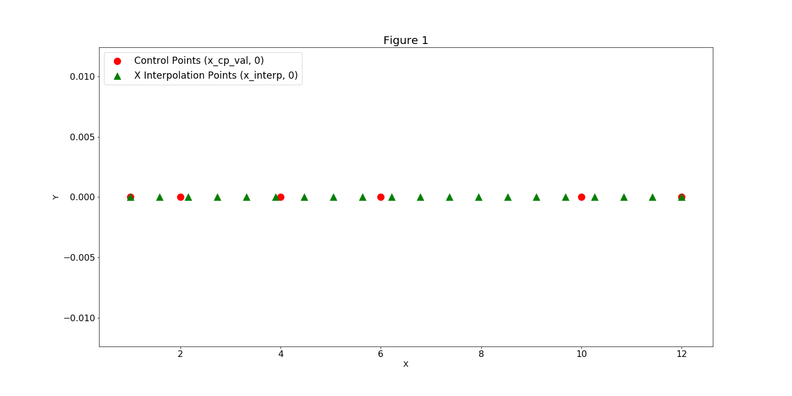
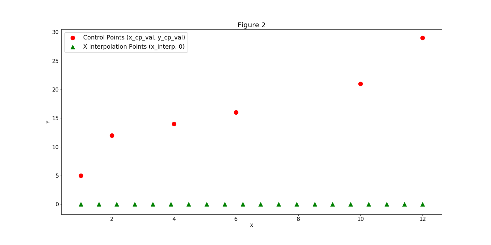
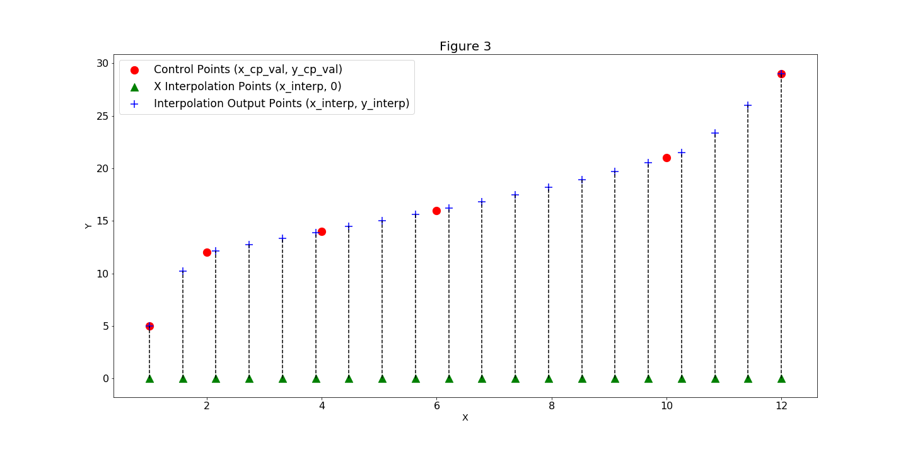
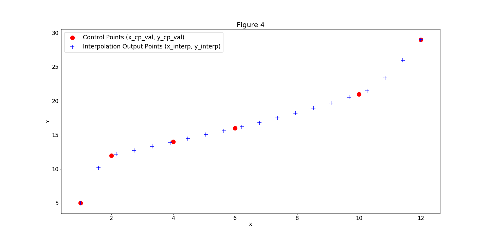

.. index:: SplineComp Example

.. _splinecomp_feature:

***************
SplineComp
***************

SplineComp allows you to represent a larger dimensional variable with a smaller dimensional variable by
using an interpolation algorithm. This is useful for reducing the size of an optimization problem by
decreasing the number of design variables it solves. The spatial distribution of the points, in both
the original and interpolated spaces is typically uniform but other distributions can be used.

.. note::

    OpenMDAO contains two components that perform interpolation: `SplineComp` and `MetaModelStructuredComp`.
    While they provide access to mostly the same algorithms, their usage is subtly different.
    The fundamental differences between them are as follows:

    :ref:`MetaModelStructuredComp <feature_MetaModelStructuredComp>` is used when you have a set of known data values y on a structured grid x and
    want to interpolate a new y value at a new x location that lies inside the grid. In this case, you
    generally start with a known set of fixed "training" values and their locations.

    :ref:`SplineComp <splinecomp_feature>` is used when you want to create a smooth curve with a large number of points, but you
    want to control the shape of the curve with a small number of control points. The x locations of
    the interpolated points (and where applicable, the control points) are fixed and known, but the
    y values at the control points vary as the curve shape is modified by an upstream connection.

    MetaModelStructuredComp can be used for multi-dimensional design spaces, whereas SplineComp is
    restricted to one dimension.

The following methods are available by setting the 'method' option:

+---------------+--------+------------------------------------------------------------------+
| Method        | Order  | Description                                                      |
+===============+========+==================================================================+
| slinear       | 1      | Basic linear interpolation                                       |
+---------------+--------+------------------------------------------------------------------+
| lagrange2     | 2      | Second order Lagrange polynomial                                 |
+---------------+--------+------------------------------------------------------------------+
| lagrange3     | 3      | Third order Lagrange polynomial                                  |
+---------------+--------+------------------------------------------------------------------+
| akima         | 3      | Interpolation using Akima splines                                |
+---------------+--------+------------------------------------------------------------------+
| cubic         | 3      | Cubic spline, with continuity of derivatives between segments    |
+---------------+--------+------------------------------------------------------------------+
| bsplines      | var.   | BSplines, default order is 4.                                    |
+---------------+--------+------------------------------------------------------------------+
| scipy_slinear | 1      | Scipy linear interpolation. Same as slinear, though slower       |
+---------------+--------+------------------------------------------------------------------+
| scipy_cubic   | 3      | Scipy cubic interpolation. More accurate than cubic, but slower  |
+---------------+--------+------------------------------------------------------------------+
| scipy_quintic | 5      | Scipy quintic interpolation. Most accurate, but slowest          |
+---------------+--------+------------------------------------------------------------------+

SplineComp Options
-------------------

.. embed-options::
    openmdao.components.spline_comp
    SplineComp
    options

SplineComp Basic Example
-------------------------

In our example, we have a pre-generated curve that is described by a series of values `y_cp` at a
sequence of locations `x_cp`, and we would like to interpolate new values at multiple locations
between these points. We call these new fixed locations at which to interpolate: `x`. When we
instantiate a `SplineComp`, we specify these `x_cp` and `x` locations as numpy arrays and pass
them in as constructor keyword arguments. (Figure 1). Next we'll add our `y_cp` data in by
calling the `add_spline` method and passing the `y_cp` values in as the keyword argument `y_cp_val` (Figure 2).
`SplineComp` computes and outputs the `y_interp` values (Figure 3).

.. embed-code::
    openmdao.components.tests.test_spline_comp.SplineCompFeatureTestCase.test_basic_example
    :layout: code, output

SplineComp Multiple Splines
---------------------------

`SplineComp` supports multiple splines on a fixed `x_interp` grid. Below is an example of how a user can
setup two splines on a fixed grid. To do this the user needs to pass in names to give to the component
input and output. The initial values for `y_cp` can also be specified here.

.. embed-code::
    openmdao.components.tests.test_spline_comp.SplineCompFeatureTestCase.test_multi_splines
    :layout: code, output

Specifying Options for 'akima'
------------------------------

When you are using the 'akima' method, there are two akima-specific options that can be passed in to the
`SplineComp` constructor.  The 'delta_x' option is used to define the radius of the smoothing interval
that is used in the absolute values functions in the akima calculation in order to make their
derivatives continuous.  This is set to zero by default, which effectively turns off the smoothing.
The 'eps' option is used to define the value that triggers a division-by-zero
safeguard; its default value is 1e-30.

.. embed-code::
    openmdao.components.tests.test_spline_comp.SplineCompFeatureTestCase.test_akima_options
    :layout: code, output

Specifying Options for 'bsplines'
---------------------------------

When you use the 'bsplines' method, you can specify the bspline order by defining 'order' in an
otherwise empty dictionary and passing it in as 'interp_options'.

In addition, when using 'bsplines', you cannot specify the 'x_cp' locations because the bspline
formulation differs from other polynomial interpolants. When using bsplines, you should instead
specify the number of control points using the 'num_cp' argument.

.. embed-code::
    openmdao.components.tests.test_spline_comp.SplineCompFeatureTestCase.test_bspline_options
    :layout: code, output

SplineComp Interpolation Distribution
-------------------------------------

The `cell_centered` function takes the number of cells, and the start and end values, and returns a
vector of points that lie at the center of those cells. The 'node_centered' function reproduces the
functionality of numpy's linspace.  Finally, the `sine_distribution` function creates a sinusoidal
distribution, in which points are clustered towards the ends. A 'phase' argument is also included,
and a phase of pi/2.0 clusters the points in the center with fewer points on the ends.

.. note::
    We have included three different distribution functions for users to replicate functionality that used to
    be built-in to the individual akima and bsplines components.

.. autofunction:: openmdao.utils.spline_distributions.sine_distribution
    :noindex:

.. autofunction:: openmdao.utils.spline_distributions.cell_centered
    :noindex:

.. autofunction:: openmdao.utils.spline_distributions.node_centered
    :noindex:

Below is an example of `sine_distribution`

.. embed-code::
    openmdao.components.tests.test_spline_comp.SplineCompFeatureTestCase.test_spline_distribution_example
    :layout: code, output

Standalone Interface for Spline Evaluation
------------------------------------------

The underlying interpolation algorithms can be used standalone (i.e., outside of the SplineComp) through the
`InterpND` class. This can be useful for inclusion in another component. The following example shows how to
create and evaluate a standalone Akima spline:

.. embed-code::
    openmdao.components.interp_util.tests.test_interp_nd.InterpNDStandaloneFeatureTestcase.test_interp_spline_akima
    :layout: code, output

Similiarly, the following example shows how to create a bspline:

.. embed-code::
    openmdao.components.interp_util.tests.test_interp_nd.InterpNDStandaloneFeatureTestcase.test_interp_spline_bsplines
    :layout: code, output

You can also compute the derivative of the interpolated output with respect to the control point values by setting
the "compute_derivate" argument to True:

.. embed-code::
    openmdao.components.interp_util.tests.test_interp_nd.InterpNDStandaloneFeatureTestcase.test_interp_spline_akima_derivs
    :layout: code, output