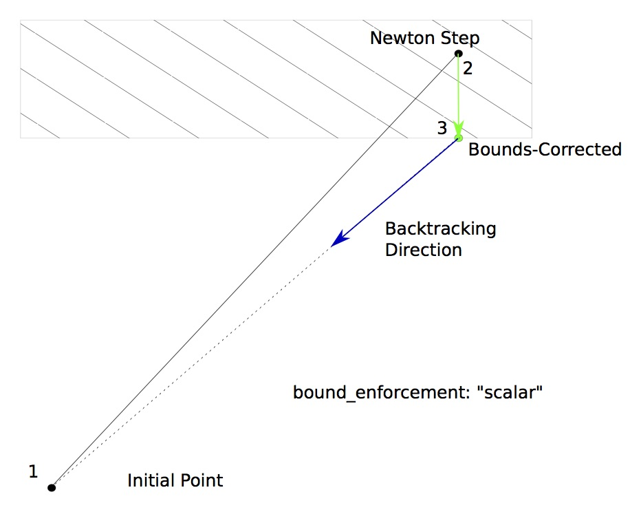
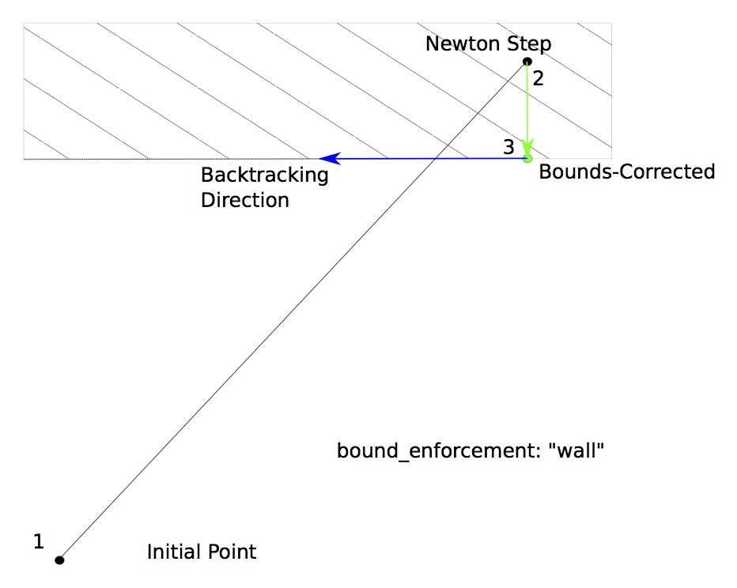

.. _feature_bounds_enforce:

***************
BoundsEnforceLS
***************

The BoundsEnforceLS only backtracks until variables violate their upper and lower bounds.

BoundsEnforceLS Options
-----------------------

.. embed-options::
    openmdao.solvers.linesearch.backtracking
    BoundsEnforceLS
    options

BoundsEnforceLS Option Examples
-------------------------------

**bound_enforcement**

BoundsEnforceLS includes the `bound_enforcement` option in its options dictionary. This option has a dual role:

1. Behavior of the non-bounded variables when the bounded ones are capped.
2. Direction of the further backtracking.

There are three difference bounds enforcement schemes available in this option.

With "vector" bounds enforcement, the solution in the output vector is pulled back to a point where none of the
variables violate any upper or lower bounds. Further backtracking continues along the Newton gradient direction vector back towards the
initial point.

.. image:: BT1.jpg

With "scalar" bounds enforcement, only the variables that violate their bounds are pulled back to feasible values; the
remaining values are kept at the Newton-stepped point. This changes the direction of the backtracking vector so that
it still moves in the direction of the initial point.

With "wall" bounds enforcement, only the variables that violate their bounds are pulled back to feasible values; the
remaining values are kept at the Newton-stepped point. Further backtracking only occurs in the direction of the non-violating
variables, so that it will move along the wall.

Note: when using BoundsEnforceLS linesearch, the `scalar` and `wall` methods are exactly the same because no further
backtracking is performed.

Here are a few examples of this option:

- bound_enforcement: vector

  The `bound_enforcement` option in the options dictionary is used to specify how the output bounds
  are enforced. When this is set to "vector", the output vector is rolled back along the computed gradient until
  it reaches a point where the earliest bound violation occurred. The backtracking continues along the original
  computed gradient.

.. embed-test::
    openmdao.solvers.linesearch.tests.test_backtracking.TestFeatureLineSearch.test_feature_boundscheck_vector

- bound_enforcement: scalar

  The `bound_enforcement` option in the options dictionary is used to specify how the output bounds
  are enforced. When this is set to "scaler", then the only indices in the output vector that are rolled back
  are the ones that violate their upper or lower bounds. The backtracking continues along the modified gradient.

.. embed-test::
    openmdao.solvers.linesearch.tests.test_backtracking.TestFeatureLineSearch.test_feature_boundscheck_scalar

- bound_enforcement: wall

  The `bound_enforcement` option in the options dictionary is used to specify how the output bounds
  are enforced. When this is set to "wall", then the only indices in the output vector that are rolled back
  are the ones that violate their upper or lower bounds. The backtracking continues along a modified gradient
  direction that follows the boundary of the violated output bounds.

.. embed-test::
    openmdao.solvers.linesearch.tests.test_backtracking.TestFeatureLineSearch.test_feature_boundscheck_wall
