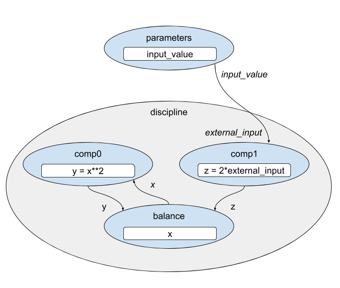

.. _feature_group_guess:

*********************************************************
Providing an Initial Guess for Implicit States in a Group
*********************************************************

In the documentation for :ref:`ImplicitComponent <comp-type-3-implicitcomp>`, 
you saw that you can provide an initial guess for implicit states within the
component using it's *guess_nonlinear* method.

:code:`Group` also provides a *guess_nonlinear* method in which you can supply
the starting value for implicit state variables in any of it's subsystems.

The following example demonstrates the capability of setting the initial guess
value at the group level, using the input from one component to compute the guess
for another.  In this case, a `Discipline` group solves a system of equations 
using a :ref:`BalanceComp <balancecomp_feature>`. It answers the question: 
"What is :math:`x` such that :math:`x^2` is equal to twice our input value".

Given our knowledge of the relationship between the two equations, we can supply
an initial guess for the implicit state variable, :math:`x`, that makes it 
unnecessary for the solver to iterate.

.. embed-code::
    openmdao.core.tests.test_group.TestGroup.test_guess_nonlinear_feature
    :layout: interleave