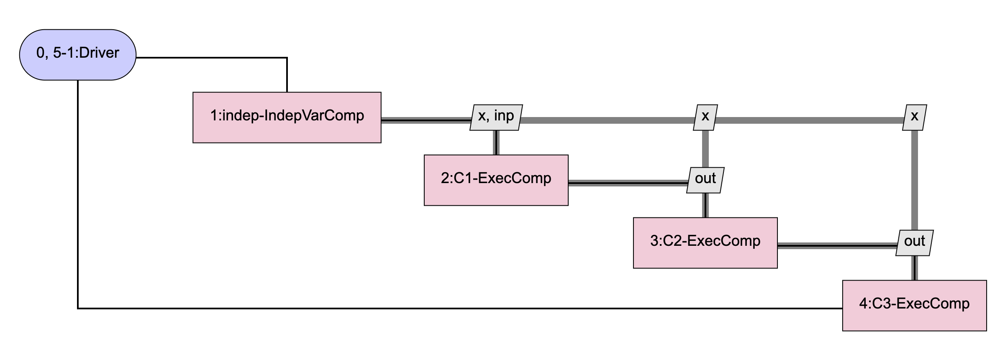
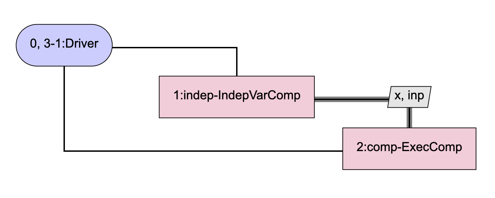

.. _feature_total_compute_jac_product:

*****************************
Matrix Free Total Derivatives
*****************************

The :code:`compute_jacvec_product` method of :code:`Problem` can be used to compute a matrix
free total jacobian vector product.  It's analagous to the way that the :code:`compute_jacvec_product`
method of :code:`System` can be used to compute partial jacobian vector products.

.. automethod:: openmdao.core.problem.Problem.compute_jacvec_product
    :noindex:

Below is an example of a component that embeds a sub-problem and uses :code:`compute_jacvec_product`
on that sub-problem to compute its jacobian.  The :code:`SubProbComp` component computes derivatives
in both 'fwd' and 'rev' directions, but in a realistic scenario, it would only compute them
in a single direction.

The model that :code:`SubProbComp` is intended to emulate is one that looks like this:

Instead of using 3 identical :code:`ExecComps` as shown above and having OpenMDAO automatically compute
the total derivatives for us, :code:`SubProbComp` will use just a single :code:`ExecComp` and will
compute its derivatives internally.  The model contained in the sub-problem looks like this:

Note that our sub-problem contains an :code:`IndepVarComp` as well as an :code:`ExecComp`.  This
is necessary because we're computing total derivatives, and total derivatives in OpenMDAO are specified
only in terms of outputs and residuals, not inputs.  At the beginning of :code:`compute` and
:code:`compute_partials`, we copy our component's inputs, :code:`inp` and :code:`x`, into the
:code:`IndepVarComp` in our sub-problem so that there they can be treated as outputs, allowing us to
compute total derivatives with respect to them.

The code for :code:`SubProbComp` is shown below:

.. embed-code::
    openmdao.core.tests.test_compute_jacvec_prod.SubProbComp

