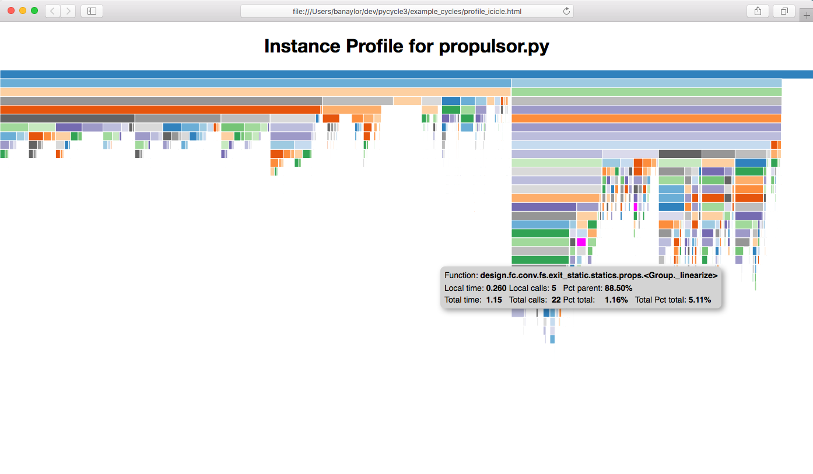

:orphan:

Instance-based Profiling
========================

Python has several good profilers available for general python
code, and instance-based profiling is not meant to replace general profiling.
However, because the OpenMDAO profiler lets you view the profiled functions grouped
by the specific problem, system, group, driver, or solver that called them, it
can provide insight into which parts of your model are more expensive, even when
different parts of your model use many of the same underlying functions.

Instance-based profiling by default will record information for all calls to any of the main
OpenMDAO classes or their descendants, for example, :code:`System`, :code:`Problem`, :code:`Solver`,
:code:`Driver`, :code:`Matrix` and :code:`Jacobian`.

The simplest way to use instance-based profiling is via the command line using the `iprofview`
command.  For example:

.. code::

   iprofview <your_python_script_here>

This will collect the profiling data and pop up an icicle viewer in a web browser.  The
web browser views a file called `profile_icicle.html` that can be saved for later viewing.
The file should be viewable in any browser.
The profiling data needed for the viewer is included directly in the file,
so the file can be passed around and viewed by other people.  It does
however require network access in order to load the d3 library.

By default, a browser will pop up immediately to view the file.  To disable
that, use the `--noshow` option.  You can use `-t` to set a custom title,
for example:

::

    iprofview <your_python_script_here> -t "Instance Profile for propulsor.py"

You should then see something like this:

   An example of a profile icicle viewer.

In the viewer, hovering over a box will show the
function pathname, the local and total elapsed time for that function, and the
local and total number of calls for that function. Also, all occurrences of that
particular function will be highlighted.  Clicking on a box will
collapse the view so that that box's function will become the top box
and only functions called by that function will be visible.  The top
box before any box has been collapsed is called `$total` and does not represent a
real function. Instead, it shows the total time that profiling was
active. If there are gaps below a parent block, i.e. its child blocks don't cover the entire
space below the parent, that gap represents the time exclusive to the parent or time
taken up by functions called by the parent that are not being profiled.

.. note::

   Documentation of options for all commands described here can be obtained by running the
   command followed by the `-h` option.  For example:

   iprofview -h

If you just want to see the timing totals for each method, you can call `iprof_totals` instead
of `iprofview`.  For example:

.. code::

   iproftotals <your_python_script_here>

`iproftotals` will write tabular output to the terminal containing total
runtime and total number of calls for each profiled function.  For example:

::

   Total     Total           Function
   Calls     Time (s)    %   Name
        1    0.000001   0.00 <Solver#1._declare_options>
        1    0.000001   0.00 indep.<System._setup_global_connections>
        1    0.000001   0.00 indep.<System._setup_connections>
        1    0.000001   0.00 comp1.<System._setup_connections>
        1    0.000002   0.00 .<System.initialize>
        1    0.000002   0.00 <Solver#0._declare_options>
        1    0.000002   0.00 indep.<System.initialize>
        1    0.000002   0.00 comp1.<System.initialize>
        1    0.000002   0.00 .<System._get_initial_procs>
        1    0.000002   0.00 .<System._setup_vars>
        1    0.000002   0.00 indep.<System._setup_vars>
        1    0.000002   0.00 indep.<System._setup_var_sizes>
   ...
        1    0.000967   0.43 <Problem#0.run_model>
        1    0.001124   0.50 .<System._setup_vectors>
        1    0.002057   0.91 comp1.<System._setup_scaling>
        1    0.002148   0.95 indep.<System._setup_scaling>
        1    0.003556   1.58 .<System._get_scaling_root_vectors>
        1    0.007772   3.45 .<System._setup_scaling>
        1    0.014359   6.38 comp1.<Component._setup_vars>
        1    0.185399  82.39 indep.<Component._setup_vars>
        1    0.199874  88.82 .<Group._setup_vars>
        1    0.217097  96.47 .<System._setup>
        1    0.217404  96.61 <Problem#0.setup>
        1    0.225035 100.00 $total

Note that the totals are sorted with the largest values at the end so that when
running `proftotals` in a terminal the most important functions will show up without having to scroll to the top of
the output, which can be large. Also note that the function names are a combination of the OpenMDAO pathname (when
available) plus the function name qualified by the owning class, or the class name followed by an instance id plus
the function name.

Running either `iprofview` or `iproftotals` will generate by default a file called `iprof.0` in your
current directory.  Either script can be run directly on the `iprof.0` file and will generate the
same outputs as running your python script.  For example:

.. code::

   iprofview iprof.0

If you want more control over the profiling process, you can import `openmdao.devtools.iprofile` and manually
call `setup()`, `start()` and `stop()`.  For example:

.. testcode:: profile_activate

    from openmdao.devtools import iprofile

    # we'll just use defaults here, but we could change the methods to profile in the call to setup()
    iprofile.setup()
    iprofile.start()

    # define my model and run it...

    iprofile.stop()

    # do some other stuff that I don't want to profile...

After your script is finished running, you should see a new file called
`iprof.0` in your current directory.  If you happen
to have activated profiling for an MPI run, then you'll have a copy of that
file for each MPI process, so `iprof.0`, `iprof.1`, etc.  As mentioned earlier, you can
run either `iprofview` or `iproftotals` directly on the `iprof.*` data file(s).

.. note::

   The timing numbers obtained from instance-based profiling will not be exact due to overhead
   introduced by the python function that collects timing data.

Instance-based Memory Profiling
===============================

The `iprofmem` command can be used to obtain an estimate of the memory usage of method calls on a
per-instance basis.  For example:

.. code::

   iprofmem <your_python_script_here>

This will generate output to the console that looks like this:

::

   DictionaryJacobian#1.Jacobian.__init__ 0.00390625 MB
   des_vars.ExplicitComponent.__init__ 0.00390625 MB
   LNRunOnce#1.Solver._set_solver_print 0.00390625 MB
   NLRunOnce#1.Solver.__init__ 0.00390625 MB
   DictionaryJacobian#2.Jacobian.__init__ 0.00390625 MB
   NLRunOnce#2.Solver.__init__ 0.00390625 MB
   LNRunOnce#2.Solver.__init__ 0.00390625 MB
   design.fan.Group.__init__ 0.00390625 MB
   design.nozz.Nozzle.initialize 0.00390625 MB
   NLRunOnce#3.Solver.__init__ 0.00390625 MB
   DictionaryJacobian#3.Jacobian.__init__ 0.00390625 MB
   design.perf.Performance.initialize 0.00390625 MB
   design.pwr_balance.Balance.initialize 0.00390625 MB
   NewtonSolver#1.NewtonSolver._declare_options 0.00390625 MB
   NLRunOnce#4.Solver.__init__ 0.00390625 MB
   LNRunOnce#3.Solver.__init__ 0.00390625 MB
   DictionaryJacobian#4.Jacobian.__init__ 0.00390625 MB
   design.fc.conv.fs.FlowStart.initialize 0.00390625 MB
   ...
   DefaultVector#2944.DefaultVector._initialize_views 0.167969 MB
   DefaultVector#2945.DefaultVector._initialize_views 0.167969 MB
   DefaultVector#2946.DefaultVector._initialize_views 0.167969 MB
   DefaultVector#2947.DefaultVector._initialize_views 0.167969 MB
   DefaultVector#2948.DefaultVector._initialize_views 0.167969 MB
   DefaultVector#2949.DefaultVector._initialize_views 0.167969 MB
   DefaultVector#2949.Vector.__init__ 0.167969 MB
   DefaultVector#2950.DefaultVector._initialize_views 0.171875 MB
   DefaultVector#2951.DefaultVector._initialize_views 0.171875 MB
   DefaultVector#2952.DefaultVector._initialize_views 0.171875 MB
   DefaultVector#2953.DefaultVector._initialize_views 0.175781 MB
   DefaultVector#2953.DefaultVector._initialize_views 0.175781 MB
   DefaultVector#2954.DefaultVector._initialize_views 0.175781 MB
   DefaultVector#2955.DefaultVector._initialize_views 0.175781 MB
   DefaultVector#2956.DefaultVector._initialize_views 0.175781 MB
   DefaultVector#2956.Vector.__init__ 0.1875 MB
   DefaultVector#2956.DefaultVector._initialize_views 0.199219 MB
   DefaultVector#2956.DefaultVector._initialize_views 0.210938 MB
   DefaultVector#2956.DefaultVector._clone_data 0.238281 MB
   design.fan.map.desMap.ExplicitComponent._apply_nonlinear 8.71875 MB
   design.DirectSolver._linearize 9.08203 MB

Note that the memory usage is listed in reverse order so that the largest usages are shown
at the bottom of the console output in order to avoid having to scroll backward to find
the methods of most interest.

.. note::

   These memory usage numbers are only estimates, based on the changes in the process memory
   measured before and after each method call.  The true memory use is difficult to determine due
   to the presence of python's own internal memory management and garbage collection.

Instance-based Call Tracing
===========================

The `icalltrace` command can be used to print a trace of each instance method call.  For example:

.. code::

   icalltrace <your_python_script_here>

Whenever a method is called that matches the search criteria, the pathname of the object instance,
or its class and an ID if it has no pathname, along with the method name, will be written to the
console, indented based on its location in the call stack.  The current call count for the method
is also displayed.   For example:

::

    Group#1.Group.__init__ (1)
       Group#1.System.__init__ (1)
          DictionaryJacobian#1.Jacobian.__init__ (1)
          .System.initialize (1)
       NLRunOnce#1.Solver.__init__ (1)
          NLRunOnce#1.Solver._declare_options (1)
       LNRunOnce#1.Solver.__init__ (1)
          LNRunOnce#1.Solver._declare_options (1)
    Problem#1.Problem.__init__ (1)
       Driver#1.Driver.__init__ (1)
    IndepVarComp#1.IndepVarComp.__init__ (1)
       IndepVarComp#1.ExplicitComponent.__init__ (1)
          IndepVarComp#1.Component.__init__ (1)
             IndepVarComp#1.System.__init__ (1)
                DictionaryJacobian#2.Jacobian.__init__ (1)
                .System.initialize (2)
    ExecComp#1.ExecComp.__init__ (1)
       ExecComp#1.ExplicitComponent.__init__ (1)
          ExecComp#1.Component.__init__ (1)
             ExecComp#1.System.__init__ (1)
                DictionaryJacobian#3.Jacobian.__init__ (1)
                .System.initialize (3)
    Problem#1.Problem.setup (1)
       .System._setup (1)
          .System._get_initial_procs (1)
          .Group._setup_procs (1)
          .System.get_req_procs (1)
          .System.get_req_procs (2)
          .System._setup_procs (1)
             indep.System.get_req_procs (1)
          .System._setup_procs (2)
             comp1.System.get_req_procs (1)
          .Group._setup_vars (1)
             .System._setup_vars (1)
             indep.Component._setup_vars (1)
                indep.System._setup_vars (1)
             comp1.Component._setup_vars (1)
                comp1.System._setup_vars (1)
          .System._get_initial_var_indices (1)
          .Group._setup_var_index_ranges (1)
             .System._setup_var_index_ranges (1)
          indep.System._setup_var_index_ranges (1)
          comp1.System._setup_var_index_ranges (1)
          .Group._setup_var_data (1)
             .System._setup_var_data (1)
             indep.Component._setup_var_data (1)
                indep.System._setup_var_data (1)
             comp1.Component._setup_var_data (1)
                comp1.System._setup_var_data (1)
             indep.System._get_maps (1)
          comp1.System._get_maps (1)
   ...

Note that even instances that will eventually have a pathname do not yet have it when `__init__` is
called, so at that point instead of the pathname, the class name and ID are displayed.  In the output
above, for example, *IndepVarComp#1*  eventually aquires the pathname *indep*, so *IndepVarComp#1*
and *indep* both refer to the same instance.

.. tags:: Tutorials, Profiling
