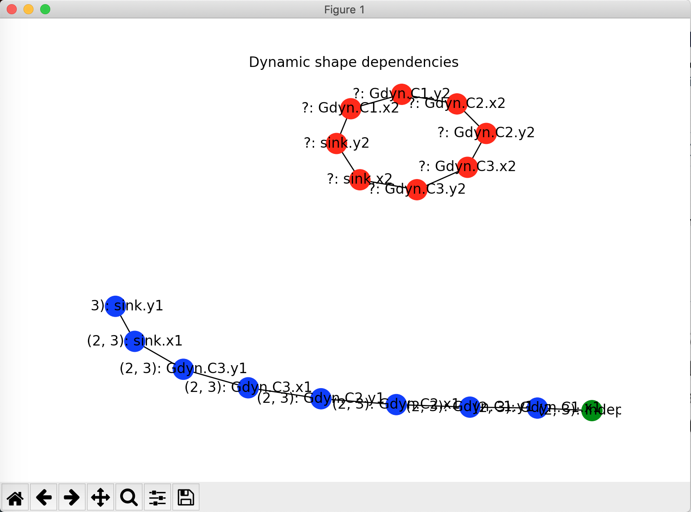

.. _dynamic-shapes:

**************************************
Determining Variable Shapes at Runtime
**************************************

It's sometimes useful to create a component where the shapes of its inputs and/or outputs are
determined by their connections.  This allows us to create components representing general
purpose vector or matrix operations such as norms, summations, integrators, etc., that size
themselves appropriately based on the model that they're added to.

Turning on dynamic shape computation is straightforward.  You just specify `shape_by_conn`
and/or `copy_shape` in your `add_input` or `add_output` calls when you add variables
to your component.

shape_by_conn
-------------

Setting `shape_by_conn=True` when adding and input or output variable will allow the shape
of that variable to be determined at runtime based on the variable that connects to it.
For example:

.. code-block:: python

    self.add_input('x', shape_by_conn=True)

copy_shape
----------

Setting `copy_shape=<var_name>`, where `<var_name>` is the local name of another variable in your
component.  This will take the shape of the variable specified in `<var_name>` and use that
shape for the variable you're adding.  For example, the following will make the shape of the `y`
variable the same as the shape of the `x` variable.

.. code-block:: python

    self.add_output('y', copy_shape='x')

Note that `shape_by_conn` can be specified for outputs as well as for inputs, as can `copy_shape`.
This means that shape information can propagate through the model in either forward or reverse.
It's often advisable to specify both `shape_by_conn` and `copy_shape` for each
dynamically shaped variable, because that will allow your component's shapes to be resolved
whether constant shapes have been defined upstream or downstream of your component in the model.
For example, for our component with input `x` and output `y`, we could define our variables as
follows:

.. code-block:: python

    self.add_input('x', shape_by_conn=True, copy_shape='y')
    self.add_input('y', shape_by_conn=True, copy_shape='x')

This way, `y` can be used to determine the shape of `x`, or `x` can determine the shape of `y`.

Examples
--------

In the following examples we look at different ways that variable shape information can be
propagated through a model.  Some of the examples use the following simple dynamically shaped
component:

.. embed-code::
    openmdao.core.tests.test_dyn_sizing.DynPartialsComp

Note that this component has sparse partials, and those are specified within the `setup_partials`
method which is called after all of the shape information is known.

Note also that we show how to make an ExecComp dyanamically shaped by setting `shape_by_conn` and
`copy_shape` in the metadata we pass into `ExecComp.__init__` for `x` and `y`.

In the first example, we specify the shape of the IndepVarComp that feeds into the rest of the
model, and all other shapes are determined based on that.

.. embed-code::
    openmdao.core.tests.test_dyn_sizing.TestDynShapeFeature.test_feature_fwd
    :layout: code, output

In the second example, the middle component determines the size of the auto-IndepVarComp and the
sink.

.. embed-code::
    openmdao.core.tests.test_dyn_sizing.TestDynShapeFeature.test_feature_middle
    :layout: code, output

Finally, the sink determines all of the upstream shapes.

.. embed-code::
    openmdao.core.tests.test_dyn_sizing.TestDynShapeFeature.test_feature_rev
    :layout: code, output

Debugging
---------

Sometimes, when the shapes of some variables are unresolvable, it can be difficult to understand
why.  There is an OpenMDAO command line tool, `openmdao view_dyn_shapes`, that can be used to
show a graph of the dynamically shaped variables and any statically shaped variables that
connect directly to them.  Each node in the graph is a variable, and each edge is a connection
between that variable and another.  Note that this connection does not have to be a
connection in the normal OpenMDAO sense.  It could be a connection internal to a component
created by declaring a `copy_shape` in the metadata of one variable that refers to another
variable.

The nodes in the graph are colored to make it easier to locate static/dynamic/unresolved
variable shapes.  Statically shaped variables are colored green, dynamically shaped
variables that have been resolved are colored blue, and any variables with unresolved shapes
are colored red.  Each node is labeled with the shape of the variable, if known, or a '?' if
unknown, followed by the absolute pathname of the variable in the model.

The plot is somewhat crude and the node labels sometimes overlap, but it's possible to zoom
in to part of the graph to make it more readable using the button that looks like a magnifying glass.

Below is an example plot for the followng case containing unresolved variable shapes.

.. embed-code::
    openmdao.core.tests.test_dyn_sizing.TestDynShapes.test_cycle_unresolved
    :layout: code
    :imports-not-required:

