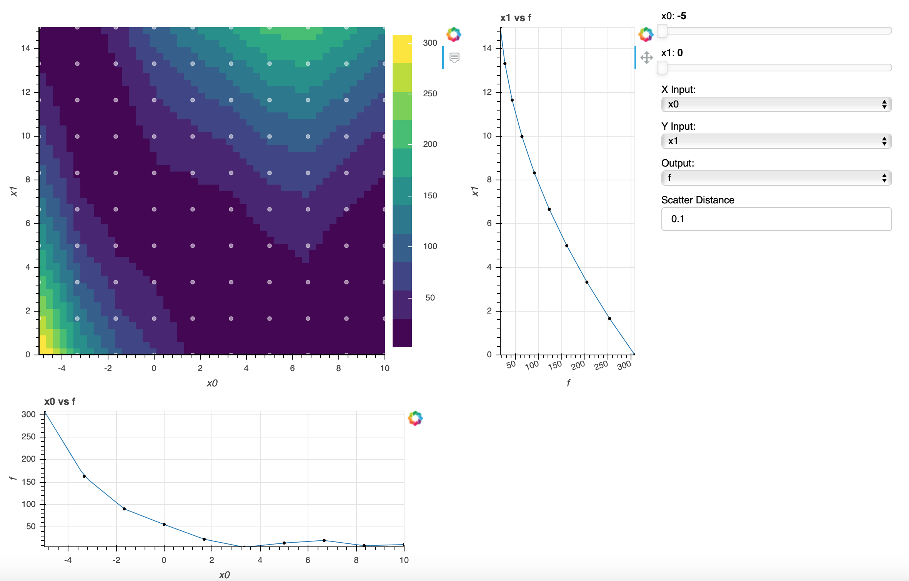

.. _meta_model_basics:

*************************
Metamodel Visualization
*************************

When evaluating meta models, it can be useful to determine their fit of the training data, graphically.
OpenMDAO has a visualization package to view the training data and meta models generated from it.
This page explains how to use `view_mm` in the command line.

The metamodel viewer allows a user the ability of reducing a high dimentional input space down
to three dimensions to enable the user to determine the fit of a meta model to the given
training data.

-----------------------
Running the Visualizer
-----------------------

.. note::
    This tool is accessible through the OpenMDAO command line tools which can be found
    :ref:`here <om-command>`.

Running :code:`openmdao view_mm structured_meta_model_example.py` will open the metamodel generated
from the script in the browser and generate a metamodel viewer like the one below. The user can adjust
sliders to make slices in the graph, change X and Y inputs, and change the scatter distance value to
fine tune the distance a point can be from the model line.

To recreate the viewer above, copy the first script given below and paste it into a file named :code:`structured_meta_model_example.py`.
Next, run :code:`openmdao view_mm structured_meta_model_example.py` in the command line.

Structured MetaModel Example Script
-----------------------------------
.. embed-code::
    ../test_suite/test_examples/meta_model_examples/structured_meta_model_example.py

Unstructured MetaModel Example Script
-------------------------------------
To view this example metamodel, copy the following script into a file named :code:`unstructured_meta_model_example.py` and then
run :code:`openmdao view_mm unstructured_meta_model_example.py` in the command line.

.. embed-code::
    ../test_suite/test_examples/meta_model_examples/unstructured_meta_model_example.py

.. note::
    OpenMDAO supports structured and unstructured metamodels. Please refer to the documentation for a more
    in depth overview of what :ref:`Unstructured <feature_MetaModelUnStructuredComp>` and :ref:`Structured <feature_MetaModelStructuredComp>`
    metamodels are.

Multiple Meta Models in Script
-------------------------------------
If your model has multiple metamodels, you can specify which of them you want to visualize. For example, in this code
there are two metamodels.

.. embed-code::
    ../visualization/meta_model_viewer/tests/multiple_metamodels.py

To visualize only the first one, you would use the command:

.. code::

    openmdao view_mm -m cos_mm multiple_metamodels.py

Command Line Interface
----------------------

The command, :code:`openmdao view_mm` requires a file path, the name of the meta model which you
want to visualize if there is more than one, and optionally a port number:

.. embed-shell-cmd::
    :cmd: openmdao view_mm -h

.. note::
    When using Bash on Windows set --no_browser option to start the server, then open an internet
    browser and copy/paste the path to viewer.