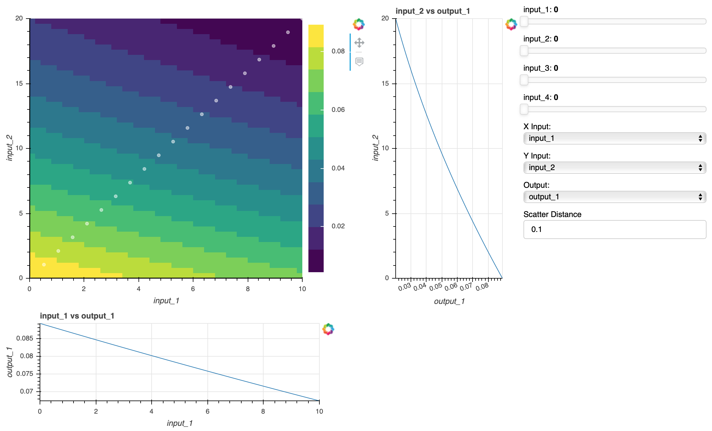

.. _meta_model_basics:

*************************
Metamodel Visualization
*************************

When evaluating surrogate models, it can be helpful to determine training data fit graphically. OpenMDAO
has created a package to visualize the training data and surrogate models generated from it. This page
explains how to use the `meta_model_viewer.py` package from the command line.

The metamodel viewer allows a user the ability of reducing a high dimentional input space down
to three dimensions to enable the user to determine the fit of a surrogate model to the given
training data.

.. embed-code::
    ../test_suite/test_examples/meta_model_examples/meta_model_viewer_example.py

From the Command Line
---------------------

.. _om-command-view_meta_model:

Generating a metamodel diagram for a model from the command line is easy. You need a
Python script that contains the metamodel.

Running :code:`openmdao meta_model meta_model_viewer_example.py` will open the metamodel generated from the script in the
browser and generate a metamodel viewer like the one below.

The command, :code:`openmdao meta_model` requires a file path and the name of the surrogate model which you
want to visualize if there is more than one surrogate in your file:

.. embed-shell-cmd::
    :cmd: openmdao meta_model -h

