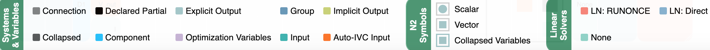
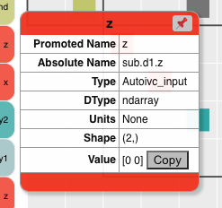
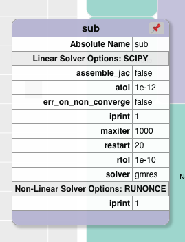

.. _n2_details:

**************************************
Details of the N2 Model Visualizations
**************************************

The N2 diagram has a number of sections:

* Model hierarchy
* Connection matrix
* Solver hierarchy
* Toolbar
* Search bar
* Legend

This page will go into the details of each section.

Just like in the :ref:`N2 Basics<n2_basics>` section of this documentation, we will use the
circuit model that is missing a connection as our example code.

.. embed-code::
    ../test_suite/scripts/circuit_with_unconnected_input.py

Here is the N2 diagram that is generated from this model.
There are three parts to the N2 diagram. The model hierarchy is on the left, the connection matrix is displayed
in the center, and the solver hierarchy is shown on the right.

.. embed-n2::
    ../test_suite/scripts/circuit_with_unconnected_input.py

Model Hierarchy
---------------

The model hierarchy is on the left side of the diagram. It is a mix of Systems and variables, both
inputs and outputs.

The top System, the root of the model, is on the left and the subsystem hierarchy is displayed to its right.

The colors indicate the type of
item in the hierarchy. To see what the colors represent, an optional legend can be displayed using the |show_legend|
button. Here is the part of the legend that explains the colors of the model hierarchy.

.. image::
    images/systems_and_variables_legend.png
    :align: center

You can click in the model hierarchy to zoom into, and also collapse and expand sections of the hierarchy. Left clicking on a
subsystem zooms the hierarchy display to just that subsystem in the hierarchy. Right clicking on a subsystem collapses all of the
hierarchy to the right of it.

Buttons on the toolbar, which are explained in the :ref:`Toolbar<toolbar>` section,
also can be used to control what is displayed in the hierarchy.

Connection Matrix
-----------------
The matrix in the middle of the diagram shows what items in the model are connected.

The color of an item on a diagonal cell matches the color of the rightmost element in the model hierarchy. The colors
for the off-diagonal items, which indicate connections, are always black.

The symbol of an item in the connection matrix indicates whether the variable is a scalar, vector, or collapsed variable.

.. image::
    images/connection_matrix_legend.png
    :align: center

Boxes, with thin black line borders, outline items in the matrix to show the grouping of the variables of the lowest level Systems.

When you hover over a connection in the matrix, arrows are drawn to indicate connections. The behavior is different
depending on whether you hover over a diagonal or an off-diagonal cell.

When hovering over a diagonal item, the explicit connections to/from that variable are displayed. Salmon colored arrows indicate
that element is the target of the connection. A green arrow indicates it is the source.

When hovering over an off-diagonal, the behavior differs depending on whether the cell is in the lower or upper
triangular part of the diagram.

In the lower triangular, the marked cells represent upstream (in the sense of execution order of the
components) connections. All the connections involved in that cycle
are drawn to indicate which systems and components are involved in the convergence loop. Downstream connection arrows
are green and upstream connections are salmon colored.

In the upper triangular, the marked cells represent downstream connections. The salmon colored arrow that is drawn shows
that connection.

Clicking in the matrix on a connection or diagonal, lets you pin connection arrows so that they don't
disappear when you hover away from the cell. You can clear these connections arrows by using the
`Hide all connection arrow button` |hide_conn_arrows| in the toolbar.

Solver Hierarchy
----------------
Each System in a model can potentially have a linear and nonlinear solver associated with it. On the right side
of the N2 diagram, the hierarchy of the solvers is shown. This time the hierarchy goes from right to left with the root
of the model on the right.
You can switch between showing the names of the linear or nonlinear
solvers using the button |toggle_solver_names| in the toolbar.

The colors indicate the type of solver. The colors are shown in the legend. The section of the legend showing
the colors of the solver types changes depending on which are displayed in the solver structure.
Here is what the section of the legend looks like for both linear and non-linear solvers.

.. |nonlinear_solvers_legend| image:: images/nonlinear_solvers_legend.png
    :align: middle
    :scale: 80 %

.. |linear_solvers_legend| image:: images/linear_solvers_legend.png
    :align: middle
    :scale: 80 %

.. table:: Solver Legend
   :widths: auto
   :align: center

   +----------------------------+-------------------------+
   | Non-Linear Solver Legend   | Linear Solver Legend    |
   +============================+=========================+
   | |nonlinear_solvers_legend| | |linear_solvers_legend| |
   +----------------------------+-------------------------+

.. note::

    When a System has a Newton non-linear solver and the `solve_subsystems` option is set to True for that solver,
    the Solver hierarchy box for that System has the text `NL: Newton (sub_solve)`.

As in the model hierarchy, you can also do zooming, collapsing, and expanding in the Solver hierarchy using left and right mouse clicks.

.. _toolbar:

Toolbar
-------
The toolbar to the left of the N2 diagram provides many useful capabilities. Explanations for all the buttons
is below. Tooltips are also provided for all the buttons as you hover over them.

View Control
************
The model hierarchy display has the notion of a `view`. The `view` is defined by the node in the hierarchy
that is visible in the diagram. Initially, it is the root of the model but if you click on a subsystem, then
only the part of the hierarchy beginning at that subsystem is shown.

You can change the view and zoom into a System by left clicking on it. Other parts of the hierarchy are no longer
visible.

The diagram keeps track of the view history and then lets you go back and forth through the history similar to undo and
redo in apps.

.. |return_to_root| image:: images/home.png
   :align: middle
   :scale: 40 %

.. |back| image:: images/back.png
   :align: middle
   :scale: 40 %

.. |forward| image:: images/forward.png
   :align: middle
   :scale: 40 %

|

.. table:: Buttons to Control Hierarchy View
   :widths: auto
   :align: left

   +---------------------+-----------------+----------------------------------------------------------------------+
   | Button              | Title           | Description                                                          |
   +=====================+=================+======================================================================+
   | |return_to_root|    | Return to root  | View entire model starting from root                                 |
   +---------------------+-----------------+----------------------------------------------------------------------+
   | |back|              | Back            | Move back in view history                                            |
   +---------------------+-----------------+----------------------------------------------------------------------+
   | |forward|           | Forward         | Move forward in view history                                         |
   +---------------------+-----------------+----------------------------------------------------------------------+

|

Collapsing and Expanding the System Hierarchy
*********************************************

The next set of buttons lets you control the collapsing and expanding of elements in the System hierarchy. The first
four buttons are revealed as a fly-out menu as you hover over this button, |control_collapse|.

.. |control_collapse| image:: images/control_collapse.png
   :align: middle
   :scale: 40 %

.. |collapse_view| image:: images/collapse_view.png
   :align: middle
   :scale: 40 %

.. |expand_view| image:: images/expand_view.png
   :align: middle
   :scale: 40 %

.. |collapse_all| image:: images/collapse_all.png
   :align: middle
   :scale: 40 %

.. |expand_all| image:: images/expand_all.png
   :align: middle
   :scale: 40 %

.. |collapse_depth| image:: images/collapse_depth.png
   :align: middle
   :scale: 40 %

|

.. table:: Buttons to Control Expanding and Collapsing of Hierarchy
   :widths: auto
   :align: left

   +---------------------+----------------------------------+--------------------------------------------------------+
   | Button              | Title                            | Description                                            |
   +=====================+==================================+========================================================+
   | |collapse_view|     | Collapse variables in view only  | Collapse only the variables in the current view        |
   +---------------------+----------------------------------+--------------------------------------------------------+
   | |expand_view|       | Expand variables in view only    | Expand only the variables in the current view          |
   +---------------------+----------------------------------+--------------------------------------------------------+
   | |collapse_all|      | Collapse all variables           | Collapse all the variables in the entire model         |
   +---------------------+----------------------------------+--------------------------------------------------------+
   | |expand_all|        | Expand all variables             | Expand all the variables in the entire model           |
   +---------------------+----------------------------------+--------------------------------------------------------+
   | |collapse_depth|    | Collapse depth                   | Set the number of hierarchy levels shown in the view   |
   +---------------------+----------------------------------+--------------------------------------------------------+

|

Connections Arrow Visibility
****************************

The connections visibility is controlled using the buttons that appear when hovering over
the |connection_visibility| button.

.. |show_conn_arrows| image:: images/show_conn_arrows.png
   :align: middle
   :scale: 40 %

.. |hide_conn_arrows| image:: images/hide_conn_arrows.png
   :align: middle
   :scale: 40 %

.. |show_all_conn_arrows| image:: images/show_all_conn_arrows.png
   :align: middle
   :scale: 40 %

|

.. table:: Buttons to Control Connections Arrow Visibility
   :widths: auto
   :align: left

   +-----------------------+--------------------------------+-----------------------------------------------------------------------------------+
   | Button                | Title                          | Description                                                                       |
   +=======================+================================+===================================================================================+
   | |show_conn_arrows|    | Show pinned connection arrows  | Display all the connection arrows the user has pinned by clicking on a connection |
   +-----------------------+--------------------------------+-----------------------------------------------------------------------------------+
   | |hide_conn_arrows|    | Hide all connection arrows     | Hide all connection arrows, pinned or otherwise                                   |
   +-----------------------+--------------------------------+-----------------------------------------------------------------------------------+
   | |show_all_conn_arrows|| Show all connections in model  | Show all connections in model. These are not added to the "pinned" list of arrows |
   +-----------------------+--------------------------------+-----------------------------------------------------------------------------------+

|

Remaining Toolbar Buttons
*************************

The buttons in the remaining part of the toolbar offer a variety of other options:

.. |toggle_solver_names| image:: images/toggle_solver_names.png
   :align: middle
   :scale: 40 %

.. |show_legend| image:: images/show_legend.png
   :align: middle
   :scale: 40 %

.. |font_size| image:: images/font_size.png
   :align: middle
   :scale: 40 %

.. |model_height| image:: images/model_height.png
   :align: middle
   :scale: 40 %

.. |save_svg| image:: images/save_svg.png
   :align: middle
   :scale: 40 %

.. |show_node_info| image:: images/show_node_info.png
   :align: middle
   :scale: 40 %

.. |help| image:: images/help.png
   :align: middle
   :scale: 40 %

|

.. table:: Remaining Toolbar Buttons
   :align: left

   +-----------------------+---------------------------------+----------------------------------------------------------------------------------------------------+
   | Button                | Title                           | Description                                                                                        |
   +=======================+=================================+====================================================================================================+
   | |toggle_solver_names| | Toggle Solver Names             | Switch between displaying the linear and non-linear solvers for the Systems                        |
   +-----------------------+---------------------------------+----------------------------------------------------------------------------------------------------+
   | |show_legend|         | Show legend / Hide legend       | Show the legend explaining the colors and icons in the diagram                                     |
   +-----------------------+---------------------------------+----------------------------------------------------------------------------------------------------+
   | |font_size|           | Font Size                       | Set the font size for the text in the diagram                                                      |
   +-----------------------+---------------------------------+----------------------------------------------------------------------------------------------------+
   | |collapse_depth|      | Set collapse depth              | Set how many levels are shown in the System hierarchy on the left                                  |
   +-----------------------+---------------------------------+----------------------------------------------------------------------------------------------------+
   | |model_height|        | Model Height                    | Set the height of the diagram in pixels                                                            |
   +-----------------------+---------------------------------+----------------------------------------------------------------------------------------------------+
   | |save_svg|            | Save SVG                        | Save the current view of the diagram to an SVG file                                                |
   +-----------------------+---------------------------------+----------------------------------------------------------------------------------------------------+
   | |show_node_info|      | Show / Hide Node Info           | Toggle info box that is displayed on hover                                                         |
   +-----------------------+---------------------------------+----------------------------------------------------------------------------------------------------+
   | |help|                | Help                            | Bring up the help window                                                                           |
   +-----------------------+---------------------------------+----------------------------------------------------------------------------------------------------+

|

Show Legend
-----------
If you click on the legend button |show_legend|, you will see the legend appear below the N2 diagram.
The Legend window can then be dragged to a location of the user's choice.

Here are explanations of the sections in the legend:

    * The System & Variables section shows the colors for the different items in the model hierarchy.

    * The N2 Symbols section shows the icons used to indicate the type of connection in the connection matrix.
      The shape of the
      icon in the matrix shows whether the connection is between scalars, vectors, or groups. The color of the icon is based
      on the color associated with the variable of that type as shown in the System & Variables part of the legend.

    * The Solvers section shows the colors used for the different solvers on the right side of the N2. Either the
      Linear or Nonlinear solvers are shown depending on the state of the Toggle Solver Names button.

Show Node Info
--------------
The Show Node Info button |show_node_info|, brings up a small window that displays information about the item the
cursor is hovering over.
Here are some examples of what the user can see when hovering over variables, Systems, connection matrix cells, and
Solvers.

|

.. table:: Show Node Info Examples
   :widths: auto
   :align: left

   +----------------------+--------------------+------------------+---------------------+
   | Variable             | System             | Connection       | Solver              |
   +======================+====================+==================+=====================+
   | |variable_node_info| | |system_node_info| | |cell_node_info| | |solver_node_info|  |
   +----------------------+--------------------+------------------+---------------------+

|

Search bar
----------

.. |search| image:: images/search.png
   :align: middle
   :scale: 50 %

The search bar below the Toolbar lets you search for variables in the model. This can be very useful when working
with very large models.

When you enter a variable name into the search box and click the search button |search| or hit the Enter key, the N2
diagram will redraw such that it collapses and shows only variables that were searched for.

A search could find multiple instances of variables with the same name. For example, in the diagram above,
a search for `V_in` would find `R1.V_in`, `R2.V_in`, and `D1.V_in`.

To return to a view that is not filtered by the variable search, clear the search box and hit the Enter key or the
Search button.

Show external connections
-------------------------
When you zoom into a System, it is useful to see external connections into that System from other Systems
that are no longer visible as a result of zooming. In that situation, the N2 diagram indicates external connections
with dashed line arrows. For example:

.. image:: images/external_connection.png
    :align: center
    :scale: 30 %

The dashed line arrow shows that `R2.V_out` variable is connected to `circuit.n2.V` even though that variable is no longer
visible in the diagram.

