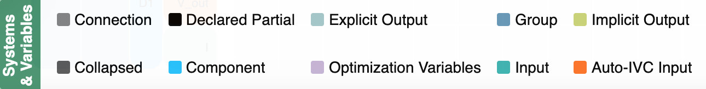

.. _n2_details:

**************************************
Details of the N2 Model Visualizations
**************************************

The N2 diagram has a number of sections:

* Model hierarchy
* Connection matrix
* Solver structure
* Toolbar
* Search bar
* Legend

This page will go into the details of each section.

Just like in the :ref:`N2 Basics<n2_basics>` section of this documentation, we will use the
circuit model that is missing a connection as our example code.

.. embed-code::
    ../test_suite/scripts/circuit_with_unconnected_input.py

Here is the N2 diagram that is generated from this model.
There are three parts to the N2 diagram. The model hierarchy is on the left, the connection matrix is displayed
in the center, and the solver structure is shown on the right.

.. raw:: html
    :file: examples/n2_circuit_with_unconnected_input.html

Model Hierarchy
---------------

The model hierarchy is on the left side of the diagram. It is actually a mix of Systems and variables, both
inputs and outputs.

The top System, the root of the model, is on the left and the subsystem hierarchy is displayed to right.

The colors indicate the type of
item in the hierarchy. To see what the colors represent, an optional legend can be displayed using the |show_legend| button.
Here is the part of the legend that explains the colors of the model hierarchy.

You can click in the model hierarchy to collapse and uncollapse sections of the hierarchy. Left clicking on a
subsystem zooms the hierarchy display to just that subsystem in the hierarchy. Right clicking on a subsystem collapses all of the
hierarchy to the right of it.

Connection Matrix
-----------------
The matrix in the middle of the diagram shows what items in the model are connected.

The color of an item on a diagonal cell matches the color of the rightmost element in model hierarchy. The colors
for the off-diagonal items, which indicate connections, are always black.

The symbol of an item in the connection matrix indicates whether the variable is a scalar, vector, or collapsed variable.

.. image::
    images/connection_matrix_legend.png

Black boxes outline items in the matrix to show the grouping of the variables of the lowest level components.

When you hover over a connection in the matrix, arrows are drawn to indicate connections. The behavior is different
depending on whether you hover over a diagonal or an off-diagonal cell.

When hovering over a diagonal item, the explicit connections to/from that variable are displayed. Red arrows indicate
that element is the target of the connection. A green arrow indicates it is the source.

When hovering over a off-diagonal, the behavior differs depending on whether the cell is in the lower or upper
triangular part of the diagram.

In the lower triangular, the marked cells represent upstream (in the sense of execution order of the
components) connections. All the connections involved in that cycle
are drawn to indicate which systems and components are involved in the convergence loop. Downstream connection arrows
are green and upstream connections are red.

In the upper triangular, the marked cells represent downstream connections. The red arrow that is drawn shows
that connection.

Clicking in the matrix on a connection or diagonal, lets us pin connections arrows so that they don't
disappear when you hover away from the cell. You can clear these connections arrows by using the Clear Arrows and
Connections button |clear_conn_arrows| in the toolbar.

Solver Structure
----------------
Each System in a model can potentially have a linear and non-linear model associated with it. On the right side
of the N2 diagram, the hierarchy of the solvers is shown. This time the hierarchy goes from right to left with the root
of the model on the right.
You can switch between showing the linear or non-linear
solvers using the button |toggle_solver_names| in the toolbar at the top.

The colors indicate the type of solver. The colors are shown in the Legend. The section of the legend showing
the colors of the solver types changes depending on which are displayed in the solver structure.
Here is what section of the legend looks like for both linear and nonlinear solvers.

.. |nonlinear_solvers_legend| image:: images/nonlinear_solvers_legend.png
   :align: top

.. |linear_solvers_legend| image:: images/linear_solvers_legend.png
   :align: top

|linear_solvers_legend|    |nonlinear_solvers_legend|

Toolbar
-------

The tool bar above the N2 diagram provides many useful capabilites.

Zoomed Element
**************
The model hierarchy display has the notion of a `view`. The `view` is defined by the node in the hierarchy
that is visible in the diagram. Initially, it is the root of the model but if you click on a subsystem, then
only the part of the hierarchy beginning at that subsystem is shown.

You can change the view and zoom into a System by clicking on it. Other parts of the hierarchy are no longer
visible.

The diagram keeps track of the view history and then lets us go back and forth through the history similar to undo and
redo in apps.

The buttons in the first group of the toolbar control the view.

.. |return_to_root| image:: images/home.png
   :align: middle
   :scale: 60 %

.. |back| image:: images/arrow-left.png
   :align: middle
   :scale: 60 %

.. |forward| image:: images/arrow-right.png
   :align: middle
   :scale: 60 %

.. |up_one_level| image:: images/arrow-up.png
   :align: middle
   :scale: 60 %

+---------------------+-----------------+----------------------------------------------------------------------+
| Button              | Title           | Description                                                          |
+=====================+=================+======================================================================+
| |return_to_root|    | Return to Root  | Make the view the entire model, starting from the root               |
+---------------------+-----------------+----------------------------------------------------------------------+
| |back|              | Back            | Move back in the view history                                        |
+---------------------+-----------------+----------------------------------------------------------------------+
| |forward|           | Forward         | Move forward in the view history                                     |
+---------------------+-----------------+----------------------------------------------------------------------+
| |up_one_level|      | Up One Level    | Move the view up one level in the hierarchy                          |
+---------------------+-----------------+----------------------------------------------------------------------+

Collapsing Variables
********************

The next set of buttons lets you control the collapsing of elements from the right side of the hierarchy.

.. |uncollapse_view| image:: images/resize-full.png
   :align: middle
   :scale: 40 %

.. |uncollapse_all| image:: images/expand.png
   :align: middle
   :scale: 60 %

.. |collapse_view| image:: images/resize-small.png
   :align: middle
   :scale: 40 %

.. |collapse_all| image:: images/compress.png
   :align: middle
   :scale: 60 %

.. |collapse_depth| image:: images/sort-numeric-asc.png
   :align: middle
   :scale: 60 %

+---------------------+----------------------------------------+------------------------------------------------------------------+
| Button              | Title                                  | Description                                                      |
+=====================+========================================+==================================================================+
| |uncollapse_view|   | Uncollapse in View Only                | Uncollapse only the variables that are in the current view       |
+---------------------+----------------------------------------+------------------------------------------------------------------+
| |uncollapse_all|    | Uncollapse All                         | Uncollapse all the variables in the entire model                 |
+---------------------+----------------------------------------+------------------------------------------------------------------+
| |collapse_view|     | Collapse Variables in View Only        | Collapse only the variables in the current view                  |
+---------------------+----------------------------------------+------------------------------------------------------------------+
| |collapse_all|      | Collapse All Variables                 | Collapse all the variables in the entire model                   |
+---------------------+----------------------------------------+------------------------------------------------------------------+
| |collapse_depth|    | Collapse Depth                         | Sets the number of hierarchy levels shown in the view            |
+---------------------+----------------------------------------+------------------------------------------------------------------+

Remaining Toolbar Buttons
*************************

The buttons in the remaining part of the toolbar offer a variety of other options:

.. |clear_conn_arrows| image:: images/eraser.png
   :align: middle
   :scale: 60 %

.. |show_path| image:: images/terminal.png
   :align: middle
   :scale: 60 %

.. |show_legend| image:: images/map-signs.png
   :align: middle
   :scale: 60 %

.. |toggle_inputs| image:: images/exchange.png
   :align: middle
   :scale: 60 %

.. |toggle_solver_names| image:: images/minus.png
   :align: middle
   :scale: 60 %

.. |font_size| image:: images/text-height.png
   :align: middle
   :scale: 60 %

.. |model_height| image:: images/resize-vertical.png
   :align: middle
   :scale: 60 %

.. |save_svg| image:: images/floppy-o.png
   :align: middle
   :scale: 60 %

.. |help| image:: images/question.png
   :align: middle
   :scale: 60 %

+-----------------------+---------------------------------+-------------------------------------------------------------------+
| Button                | Title                           | Description                                                       |
+=======================+=================================+===================================================================+
| |clear_conn_arrows|   | Clear Arrows and Connections    | Remove the arrows and connections displayed                       |
+-----------------------+---------------------------------+-------------------------------------------------------------------+
| |show_path|           | Show Path                       | Show the full path to the System at the top of the view           |
+-----------------------+---------------------------------+-------------------------------------------------------------------+
| |show_legend|         | Show Legend                     | Show the legend explaining the colors and icons in the diagram    |
+-----------------------+---------------------------------+-------------------------------------------------------------------+
| |toggle_inputs|       | Toggle Inputs                   | Toggle between hiding and showing the inputs                      |
+-----------------------+---------------------------------+-------------------------------------------------------------------+
| |toggle_solver_names| | Toggle Solver Names             | Toggle between showing linear and nonlinear solvers               |
+-----------------------+---------------------------------+-------------------------------------------------------------------+
| |font_size|           | Font Size                       | Set the font size for the text in the diagram                     |
+-----------------------+---------------------------------+-------------------------------------------------------------------+
| |model_height|        | Model Height                    | Set the pixel height of the diagram. Default is 600 pixels        |
+-----------------------+---------------------------------+-------------------------------------------------------------------+
| |save_svg|            | Save SVG                        | Save the current view of the diagram to an SVG file               |
+-----------------------+---------------------------------+-------------------------------------------------------------------+
| |help|                | Help                            | Sets the number of hierarchy levels shown in the view             |
+-----------------------+---------------------------------+-------------------------------------------------------------------+

Search bar
----------

.. |search| image:: images/search.png
   :align: middle
   :scale: 60 %

The search bar below the Toolbar lets us search for variables in the model. This can be very useful when working
with very large models.

When you enter a variable name into the search box and click the search button |search| or hit the Enter key, the N2
diagram will redraw such that it collapses and shows only variables that were searched for.

A search could find multiple instances of variables with the same name. For example, in the diagram above,
a search for `V_in` would find `R1.V_in`, `R2.V_in`, and `D1.V_in`.

To return to a view that is not filtered by the variable search, clear the search box and hit the Enter key or the
Search button.

Legend
------

If you click on the legend button |show_legend|, you will see the legend appear below the N2 diagram. Here are explanations of
the sections in the legend:

    * The System & Variables column shows the colors for the different items in the model hierarchy.

    * The N^2 Symbols column shows the icons used to indicate the type of connection in the connection matrix.
      The shape of the
      icon in the matrix shows whether the connection is between scalars, vectors, or groups. The color of the icon is based
      on the color associated with the variable of that type as shown in the System & Variables part of the legend.

    * Finally, there is a column describing the colors for the items in the solver hierarchy on the right of the
      diagram. The colors indicate
      the type of solver, either linear or nonlinear, depending what is being displayed.

