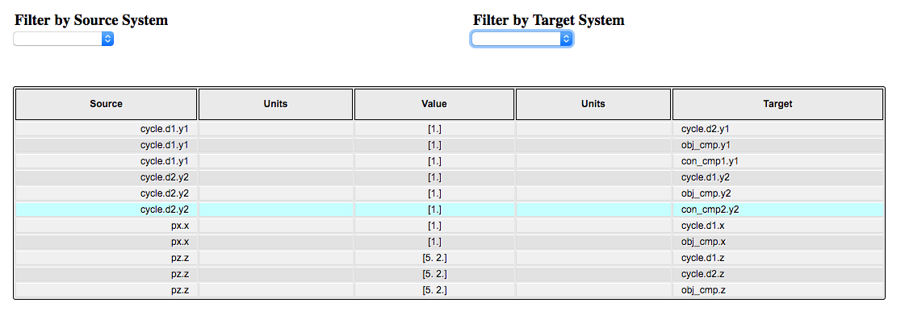

.. _view_connections:

***************************
View Connections of a Model
***************************

View Connections from Command Line
##################################

The :code:`openmdao view_connections` command generates a table of connection information for all input and
output variables in the model.  This is documented on :ref:`openmdao view_connections <om-command-view_connections>`.

View Connections from Script
############################

You can also generate a display of model connections from within a script by calling the function :code:`view_connections`.

.. autofunction:: openmdao.visualization.connection_viewer.viewconns.view_connections
   :noindex:

Here is an example of how this function can be used.

.. embed-code::
    openmdao.visualization.connection_viewer.tests.test_viewconns.TestSellarFeature.test_feature_sellar
    :layout: interleave

In this example, an HTML file named `sellar_connections.html` is created. This file can then be opened using using your
browser. The page will look like this.

   An example of a connection viewer.

Each column in the table can be sorted by clicking on the column header, and filtered by typing
text into the 'filter column' field.  The column will be filtered by doing a case insenstive
substring match of the text in the field.  By default, the promoted input and output name columns
are shown and the absolute name columns are hidden, but toggle buttons at the bottom of the
table allow any column to be shown or hidden.

