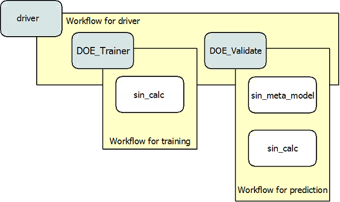

.. index:: single-output metamodel

.. _`Using-a-MetaModel-Component`:

Using a MetaModel Component
===========================

This tutorial is a demonstration of how to construct a MetaModel of a component using a
Kriging surrogate. Generally, MetaModel capabilities are used to construct a
low computational cost replacement for an expensive component. (A more detailed description of
this class can be found under the source documentation for :ref:`MetaModel`.)

For this example, a component was written for the ``sine`` function. This component
has only one input and one output, which will be mimicked by the MetaModel. Had
there been additional variables, access to those would also be available
through the MetaModel.

.. testcode:: MetaModel_parts

    import sys
    from math import sin

    from openmdao.lib.casehandlers.api import DBCaseRecorder
    from openmdao.lib.components.api import MetaModel
    from openmdao.lib.doegenerators.api import FullFactorial, Uniform
    from openmdao.lib.drivers.api import DOEdriver
    from openmdao.lib.surrogatemodels.api import FloatKrigingSurrogate
    from openmdao.main.api import Assembly, Component, set_as_top
    from openmdao.main.datatypes.api import Float
    from openmdao.main.sequentialflow import SequentialWorkflow

    class Sin(Component):
        ''' Simple sine calculation. '''

        x = Float(0.0, iotype="in", units="rad")

        f_x = Float(0.0, iotype="out")

        def execute(self):
            self.f_x = .5*sin(self.x)

To create a MetaModel, we first define an assembly to work in. After we have
created an assembly, the MetaModel component needs to be instantiated. In
this example, the MetaModel was instantiated as ``sin_meta_model``, making it
easy to identify. The inputs to a metamodel are called params, and the
outputs are called responses. When you instantiate a metamodel, you give it a
tuple of params and a tuple of responses that you want it to model.

The next step is to fill the ``default_surrogate`` Slot. In this case we set
it to KrigingSurrogate, meaning that all outputs will be modeled with Kriging
surrogate models, unless otherwise specified. Specific surrogate models can
be specified for specific output variables. We cover that in the next
tutorial.

.. testcode:: MetaModel_parts

    class Simulation(Assembly):
        ''' Top level assembly for MetaModel of a sine component using a
        Kriging surrogate.'''

        def configure(self):

            # Our component to be meta-modeled
            self.add("sin_calc", Sin())

            # Create meta_model for f_x as the response
            self.add("sin_meta_model", MetaModel(params = ('x', ),
                                                 responses = ('f_x', )))

            # Use Kriging for the f_x output
            self.sin_meta_model.default_surrogate = FloatKrigingSurrogate()

Once the `model` and ``default_surrogate`` Slots of the MetaModel have been
filled, the MetaModel is ready for training. To do so, we need to feed it
training data. When you create a MetaModel instance, a selection of input and
output variables are created based on the names you gave it in the params and
responses tuples. These variables allow you to operate the metamodel in
*training* and *prediction*. So, for sin_calc, the metamodel created the
inputs``params.sin_calc.x`` and ``responses.sin_calc.f_x`` which we need to
connect to a source of the training data.

 .. testcode:: MetaModel_parts
    :hide:

    self = set_as_top(Simulation())

.. testcode:: MetaModel_parts

            # Training the MetaModel
            self.add("DOE_Trainer", DOEdriver())
            self.DOE_Trainer.DOEgenerator = FullFactorial()
            self.DOE_Trainer.DOEgenerator.num_levels = 25
            self.DOE_Trainer.add_parameter("sin_calc.x", low=0, high=20)
            self.DOE_Trainer.add_response('sin_calc.f_x')

            # Pass training data to the meta model.
            self.connect('DOE_Trainer.case_inputs.sin_calc.x', 'sin_meta_model.params.x')
            self.connect('DOE_Trainer.case_outputs.sin_calc.f_x', 'sin_meta_model.responses.f_x')

In this case, we're going to train with a DOEdriver, called ``DOE_Trainer``.
We specify a FullFactorial DOEgenerator, which creates a set of evenly spaced
points across an interval. We (somewhat arbitrarily) selected 25 points for our training
set, specified by ``num_levels`` under the DOEgenerator. The proper training set, is of course,
highly problem dependent. The training interval is based on the low and high values
specified in the ``add_parameter`` call.

The first time a MetaModel runs, it trains using the data in the params and
responses variable trees, and then predicts a new response. Thereafter, it
always predicts. The outputs generated by the training run are stored in the
DOE generator in it's ``case_inputs`` and ``case_outputs`` trees..

After you train a MetaModel, you want to do something with it. Here, we just run a simple validation
with another DOEDriver called ``DOE_Validate``. This time, the Uniform DOEGenerator was used. This
provides a random sampling of points from within the range of input variables.  Twenty
validation points are being used in this particular case.

Here, we add a new instance of the sine component called ``sin_calc``,
so we can calculate an actual and a predicted value simultaneously.

.. testcode:: MetaModel_parts

        # Cross-validate the metamodel using random data
        self.add("DOE_Validate", DOEdriver())
        self.DOE_Validate.workflow = SequentialWorkflow()
        self.DOE_Validate.DOEgenerator = Uniform()
        self.DOE_Validate.DOEgenerator.num_samples = 100
        self.DOE_Validate.add_parameter(("sin_meta_model.x", "sin_calc.x"),
                                        low=0, high=20)
        self.DOE_Validate.add_response("sin_calc.f_x")
        self.DOE_Validate.add_response("sin_meta_model.f_x")

        #Iteration Hierarchy
        self.driver.workflow.add(['DOE_Trainer', 'DOE_Validate'])
        self.DOE_Trainer.workflow.add('sin_calc')
        self.DOE_Validate.workflow.add(['sin_calc', 'sin_meta_model'])

Now, the outputs of the MetaModel will be the predicted values as determined by the surrogate
model.

The last thing we do is specify the workflows which control the
execution order of this example. Remember that the top driver in any assembly must be called
`driver`.  The type of workflow being executed is a sequential workflow,
meaning that is a simple sequence of components.

The following figure visually shows the iteration hierarchy for this
MetaModel. Note that ``sin_calc`` appears in two workflows. This is necessary
since in the training workflow it is executed to generate the data that the
metamodel needs for training, and within the prediction workflow, it is run
again for validation with the prediction inputs. Thus it must be added to
each workflow separately.

.. _`nn_metamodel iteration hierarchy`:

   View of the Iteration Hierarchy

Finally, the first two lines of the following code are required to actually
run the MetaModel. The remaining code is for accessing and printing the data.
Using the data stored in the DOE generators, we can access and print the run
data.

.. testcode:: MetaModel_parts

    if __name__ == "__main__":

        sim = Simulation()
        sim.run()

        #This is how you can access any of the data
        train_inputs = sim.DOE_Trainer.case_inputs.sin_calc.x
        train_actual = sim.DOE_Trainer.case_outputs.sin_calc.f_x
        inputs = sim.DOE_Validate.case_inputs.sin_meta_model.x
        actual = sim.DOE_Validate.case_outputs.sin_calc.f_x
        predicted = sim.DOE_Validate.case_outputs.sin_meta_model.f_x

        if '--noplot' not in sys.argv:
            import pylab as p

            p.scatter(train_inputs, train_actual, c='g', label="training data")
            p.scatter(inputs, predicted, c='b', label="predicted result")
            p.legend()
            p.show()

        for a,p in zip(actual, predicted):
            print "%1.3f, %1.3f"%(a,p)

To view this example, and try running and modifying the code for yourself, you can download it here:
:download:`krig_sin.py </../examples/openmdao.examples.metamodel_tutorial/openmdao/examples/metamodel_tutorial/krig_sin.py>`.
