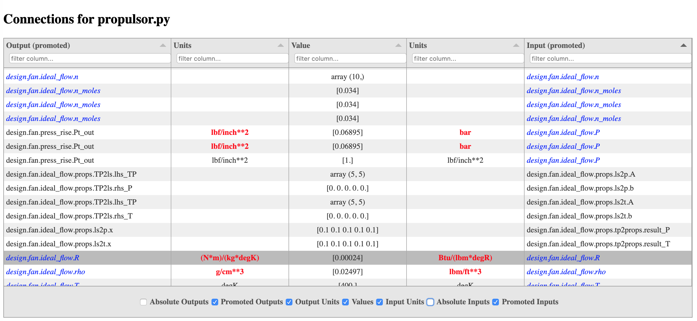

.. _om-command:

******************
Command Line Tools
******************

OpenMDAO has a number of debugging/viewing command line tools that are available via the `openmdao`
command.  There are two types of commands available, those that perform some sort of viewing or
configuration checking on the Problem after its setup is complete, and those that are used to
collect information about the entire run of the Problem, things like profilers and tracers.

.. note::
    The `openmdao` sub-commands, as well as any other console scripts associated with OpenMDAO, will
    only be available if you have installed OpenMDAO using *pip*. See :ref:`Getting Started <GettingStarted>`

All available :code:`openmdao` sub-commands can be shown using the following command:

.. embed-shell-cmd::
    :cmd: openmdao -h

All sub-commands are shown under 'positional arguments'.  To get further info on any sub-command,
for example, for :code:`tree`, follow the command with a *-h*.  For example:

.. embed-shell-cmd::
    :cmd: openmdao tree -h

.. note::
    Several of the example commands below make use of a file :code:`circuit.py`. This file is located in the
    openmdao/test_suite/scripts directory.

Post-setup Commands
-------------------

The following commands all register a function that will run at the end of a Problem's
:code:`final_setup` function.  After the registered function completes, the program will exit, rather than
continuing to the end of the user's run script. This makes it convenient to view or check the
configuration of a model in any run script without having to wait around for the entire script
to run.

.. _om-command-check:

openmdao check
##############

The :code:`openmdao check` command will perform a number of checks on a model and display
errors, warnings, or informational messages describing what it finds. Some of the available
checks are *unconnected_inputs*, which lists any input variables that are not connected, and
*out_of_order*, which displays any systems that are being executed out-of-order.
You can supply individual checks on the command line using *-c* args.  For example:

.. embed-shell-cmd::
    :cmd: openmdao check -c cycles circuit.py
    :dir: ../test_suite/scripts

Otherwise, a set of default checks will be done.
To see lists of the available and default checks, run the following command:

.. embed-shell-cmd::
    :cmd: openmdao check -h

.. _om-command-n2:

openmdao n2
###################

The :code:`openmdao n2` command will generate an :math:`N^2` diagram of the model that is
viewable in a browser, for example:

.. code-block:: none

    openmdao n2 circuit.py

will generate an :math:`N^2` diagram like the one below.

.. embed-n2::
    ../test_suite/scripts/circuit.py

.. _om-command-view_connections:

openmdao view_connections
#########################

The :code:`openmdao view_connections` command generates a table of connection information for all input and
output variables in the model.  It's primary purpose is to help debug a model by making the following
things easier:

    - Identifying unconnected inputs
    - Highlighting unit conversions or missing units
    - Identifying missing or unwanted implicit connections

The table can be sorted by any column by clicking on the
column header, and a column can be filtered by typing text into the 'filter column' field found
at the top of each column.  Also, any column can be shown or hidden using the toggle buttons at
the bottom of the table.  When input and output units differ, they are highlighted in
red.  In the promoted input and output columns, variables that are promoted at some level in
the model are shown in blue, while variables that are never promoted are shown in black.

Below is an example of a connection viewer for a pycycle propulsor model obtained using the command:

.. code-block:: none

    openmdao view_connections propulsor.py

   An example of a connection viewer.

By default the promoted names columns of both inputs and outputs are shown, but in the example
above, the absolute input names are shown and the promoted input names are hidden.

Unconnected inputs can easily be identified by typing 'NO CONNECTION' or 'NO ', into
the filter field of either the absolute or promoted output column.  Unconnected outputs can
be shown similarly by typing 'NO CONNECTION' or 'NO ' into the filter field of either the absolute
or promoted input column.

When showing promoted output and promoted input columns, if the promoted output name equals the
promoted input name, that means the the connection is an implicit connection.  Otherwise the
connection is explicit, meaning somewhere in the model there is an explicit call to `connect`
that producted the connection.

In OpenMDAO, multiple inputs can be promoted to the same name, and by sorting the promoted inputs
column, all such inputs will be grouped together.  This can make it much easier to spot either
missing or unwanted implicit connections.

.. _om-command-tree:

openmdao tree
#############

The :code:`openmdao tree` command prints an indented list of all systems in the model tree.  Each system's
type and name are shown, along with size of their inputs and outputs, and their linear and nonlinear solvers if
they differ from the defaults, which are LinearRunOnce and NonlinearRunOnce respectively.
If the `-c` option is used, the tree will print in color if the terminal supports it and
the *colorama* package is installed. If colors are used, implicit and explicit components will be
displayed using different colors.

The tree command also allows specific attributes and/or vector variables to be printed out along with their
corresponding system in the tree.

Here's an example of the tree output for a simple circuit model:

.. embed-shell-cmd::
    :cmd: openmdao tree circuit.py
    :dir: ../test_suite/scripts

.. _om-command-summary:

openmdao summary
################

The :code:`openmdao summary` command prints a high level summary of the model.  For example:

.. embed-shell-cmd::
    :cmd: openmdao summary circuit.py
    :dir: ../test_suite/scripts

.. _om-command-cite:

openmdao cite
#############

The :code:`openmdao cite` command prints citations for any classes in the model that have them.
It supports optional `-c` arguments to allow you to limit displayed citations to
only those belonging to a particular class or group of classes.  By default, all citations for
any class used in the problem will be displayed. For example:

.. embed-shell-cmd::
    :cmd: openmdao cite circuit.py
    :dir: ../test_suite/scripts

Profiling and Tracing Commands
------------------------------

The following commands perform profiling or tracing on a run script, filtering their target
functions based on pre-defined groups of functions that can be displayed using the `-h` command
line option.  For example, here's the usage output for the :code:`openmdao trace` command, which includes
the function groups available at the time of this writing:

.. code-block:: none

    usage: openmdao trace [-h] [-g METHODS] [-v] file

    positional arguments:
      file                  Python file to be traced.

    optional arguments:
      -h, --help            show this help message and exit
      -g METHODS, --group METHODS
                            Determines which group of methods will be traced.
                            Default is "openmdao". Options are: ['dataflow',
                            'linear', 'mpi', 'openmdao', 'openmdao_all', 'setup']
      -v, --verbose         Show function locals and return values.

.. _om-command-iprof:

openmdao iprof
##############

The :code:`openmdao iprof` command will display an icicle plot showing the time elapsed in all of the target
methods corresponding to each object instance that they were called on.  For more details, see
:ref:`Instance-based Profiling <instbasedprofile>`.

.. _om-command-iprof-totals:

openmdao iprof_totals
#####################

The :code:`openmdao iprof_totals` command performs the same profiling as `openmdao iprof`, but it outputs a simple,
text-based summary of the total time spent in each method.  The :ref:`Instance-based Profiling <instbasedprofile>`
section contains more details.

.. _om-command-trace:

openmdao trace
##############

The :code:`openmdao trace` command prints a call trace for a specified set of functions.  Optionally it can
display values of function locals and return values.  For more detail, see
:ref:`Instance-based Call Tracing <instbasedtrace>`.

Memory Profiling
----------------

.. _om-command-mem:

openmdao mem
############

The :code:`openmdao mem` command profiles the memory usage of python functions.  For more detail,
see :ref:`Memory Profiling <instbasedmemory>`.

.. _om-command-mempost:

openmdao mempost
################

The :code:`openmdao mempost` postprocesses the raw memory dump file generated by `openmdao mem`.
For more detail, see :ref:`Memory Profiling <instbasedmemory>`.

Other Commands
--------------

.. _om-command-calltree:

openmdao call_tree
##################

The :code:`openmdao call_tree` command takes the full module path of a class method and displays the
call tree for that method.  It's purpose is to show which class 'owns' the specified method
call and any other 'self.*' methods that it calls.  Note that it shows all of the methods called,
regardless of the result of conditionals within any function, so the displayed tree does not
necessarily represent a trace of the function as it executes.  The functions are ordered top to
bottom as they are encountered in the source code, and a given subfunction is only displayed
once within a given function, even if it is actually called in multiple places within the function.
Here's an example:

.. embed-shell-cmd::
    :cmd: openmdao call_tree openmdao.api.LinearBlockGS.solve

.. _om-command-scaffold:

openmdao scaffold
#################

The :code:`openmdao scaffold` command generates simple scaffolding, or 'skeleton' code for
an explicit or implicit component.  In addition, it will generate the scaffolding for a simple
test file of that component.  The available options are as follows:

.. embed-shell-cmd::
    :cmd: openmdao scaffold -h

This command is only an initial attempt to provide this sort of functionality and any user
feedback describing how to improve it is welcome.

Using Commands under MPI
------------------------

In general, usage of openmdao subcommands under MPI is the same as usual, except the command will
be preceded by `mpirun -n <num_procs>`.  For example:

.. embed-shell-cmd::
    :cmd: mpirun -n 2 openmdao summary multipoint_beam_opt.py
    :dir: ../test_suite/scripts
