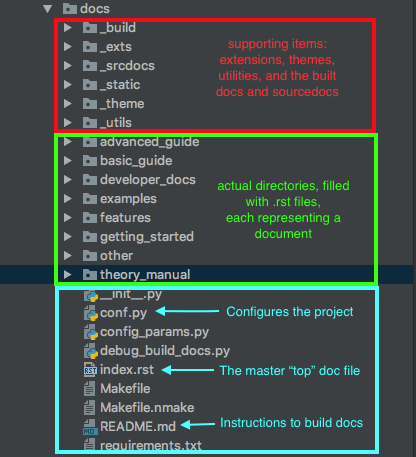

.. _`repository_structure`:

Repository Structure
====================

Sample OpenMDAO-Compatible Repository Template
----------------------------------------------

A lot of small details go into setting up a repository: the code itself, packaging mechanisms, continuous integration
configuration, documentation building, and documentation styling, to name a few. To aid in the setup uof a new tool built
upon OpenMDAO, we have created a Github repository that is a basic template of how to set up your project. It is a small
working example that you can clone and copy to help set up your own repository: `OpenMDAO Library Template <https://github.com/OpenMDAO/library_template>`_

Project Documentation Structure
-------------------------------

First, to make things run smoothly, set up your project structure so that your documentation lies in the top-level project directory
in a directory named `/docs`. For instance, "openmdao/docs" or "openaerostruct/docs".  The reasons for this location:

    #. This is where openmdao's sourcedoc-generating script, `generate_docs` will be looking for docs.
    #. This is where the github-pages publishing package `travis-sphinx` will be looking for docs.

If you must put docs elsewhere for some reason, just be aware that it will require modifications to things in the above list.

Within `/docs`, you will have a lot of important files that will all interact to create your project docs:

    #. A `conf.py` file, that configures your Sphinx documentation completely. To see an example of ours, see :ref:`Setting Up Project Documentation in Sphinx<docs_with_sphinx>`.
    #. An `index.rst` file, that is the top-level document in your entire project.
    #. A `README.md` file, that gives instructions on how to build the docs.
    #. A `Makefile`, that is responsible for the various options for doc building.
    #. Directories of .rst files that will be built.
    #. Directories of supporting modules, (e.g. extensions).

Here's an example of how all those things might look within the context of a
real project, OpenMDAO:

