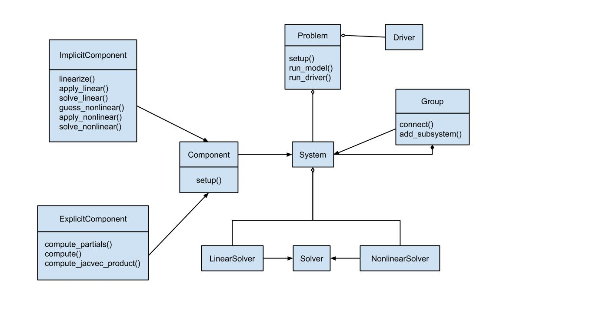

************************
OpenMDAO Class Structure
************************

In the :ref:`Basic User Guide<BasicUserGuide>`, you have seen how to define a problem composed of
a model and a driver. You saw how a model can be built from components of different types and how
a driver is used to perform an optimization. Then in the :ref:`Advanced User Guide<AdvancedUserGuide>`,
you learned about solvers and methods for computing derivatives.

The following diagram shows the relationship between these various object types (classes) and the 
functionality that is assigned to each.

Problem
-------
The Problem class defines a top-level container, holding all other objects. A problem instance
contains the system and its subsystems that constitute the model hierarchy, and also contains a
single driver instance. In addition to serving as a container, the problem also provides the user 
interface for model setup and execution.

System
------
A :code:`System` can be a :code:`Group` or a :code:`Component`.

A :code:`Group` contains components, other groups, or a mix of both. The containment relationships 
between groups and components form a hierarchy tree, where a top-level group contains other groups, 
which  contain other groups, and so on, until we reach the bottom of the tree, which is composed 
only of components. In addition to managing the data dependencies between its subsystems, groups 
serve three purposes: 

#. They help to package sets of components together, e.g., the components for a given discipline.
#. They help create namespaces (since all components and variables are named based on their ancestors
   in the tree). 
#. They facilitate the use of hierarchical nonlinear and linear solvers.

Instances of the :code:`Component` class provide the lowest-level functionality representing basic calculations.
Each component instance maps input values to output values via some calculation. A component instance
must be one of two component types: :code:`ExplicitComponent` or :code:`ImplicitComponent`. The difference
between these component types is explained in the section on :ref:`How OpenMDAO Represents Variables
<building-components>`.

The hierarchy of groups and components collectively form the model.

Solver
------
Every system may contain two solvers: a :code:`NonlinearSolver` and a :code:`LinearSolver`, which share
a common :code:`Solver` base class. Nonlinear solvers are used to converge implicit components or groups
with cycles and linear solvers are used when computing derivatives across the model (see :ref:`Setting
Nonlinear and Linear Solvers <set-solvers>`). Additional details about the different kinds of solvers 
can be found in the :ref:`OpenMDAO Solvers<theory_solver_api>` section.

Driver
------
The :code:`Driver` class defines algorithms that iteratively call the model. There are different types
of drivers, for example one driver might implement an optimization algorithm while another would execute
a design of experiments (DOE). The driver types that are included with OpenMDAO are described in 
:ref:`Drivers`.
