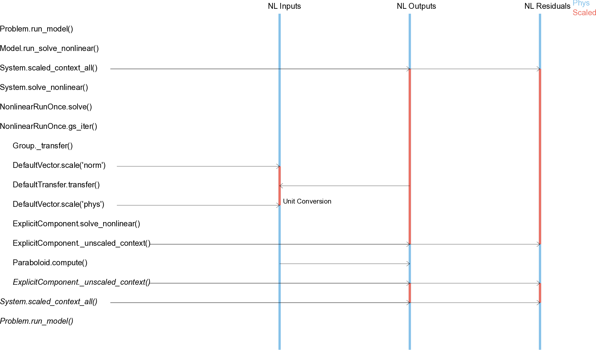
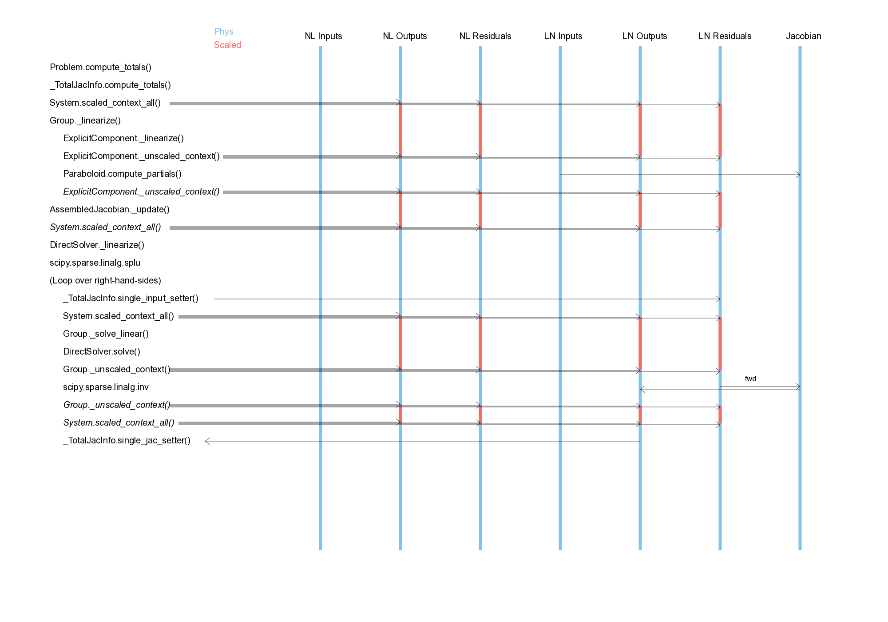
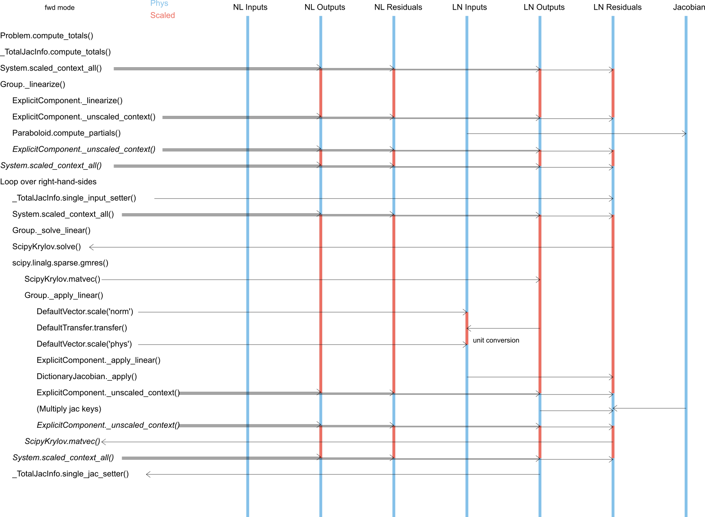

.. _theory_scaling:

*****************************
Scaling Variables in OpenMDAO
*****************************

In the :ref:`section of the documentation that covers scaling variables <scale_outputs_and_resids>`, you learned how you can specify multiplicative and additive scale factors
that are applied to the output and residual variables to aid solver convergence. This theory document shows how that scaling is handled internally.

When OpenMDAO runs a model, all of the numerical data from connections is assembled into a set of vectors called the "inputs" and "outputs"
vectors. When a component calls its "compute" function, it is passed a sub-vector that contains views to just the data relevant to that component.
A similar-sized vector called "residuals" is also created to house implicit and cycle-induced residuals. Each vector can transform all of its data
or a portion of its data into a scaled or unscaled state when requested. Doing so requires multiplication with a vector of scalers and
addition with a vector of adders.  There is a small amount of cost to this, so OpenMDAO tries to scale/unscale only when necessary and only over
as tight a scope as required.

Scaling is used primarily as an aid to solver convergence (both linear and nonlinear). Whenver a user interacts with OpenMDAO, or whenever a component
calls a user-written function like "compute", the vectors will always be in an unscaled state. The following tables summarize this:

**outputs and residuals (linear and nonlinear) are in an unscaled state**

 - Before `run_model` is called
 - After `run_model` is finished
 - During ExplicitComponent API calls to `compute`, `compute_partials`
 - During ImplicitComponent API calls to `apply_nonlinear`, `linearize`
 - During `guess_nonlinear`
 - When a Driver runs the model or computes a total derivative

**outputs and residuals (linear and nonlinear) are in a scaled state**

 - During solver iteration (computing next step, determining convergence)
 - When data is passed from outputs to inputs
 - When OpenMDAO loops over the model hieararchy

The scaling system is also used to handle unit conversion. This proves to be a good fit because every unit in the unit library can be represented
as a multiplication and an addition.  Unit conversion happens upon the passing of data from outputs to inputs. You cannot specify scaling for
inputs, but they are automatically given one that amalgamates the scaling of the connected output with the unit conversion factors. In operation,
the inputs vector is transformed into a scaled state prior to passing the data, and then unscaled afterwards. The unscale transformation removes
the output scaling and applies the conversion between output and input units.

Note that OpenMDAO also supports another independent scaling that is used by many drivers. These are specified when calling "add_design_var",
"add_constraint", or "add_objective", and are only seen by drivers. They have no impact on and no interaction with the vector scaling described
in this theory document.

Scenarios: run_model
---------------------

This sequence diagram shows the simplest possible operation -- executing a single explicit component with an input that comes from an IndepVarComp
and solved using the RunOnce solver.  It shows how the outputs and residuals vectors are placed into an unscaled state right before compute is
called on the `Paraboloid`. You can also see where unit conversion takes places during data passing.

Scenarios: computing total derivatives with a DirectSolver
----------------------------------------------------------

This sequence diagram shows computation of derivatives using a DirectSolver for the same model as above, so now we also include the linear vectors
which are used in the computation of derivatives. We also include the Jacobian, which is never scaled. There are two phases here during which the vectors
are converted to a scaled state for the overall operation, and then unscaled for user calls.

The first phase is linearize, where compute_partials is called on the Paraboloid. During this phase, the entire jacobian is assembled from the component
subjacobians. Note that, while for a single iteration it might seem like a waste to scale at the start of the linearization, keep in mind that linearize
normally occurs immediately after execution, so the model is already in a scaled state.

The second phase loops over the right hand sides and performs the LU solve. This essentially takes the contents of the linear residuals (or outputs in "rev" mode)
and multiplies with the inverse jacobian, placing the results in the linear outputs (or residuals in "rev" mode).  This operation is always done with
the vectors unscaled. You might ask why we don't just scale the jacobian, but that would involve n**2 multiplications compared to 2*n so for any problem
larger than a few variables, it is considerably more efficient to just scale the vectors as needed.

Scenarios: computing total derivatives with ScipyKrylov
-------------------------------------------------------

This sequence shows computation of derivatives with a Krylov iterative solver rather than a direct solver. Aside from the additional looping, the main
difference is that unit conversion of the derivatives are also handled by unscaling the linear inputs vector when it is passed rather than being baked in
to the assembled jacobian.

