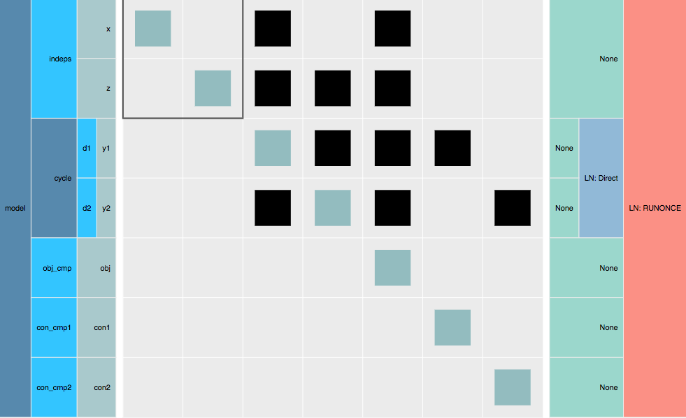

.. _theory_assembled_vs_matrix_free:

**************************************************************************
Selecting Linear Solver Architecture: Dense, Sparse, or Matrix Free
**************************************************************************

Broadly speaking, there are two classes of linear solver architecture:

  * Assembled Jacobian
  * Matrix-free

At any level of the hierarchy in an OpenMDAO model you have the options of choosing between these two options.
Simple models will often just use one linear solver architecture at the top of the model hierarchy.
More complex models, might use both architectures at different parts of the hierarchy.
At any level of the hierarchy, you can look at the aspects of the components contained within that group in order to
figure out what kind of linear solver structure is needed.

----------------------------
Assembled-Jacobian Problems
----------------------------
Using an assembled Jacobian means that OpenMDAO will explicitly allocate the memory for the entire Jacobian matrix up front, and then hold onto that and re-use it throughout the run.
This has several computational advantages, but the major one is that it helps to reduce framework overhead for models with deep model hierarchies and large numbers of variables.

You should strongly using an assembled Jacobian if all the components in your model provide derivatives using the :ref:`compute_partials <comp-type-2-explicitcomp>` or :ref:`linearize <comp-type-3-implicitcomp>` methods.
These methods are explicitly computing the elements of that Jacobian matrix, and so it makes sense to collect them into an actual matrix memory representation.

Additionally, if your model has a very large hierarchy (i.e. many levels, many components, many variables) then an assembled Jacobian will likely offer significant performance advantage.
The reason is without the assembled Jacobian, then OpenMDAO must recursively loop over each level of the hierarchy, each component, and each variable in order to compute Jacobian-vector products.
That triple for-loop is rather expensive, and its much more efficient to collect the Jacobian a single chunk of memory if possible.
So even if you are using an iterative linear solver, such as :ref:`ScipyKrylov<scipyiterativesolver>` or :ref:`PetscKrylov<petscKrylov>`

.. note::
    If you want to see how to add an assembled Jacobian to your model, check out :ref:`this feature doc <feature_assembled_jacobian>`.

Sparse Assembled Jacobian
--------------------------
In the majority of cases, if an assmbled Jacobian is appropriate for your model then you want to use the :ref:`CSCJacobian<openmdao.jacobians.assembled_jacobian.py>`.
The :ref:`CSCJacobian<openmdao.jacobians.assembled_jacobian.py>` only allocates memory for the non-zero partial derivatives.
How does OpenMDAO know which partials are non-zero?
The authors of the components in your model declared them using either a :ref:`dense<feature_specify_partials>` or :ref:`sparse<feature_sparse_partials>` form of :code:`delcare_partials`.

Even if all of your components declared their partial derivatives as dense (or if they are all scalar variables and specifying sparsity doesn't have meaning), at the group level there is still a sparsity pattern to be taken advantage of.
This sparsity arises from the way components are connected to one and other, because unless there is a connection present there is no need to allocate space associated with that portion of the Jacobian.
We can see this clearly by looking at a collapsed form of the N2 diagram with just the outputs shown.
There are 7 scalar outputs, so we have a :math:`7 \times 7` partial derivative Jacobian.
Out of the possible 49 matrix entries, only 18 are actually non-zero.
That makes it 37% sparse.
Sellar is only a tiny toy problem, but a real problem with 1000's of variables you will more commonly see sparsities in the single digits.

    The partial derivative Jacobian for the Sellar problem has only 18 non-zero values in it. It is 37% sparse.

Dense Assembled Jacobian
-------------------------
A :ref:`DenseJacobian<openmdao.jacobians.assembled_jacobian.py>` allocates a dense :math:`n \times n` matrix, where :math:`n` is the sum of the sizes of all output variables in your model, to store partial derivatives in.
So if you had a model that had 3 outputs of length 1000 each, then :math:`n=3000` and a :ref:`DenseJacobian<openmdao.jacobians.assembled_jacobian.py>` would allocate a :math:`3000 \times 3000` matrix.

Then whenever the Jacobian is needed, this dense matrix is provided.
If you chose to use the :ref:`DirectSolver`, then it will use scipy's `lu_factor`_  and `lu_solve`_  methods to solve linear system for total derivatives.

If you have a very heavily interconnected model, where many components connect to many others then a :ref:`DenseJacobian<openmdao.jacobians.assembled_jacobian.py>` makes sense.
However, the reality is that most models are very sparse at the group level even if the individual sub-Jacobians of the components are quite dense.
So while there are some problems where it is appropriate, in most situations you don't want to use the :ref:`DenseJacobian<openmdao.jacobians.assembled_jacobian.py>`.

.. _lu_factor: https://docs.scipy.org/doc/scipy/reference/generated/scipy.linalg.lu_factor.html
.. _lu_solve: https://docs.scipy.org/doc/scipy/reference/generated/scipy.linalg.lu_solve.html#scipy.linalg.lu_solve

---------------------
Matrix-Free Problems
---------------------

OpenMDAO is capable of solving linear systems in a matrix-free manner, to support situations where the Jacobian is too big to be fit into memory or when its just too inefficient to do so.

Practically speaking, if any components in your model use the :ref:`compute_jacvec_product<comp-type-2-explicitcomp>` or `apply_linear<comp-type-3-implicitcomp>` to provide derivatives then you should be using a matrix-free linear solver architecture. These two methods provide linear operators that take in a vector and output the effect of multiplying it by a matrix. However, the underlying implementation does not actually need to assemble any matrices.

Some high-fidelity PDE solvers will provide this kind of interface to get access to their partial derivatives.
The kind of linear operator is also what is generally provided by algorithmic differentiations packages.

Essentially, when you have problems with components that have very large array outputs (i.e. array lengths in the millions) and which run distributed across many cores then a matrix-free linear solver architecture is something you want to consider.

.. ----------------
.. Mixed problems
.. ----------------
