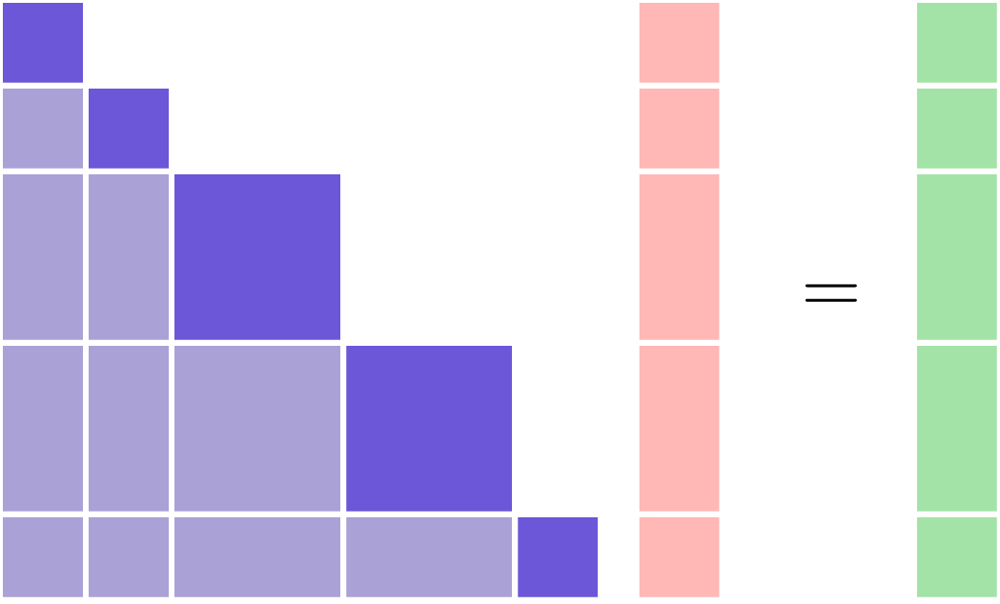
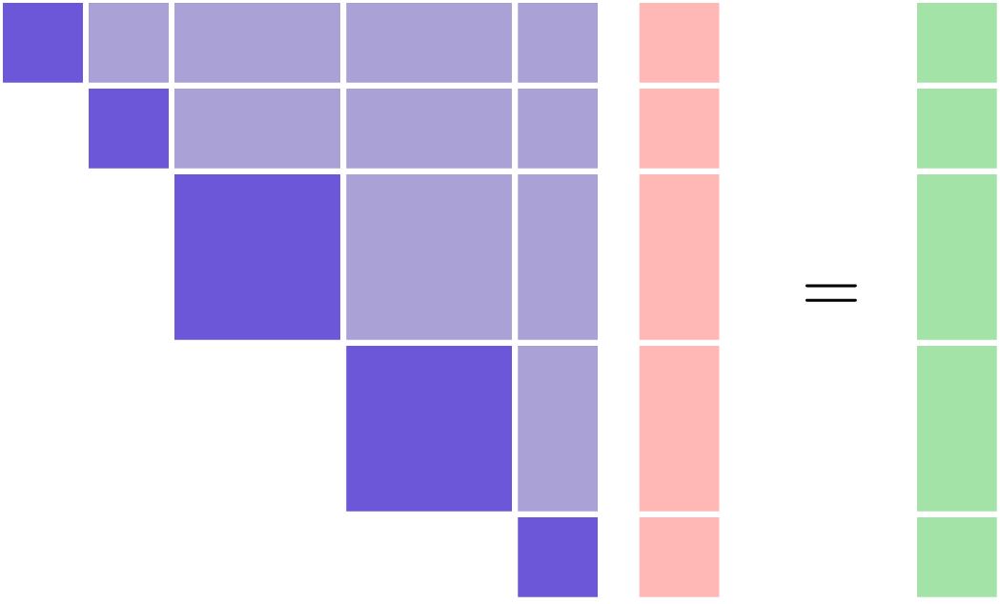
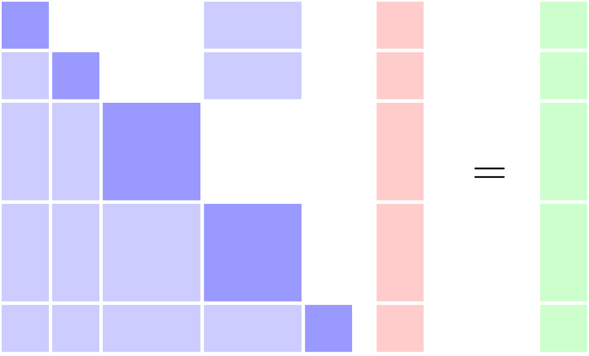

.. _theory_selecting_linear_solver:

*********************************************
Determining What Kind of Linear Solver to Use
*********************************************

Since total derivatives are computed by solving the unified derivatives equations, there is always some kind of linear solver used by the framework whenever :ref:`compute_totals<feature_compute_totals>` is called.
However, the specific type of linear solver that should be used will vary greatly depending on the underlying model structure.
The most basic distinguishing feature of a model that governs what kind of linear solver should be used is the presence of any coupling.

----------------
Uncoupled Models
----------------

If you have a completely uncoupled model, then the partial-derivative Jacobian matrix will have a lower-triangular structure.
The resulting linear system can be solved using a block-forward or block-backward substitution algorithm.
Alternatively you could view the solution algorithm as a single iteration of a block Gauss-Seidel algorithm.
In OpenMDAO, the single-pass block Gauss-Seidel algorithm is implemented via the :ref:`LinearRunOnce<lnrunonce>` solver.
This is the default solver used by OpenMDAO on all :ref:`Groups<feature_grouping_components>`.

    The linear system for an uncoupled system can be solved with forward substitution in forward mode

If you are using *reverse* mode, then the left-hand side of the unified derivatives equations will be the transpose-Jacobian and will have an upper-triangular structure.
The upper-triangular transpose Jacobian structure is notable because it can also be seen in the :ref:`n2 diagram<om-command-view_model>`
that OpenMDAO can produce.

    The linear system for an uncoupled system can be solved with back substitution in reverse mode.

--------------
Coupled Models
--------------

Coupled models will always have a non-triangular structure to their partial-derivative Jacobian.
In other words, there will be non-zero entries both above and below the diagonal.

    The linear solver for a coupled system must be solved using either a direct factorization or an iterative linear solver.

Consequently, these linear systems **cannot** be solved with the :ref:`LinearRunOnce<lnrunonce>`.
There are two basic categories of linear solver that can be used in this situation:

    #. direct solvers (e.g. :ref:`DirectSolver<directsolver>`)
    #. iterative solvers (e.g. :ref:`LinearBlockGS<linearblockgs>`, :ref:`ScipyKrylov<scipyiterativesolver>`)

Direct solvers make use of a the Jacobian matrix, assembled in memory, in order to compute an inverse or a factorization that can be used to solve the linear system.
Conversely, iterative linear solvers find the solution to the linear system without ever needing to access the Jacobian matrix directly.
They search for solution vectors that drive the linear residual to 0 using only matrix-vector products.
The key idea is that **some** kind of linear solver is needed when there is coupling in your model.

Which type of solver is best for your model use is heavily case-dependent and sometimes can be a difficult question to answer absolutely.
However, there are a few rules of thumb that can be used to guide most cases:

    #. direct solvers are very simple to use and for smaller problems is likely to be the best option.
    The only downside is that the cost of computing the factorization scales with :math:`n^3` where :math:`n` is the length of your variable vector and so the compute cost can get out of control.
    If :math:`n` < 2000 try this solver first.
    #. iterative solvers are more difficult to use because they do not always succeed in finding a good solution to the linear problem.
    Often times they require preconditioners in order to be effective.
    However, with adequate preconditioning iterative solvers can dramatically outperform direct solvers for even moderate sized problems.
    The trade off you make is computational speed for complexity in getting the solver to work.
    Iterative solvers can also offer significant memory savings, since there isn't a need to allocate one large matrix for all the partials.

.. note::

    There is an analogy between linear and non-linear solvers.
    Any coupling in your model will affect both the linear and non-linear solves,
    and thus impact which type of linear and non-linear solvers you use.

    In the most basic case, an uncoupled model will use the default :ref:`NonLinearRunOnce <nlrunonce>` and the :ref:`LinearRunOnce<lnrunonce>` solvers.
    These *RunOnce* solvers are a special degenerate class of solver, which can't handle any kind of coupling or implicitness in a model.
    Any model with coupling will require an iterative nonlinear solver.
    Any model that requires an iterative nonlinear solver will also need a
    linear solver other than the default :ref:`LinearRunOnce<lnrunonce>` solver.

