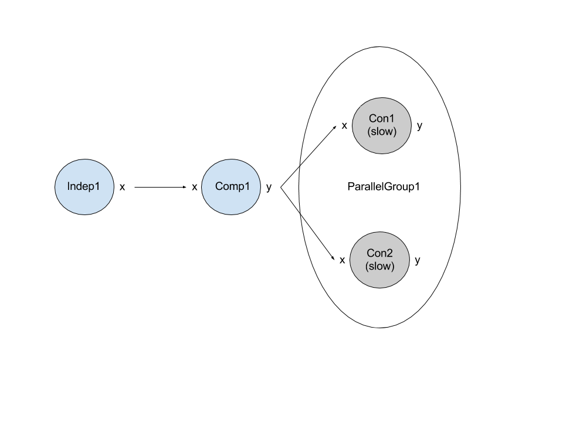
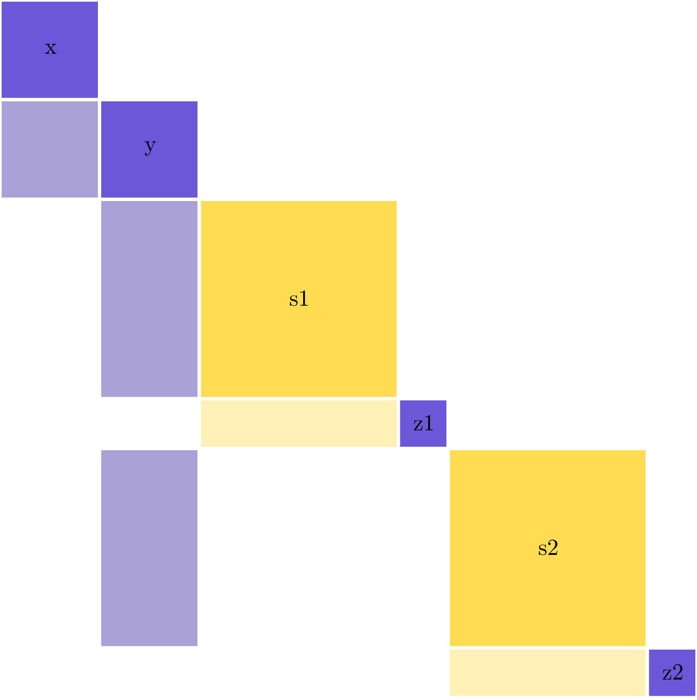
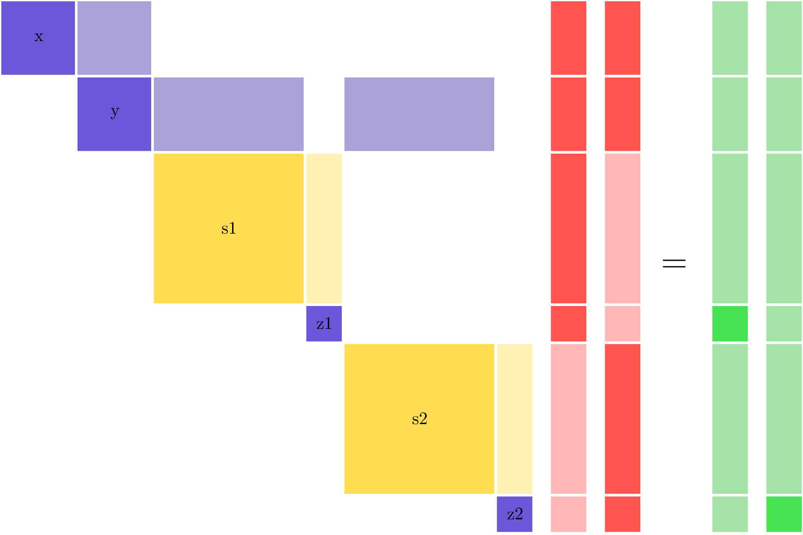
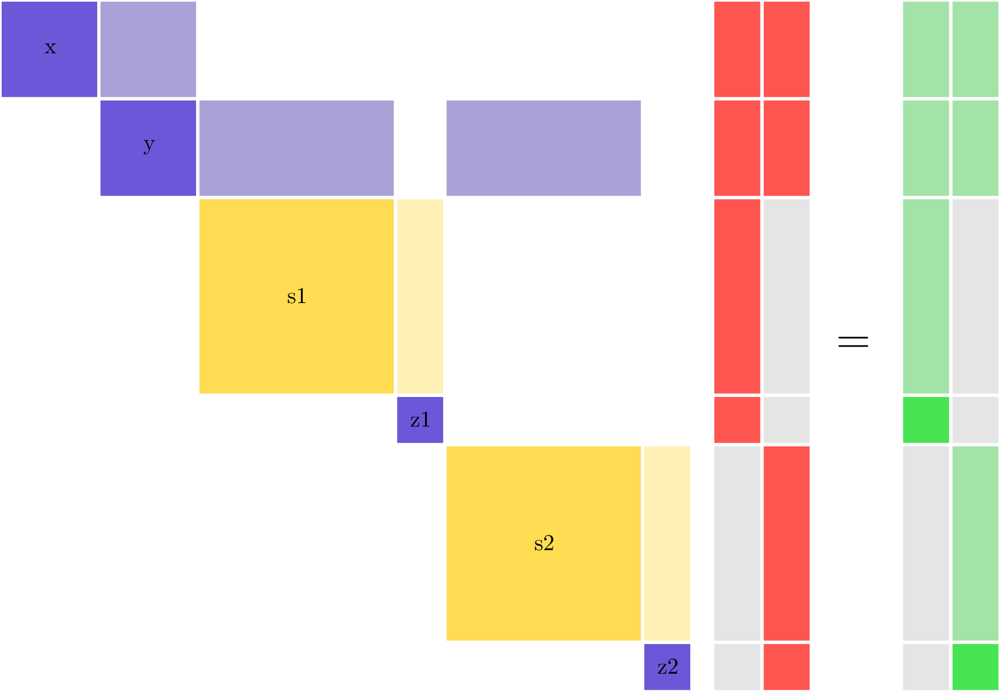

.. _theory_fan_out:

***************************************************************************
Parallelizing Derivative Solves of Multipoint Models At a Small Memory Cost
***************************************************************************

A fan-out structure in a model is when you have a data path through the model that starts out serial and then reaches a point where multiple components can be run in parallel.
This model structure is common in engineering problems, particularly in multi-point problems where you want to evaluate the performance of a given system at multiple operating conditions during a single analysis.

For example, consider a simple example problem as follows:

   A very simple model with a fan-out structure.

Assume that the variables :code:`x` and :code:`y` are size 100 array variables computed by inexpensive components.
These are upstream of the expensive implicit analyses (e.g. some kind of PDE solver) computing the very large
implicit variables :code:`s1` and :code:`s2` (noted in yellow similar to the coloring in an N2 diagram).
Lastly there are two scalar variables :code:`z1` and :code:`z2`, computed using the converged values for :code:`s1` and :code:`s2`.

The components that compute :code:`s1,z1` and :code:`s2,z2` have no dependence on each other so we put them into a :ref:`parallel group<feature_parallel_group>` and each group can run on its own processor (or set of processors).
The upstream components that compute :code:`x` and :code:`y` are a serial bottleneck, but they are very inexpensive compared to the expensive components in the parallel group.
So we can expect to get reasonable parallel scaling when running the nonlinear analysis a model set up like this.

This potential for parallelization can also be seen by looking at the partial-derivative Jacobian structure of this example model.
The dense column for :code:`y` means that you must compute it before you can compute :code:`s1,z1` and :code:`s2,z2`.
However, the block-diagonal structure for :code:`s1,z1` and :code:`s2,z2` means that these parts of the model can be run in parallel.

If we want to compute the derivatives :math:`\frac{dz1}{dx}` and :math:`\frac{dz2}{dx}`, then reverse mode is preferred because it requires 2 linear solves instead of 100, but there is an inherent inefficiency that will limit the parallel scalability of reverse mode that needs to be considered as well.
Given the feed-forward structure of this model, the :ref:`LinearRunOnce<lnrunonce>` solver is recommended, which will use a back-substitution-style algorithm to solve for total derivatives in reverse mode.
Looking at the linear system needed to solve in reverse mode, we see that the dense column for :code:`y` in the partial derivative Jacobian has now become a dense row ---in reverse mode you use :math:`\left[ \frac{\partial R}{\partial U} \right]^T` --- and because we're using back-propagation, that dense row now occurs *after* the two parallel constraints in the execution order (remember that order is reversed from the forward pass).
You can see that in each of the two solution vectors, the entries for :code:`y` and :code:`x` are highlighted as nonzero, and hence they would overlap if you tried to perform both linear solves at the same time.

Recall that in the non-linear analysis, moving forward through the model, you could run both the expensive analyses in parallel, and not being able to do the same thing in reverse represents a significant parallel inefficiency.
When solving for derivatives of :code:`z1`, the :code:`z2` components won't have any work to do and will idle.
Similarly the :code:`z1` components won't have any work to do when solving for derivatives of :code:`z2`.
That means that in each linear solve half of the computational resources of the model will be idle.
This is represented visually by the light red sections of the vector, representing known zero entries in the vector.
In general, if you had n different :code:`z` variables, then only :math:`1/n` of the total compute resource would be active for any one linear solve.

So despite having good parallel scaling for the nonlinear analysis (moving forward through the model), in reverse mode the parallel scaling is essentially non-existent.

.. note::

    This kind of parallel scaling limitation is unique to reverse mode. If :code:`z1` and :code:`z2` were very large vectors, and :code:`x` was smaller vector, then we could use forward mode for the total derivative calculations, and both :code:`z1` and :code:`z2` would have work to do for every single solve.

Approach for Computing Parallel Derivatives in Multipoint Models
-------------------------------------------------------------------

Keeping in mind that we've stipulated that computations for :code:`x` and :code:`y` are inexpensive, the existing parallel resources of the model can be leveraged to enable parallel calculation of derivatives for both :code:`z1` and :code:`z2`.

The fundamental problem is that both :code:`z1` and :code:`z2` need to back-propagate through :code:`y` and :code:`x` in order to compute derivatives, so parallelizing the two solves would result in the two back-propagations interfering with each other.
However, we already have two processors (one for :code:`s1,z1` and one for :code:`s2,z2`), so we can duplicate :code:`y` and :code:`x` on each processor and then handle the back-propagation for each of the two linear solves on separate processors.
At the end of that back-propagation, each processor will now have the correct derivative for one of the constraints, and the derivative values need to be all-gathered before they can be used.

This duplication will come with a small additional memory cost, because space for :code:`x,y` must now be allocated in the linear vectors on all processors.
As long as the  :code:`s1,z1` and :code:`s2,z1` variables are much larger, this additional memory cost is negligible.

When using this parallelization algorithm, there are still :math:`n` linear solves, for :math:`n` variables, but now all of them can be run in parallel to gain back the scaling that is inherently present in the forward mode for this model structure.
The linear solves now look like this:

Here, each of the two vectors is being solved for on a different processor.
The grayed-out blocks represent memory that is **not** allocated on that processor.

Coloring Variables for Parallel Derivatives
-------------------------------------------

In the above example, there was only a single set of variables computed in parallel.
Even if the model was larger and ran with :math:`n` points across :math:`n` processors, all the :math:`z` variables could be combined into a single parallel derivative solve.
In a parallel coloring sense, all the :math:`z` variables belong to the same color.

Consider a slightly more complex problem where each point outputs two different variables: :math:`a` and :math:`b`.
Using standard reverse mode, for :math:`n` points there would need to be :math:`2n` linear solves to compute all the derivatives.
Just like before, parallel derivatives are needed to maintain the parallel scaling of the model in reverse mode.
However, unlike the earlier problem, there would now need to be two different colors: one for all the :math:`a` variables and one for all the :math:`b` variables.

.. figure:: matrix_figs/parallel_adj_2color.png
   :align: center
   :width: 75%
   :alt: Jacobian structure for fan-out model with 2 colors using parallel adjoint

.. note::

    Parallel derivative coloring is distinct from :ref:`simultaneous derivative coloring<theory_separable_variables>`.
    In the parallel coloring, you are specifying variables for which distinct linear solves can be performed in parallel on different processors.
    In simultaneous coloring you are specifying sets of variables that can be combined into a single linear solve.

.. Demonstration of the Parallel Speed-up
.. --------------------------------------

.. How to use it
.. --------------

