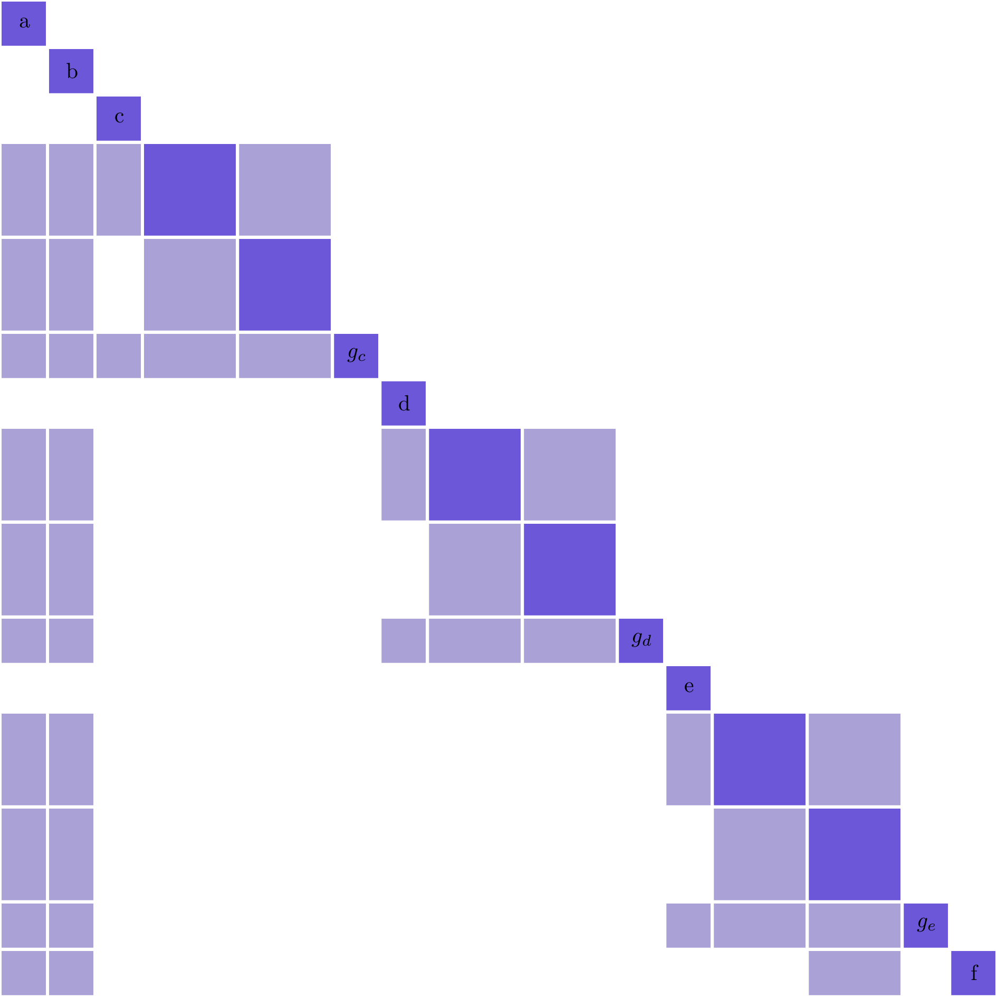
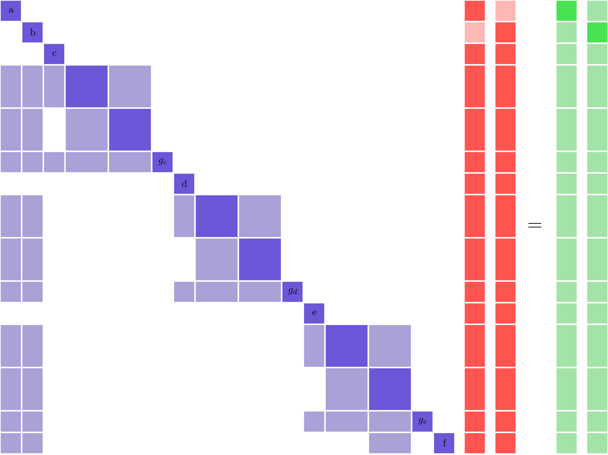
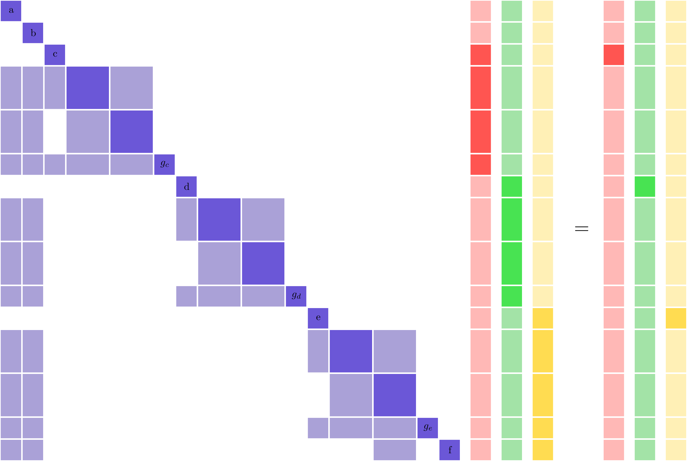
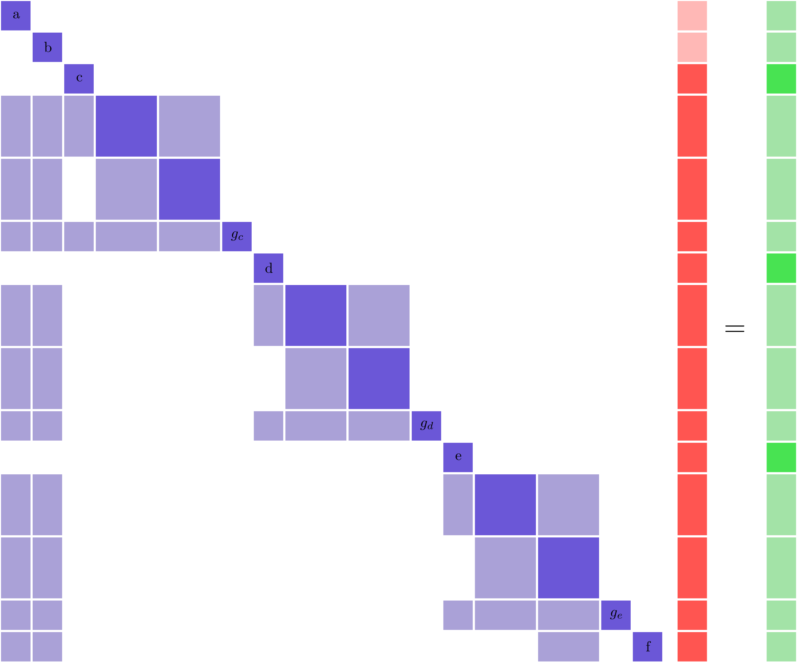

.. _theory_separable_variables:

****************************************************************************************
Solving for Multiple Derivatives Simultaneously for Separable Constraints
****************************************************************************************

A set of constraints are separable when there are subsets of the design variables that don't affect any of the responses.
In other words, there is some subset of columns of the **total derivative Jacobian** where none of those columns have nonzero values in any of the same rows.
This kind of sparsity structure in the total derivative Jacobian allows OpenMDAO to solve for compute multiple total derivatives simultaneously, which can dramatically reduce the cost of computing total derivatives.
Remember that OpenMDAO solves the :ref:`unified derivative equations<theory_total_derivatives>` to compute total derivatives

.. math::

    \left[\frac{\partial \mathcal{R}}{\partial U}\right] \left[\frac{du}{dr}\right] = \left[ I \right] = \left[\frac{\partial \mathcal{R}}{\partial U}\right]^T \left[\frac{du}{dr}\right]^T .

When separable constraints are present multiple right hand sides from :math:`\left[ I \right]` can be combined into a single right hand side vector and then total derivatives for multiple variables can be computed with a single linear solve.
Normally, summing multiple right hand side vectors would result in the solution vector holding linear combinations of multiple derivatives:

.. math::

  \begin{gather}
  \frac{du_0}{dr_0} + \frac{du_0}{dr_2} + \cdots + \frac{du_0}{dr_n}\\
  \vdots \\
  \frac{du_m}{dr_0} + \frac{du_m}{dr_2} + \cdots + \frac{du_m}{dr_n}\\
  \end{gather}

However, because the problem is separable we know that :math:`\frac{dy_i}{dx_j}=0` for all :math:`i \ne j` for seperable variables.
So it is safe to do all the linear solves at the same time.

.. note::

  Most optimization problems don't display this kind of separability because all (or at least most) of the design variables effect the objective function.
  This means that there is a dense row in the total derivative Jacobian which means the problem is not separable in forward mode.
  Similarly if you are using reverse mode any input that affects all the outputs creates dense column (which would become a dense row in the transpose of the total derivative Jacobian), will also prevent a separable problem structure.

A Simple Example
------------------

Consider a notional optimization problem with 5 design variables (:math:`a, b, c, d, e`), one objective (:math:`f`), and three constraints (:math:`g_c, g_d, g_e`).
Normally with 5 design variables and 4 responses --- 3 constraints + 1 objective --- you would choose to use reverse mode since that would yield a lower number of linear solves.
However, if the problem had the following partial derivative Jacobian structure then it would be separable in forward mode and we'll show that because of that forward mode is the preferred method.

The two dense columns corresponding to :math:`a, b` mean that all of the outputs depend on these variables and they must each get their own linear solves in forward mode.

Normally, each of the remaining variables (:math:`c, d, e`) would also need their own linear solves, as shown below.
In this figure, the known non-zero values in the solution vector are noted by the darker red.
Notice how the three separate vectors have no overlapping non-zero values anywhere.

Those three solution vectors are non-overlapping because the three associated variables are separable.
The forward separable structure shows up clearly in the partial derivative Jacobian because it has been ordered to expose a block diagonal structure.
This allows us to collapse all three linear solves into a single simultaneous one:

So using forward simultaneous derivatives reduces the required number of solves from 5 to 3 (2 for :math:`a, b` and 1 for :math:`c, d, e`).
Hence, it would be faster to solve for total derivatives using forward mode with simultaneous derivatives than reverse mode.

Determining if Your Problem is Separable
------------------------------------------------

The simple example above was contrived to make it relatively obvious that the problem was separable.
For realistic problems even if you know that the problem should be separable, computing the actual input/output sets can be challenging.
You can think of the total derivative Jacobian as a graph with nodes representing each variable and non-zero entries representing edges connecting the nodes.
Then the task of finding the separable variables can be performed using a graph coloring algorithm.
In that case, a set of separable variables are said to have the same color.
The simple example problem would then have three colors; one each for :math:`a` and :math:`b` and one more for :math:`c,d,e`.

Of course, in order to use a graph coloring algorithm you need to first have the total derivative Jacobian.
OpenMDAO can compute that for you, but there is one potential pitfall that needs to be accounted for.
For any arbitrary point in the design space there is a chance that some total derivatives will turn out to be zero, but could be non-zero at other locations.
An incidental zero would mean a missing edge in the graph and could potentially deliver an incorrect coloring.

However, in general OpenMDAO knows the partial derivative sparsity of a model because the :ref:`non-zero partials are specified<feature_sparse_partials>` by each component in its setup method.
So we need to compute the sparsity pattern of the total Jacobian, given the sparsity pattern of the partial Jacobian, in a way that reduces the impact of incidental zero values.

OpenMDAO accomplishes this by setting random numbers into the non-zero entries of the partial derivative matrix, and then computing total derivatives using that random left hand side for the linear system.
Using random values reduces the likelyhood that an incidental non-zero will show up in the Jacobian, and that chance can be further reduced by computing the total derivative Jacobian multiple times with different random left hand sides.

Hence the cost of the coloring algorithm is roughly equivalent to the cost of several computations of the complete total derivative Jacobian.
If the model is intended to be used in an optimization context, then it is fair to assume that these computations are inexpensive enough to be performed several times for the coloring.
If the problem structure stays fixed, the coloring only needs to be computed once.

.. Relevance to Finite Difference and Complex Step
.. --------------------------------------------------
.. It is worth noting that, in addition to speeding up linear solutions for the unified derivative equations, forward separability also offers benefits when finite difference or complex step are being used to compute derivatives numerically.
.. For the same reasons that multiple linear solves can be combined, you can also take steps in multiple variables to compute derivatives with respect to multiple variables at the same time.

How to actually use it!
-------------------------
OpenMDAO provides a mechanism for you to specify a coloring to take advantage of separability, via the
:ref:`set_simul_deriv_color<feature_simul_coloring>` method.
OpenMDAO also provides a :ref:`coloring tool<feature_automatic_coloring>` to determine the minimum number of colors your problem can be reduced to.

You can also see an example of setting up an optimization with
simultaneous derivatives in the :ref:`Simple Optimization using Simultaneous Derivatives <simul_deriv_example>`
example.