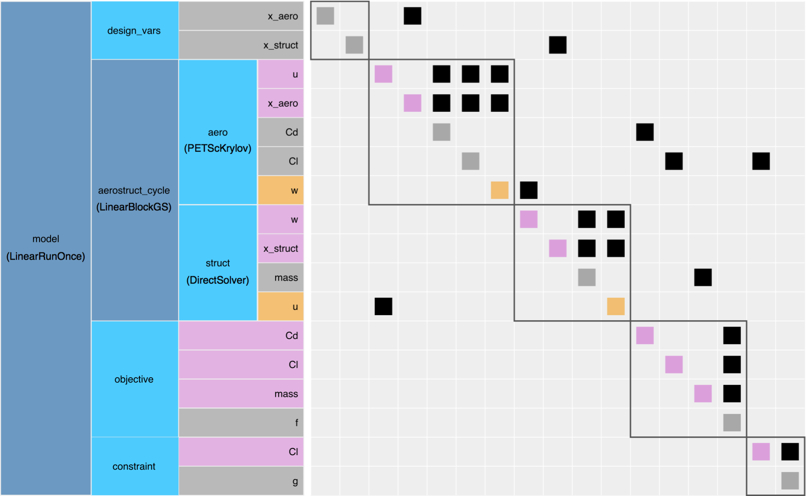

.. _theory_total_derivatives_solver_setup:

----------------------------------------------
Setting Up a Model for Efficient Linear Solves
----------------------------------------------

There are a number of different features that you can use to control how the linear solves are performed that will have an impact on both the speed and accuracy of the linear solution.
A deeper understanding of how OpenMDAO solves the unified derivatives equations is useful in understanding when to apply certain features, and may also help you structure your model to make the most effective use of these features.
The explanation of OpenMDAO's features for improving linear solver performance are broken up into three sections below:

.. _theory_selecting_linear_solver:

*********************************************
Determining What Kind of Linear Solver to Use
*********************************************

Since total derivatives are computed by solving the unified derivatives equations, there is always some kind of linear solver used by the framework whenever :ref:`compute_totals<feature_compute_totals>` is called.
However, the specific type of linear solver that should be used will vary greatly depending on the underlying model structure.
The most basic distinguishing feature of a model that governs what kind of linear solver should be used is the presence of any coupling.

Uncoupled Models
----------------

If you have a completely uncoupled model, then the partial-derivative Jacobian matrix will have a lower-triangular structure.
The resulting linear system can be solved using a block-forward or block-backward substitution algorithm.
Alternatively you could view the solution algorithm as a single iteration of a block Gauss-Seidel algorithm.
In OpenMDAO, the single-pass block Gauss-Seidel algorithm is implemented via the :ref:`LinearRunOnce<lnrunonce>` solver.
This is the default solver used by OpenMDAO on all :ref:`Groups<feature_grouping_components>`.

.. figure:: matrix_figs/uncoupled_fwd.png
    :align: center
    :width: 50%

    The linear system for an uncoupled system can be solved with forward substitution in forward mode

If you are using *reverse* mode, then the left-hand side of the unified derivatives equations will be the transpose-Jacobian and will have an upper-triangular structure.
The upper-triangular transpose-Jacobian structure is notable, because it can also be seen in the :ref:`n2 diagram<om-command-view_model>`
that OpenMDAO can produce.

.. figure:: matrix_figs/uncoupled_rev.png
    :align: center
    :width: 50%

    The linear system for an uncoupled system can be solved with back substitution in reverse mode.

Coupled Models
--------------

Coupled models will always have a non-triangular structure to their partial-derivative Jacobian.
In other words, there will be nonzero entries both above and below the diagonal.

.. figure:: matrix_figs/coupled_fwd.png
    :align: center
    :width: 50%

    The linear system of a coupled model must be solved using either a direct factorization or an iterative linear solver.

Consequently, these linear systems **cannot** be solved with the :ref:`LinearRunOnce<lnrunonce>`.
There are two basic categories of linear solver that can be used in this situation:

    #. direct solvers (e.g. :ref:`DirectSolver<directsolver>`)
    #. iterative solvers (e.g. :ref:`LinearBlockGS<linearblockgs>`, :ref:`ScipyKrylov<scipyiterativesolver>`)

Direct solvers make use of the Jacobian matrix, assembled in memory, in order to compute an inverse or a factorization that can be used to solve the linear system.
Conversely, iterative linear solvers find the solution to the linear system without ever needing to access the Jacobian matrix directly.
They search for solution vectors that drive the linear residual to 0 using only matrix-vector products.
The key idea is that **some** kind of linear solver is needed when there is coupling in your model.

Which type of solver is best for your model use is heavily case-dependent and sometimes can be a difficult question to answer absolutely.
However, there are a few rules of thumb that can be used to guide most cases:

    #. Direct solvers are very simple to use, and for smaller problems, are likely to be the best option. The only downside is that the cost of computing the factorization scales is :math:`n^3`, where :math:`n` is the length of your variable vector, so the compute cost can get out of control. If :math:`n` < 2000, try this solver first.
    #. Iterative solvers are more difficult to use because they do not always succeed in finding a good solution to the linear problem. Often times they require preconditioners in order to be effective. However, with adequate preconditioning, iterative solvers can dramatically outperform direct solvers for even moderate-sized problems. The trade-off you make is computational speed for complexity in getting the solver to work. Iterative solvers can also offer significant memory savings, since there isn't a need to allocate one large matrix for all the partials.

.. note::

    There is a relationship between linear and non-linear solvers.
    Any coupling in your model will affect both the linear and non-linear solves,
    and thus impact which type of linear and non-linear solvers you use.

    In the most basic case, an uncoupled model will use the default :ref:`NonLinearRunOnce <nlrunonce>` and the :ref:`LinearRunOnce<lnrunonce>` solvers.
    These *RunOnce* solvers are a special degenerate class of Solver, which can't handle any kind of coupling or implicitness in a model.
    Any model with coupling will require an iterative nonlinear solver.
    Any model that requires an iterative nonlinear solver will also need a
    linear solver other than the default :ref:`LinearRunOnce<lnrunonce>` solver.

.. _theory_assembled_vs_matrix_free:

*******************************************************************
Selecting Linear Solver Architecture: Dense, Sparse, or Matrix-Free
*******************************************************************

Broadly speaking, there are two classes of linear solver architecture:

  * Assembled Jacobian
  * Matrix-free

At any level of the hierarchy in an OpenMDAO model, you have the option of choosing between these two options.
Simple models will often just use one linear solver architecture at the top of the model hierarchy.
More complex models might use both architectures at different parts of the hierarchy.
At any level of the hierarchy, you can look at the aspects of the components contained within that group in order to
figure out what kind of linear solver structure is needed.

Assembled-Jacobian Problems
---------------------------

Using an assembled Jacobian means that OpenMDAO will explicitly allocate the memory for the entire
Jacobian matrix up front, and then hold onto that and re-use it throughout the run.
This has several computational advantages, but the major one is that it helps to reduce framework
overhead for models with deep system hierarchies and large numbers of variables.

You should strongly consider using an assembled Jacobian if all the components in your model provide
derivatives using the :ref:`compute_partials <comp-type-2-explicitcomp>` or
:ref:`linearize <comp-type-3-implicitcomp>` methods.
These methods are explicitly computing the elements of that Jacobian matrix, and so it makes sense
to collect them into an actual matrix memory representation.

Additionally, if your model has a very large hierarchy (i.e. many levels, many components,
many variables) then an assembled Jacobian will likely offer a significant performance advantage.
The reason that large models benefit is that without the assembled Jacobian, OpenMDAO must
recursively loop over each level of the hierarchy, each component, and each variable in order to
compute Jacobian-vector products.
That triple for-loop is rather expensive, and it's much more efficient to collect the Jacobian in a
single chunk of memory if possible.
So even if you are using an iterative linear solver, such as :ref:`ScipyKrylov<scipyiterativesolver>`
or :ref:`PetscKrylov<petscKrylov>`, an assembled Jacobian is generally more efficient.

.. note::
    If you want to see how to add an assembled Jacobian to your model, check out
    :ref:`this feature doc <feature_assembled_jacobian>`.

Sparse Assembled Jacobian
*************************

In the majority of cases, if an assembled Jacobian is appropriate for your model, then you want to
use the :ref:`CSCJacobian<openmdao.jacobians.assembled_jacobian.py>`.
The :ref:`CSCJacobian<openmdao.jacobians.assembled_jacobian.py>` only allocates memory for the
nonzero partial derivatives.
How does OpenMDAO know which partials are nonzero?
The authors of the components in your model declared them using either a
:ref:`dense<feature_specify_partials>` or :ref:`sparse<feature_sparse_partials>` form of :code:`declare_partials`.

Even if all of your components declared their partial derivatives as dense (or if they are all
scalar variables and specifying sparsity doesn't have meaning), at the group level there is still a
sparsity pattern to be taken advantage of.
This sparsity arises from the way components are connected to one another, because unless there is
a connection present, there is no need to allocate space associated with that portion of the Jacobian.
We can see this clearly by looking at a collapsed form of the :math:`N^2` diagram with just the outputs shown.
There are 7 scalar outputs, so we have a :math:`7 \times 7` partial derivative Jacobian.
Out of the possible 49 matrix entries, only 18 are actually nonzero. That makes it 63% sparse. Sellar is only a
tiny toy problem, but in a real problem with thousands of variables, you will more commonly see sparsity percentages
of over 90%.

.. figure:: sellar_n2_outputs_only.png
    :align: center
    :width: 75%

    The partial-derivative Jacobian for the Sellar problem has only 18 nonzero values in it. Only 37% of the matrix elements are nonzero.

If you chose to use the :ref:`DirectSolver`, then it will use scipy's sparse `splu`_  method to solve linear system for total derivatives.

Dense Assembled Jacobian
************************

A :ref:`DenseJacobian<openmdao.jacobians.assembled_jacobian.py>` allocates a dense
:math:`n \times n` matrix, where :math:`n` is the sum of the sizes of all output variables in your
model, to store partial derivatives in.
So if you had a model that had 3 outputs of length 1000 each, then :math:`n=3000` and a
:ref:`DenseJacobian<openmdao.jacobians.assembled_jacobian.py>` would allocate a :math:`3000 \times 3000` matrix.

Then whenever the Jacobian is needed, this dense matrix is provided.
If you chose to use the :ref:`DirectSolver`, then it will use scipy's `lu_factor`_  and `lu_solve`_
methods to solve linear system for total derivatives.

If you have a very heavily-interconnected model, where many components connect to many others, then a
:ref:`DenseJacobian<openmdao.jacobians.assembled_jacobian.py>` makes sense.
However, the reality is that most models are very sparse at the group level even if the individual
sub-Jacobians of the components are quite dense.
So while there are some problems where it is appropriate, in most situations you don't want to use
the :ref:`DenseJacobian<openmdao.jacobians.assembled_jacobian.py>`.

.. _lu_factor: https://docs.scipy.org/doc/scipy/reference/generated/scipy.linalg.lu_factor.html
.. _lu_solve: https://docs.scipy.org/doc/scipy/reference/generated/scipy.linalg.lu_solve.html#scipy.linalg.lu_solve
.. _splu: https://docs.scipy.org/doc/scipy-0.14.0/reference/generated/scipy.sparse.linalg.splu.html

********************
Matrix-Free Problems
********************

OpenMDAO is capable of solving linear systems in a matrix-free manner, to support situations where
the Jacobian is too big to be fit into memory or when it's just too inefficient to do so.

Practically speaking, if any components in your model use the :ref:`compute_jacvec_product<comp-type-2-explicitcomp>`
or :ref:`apply_linear<comp-type-3-implicitcomp>` to provide derivatives, then you should be using a
matrix-free linear solver architecture.
These two methods provide linear operators that take in a vector and output the effect of multiplying
it by a matrix. However, the underlying implementation does not actually need to assemble any matrices.

Some high-fidelity PDE solvers will provide this kind of interface to get access to their partial derivatives.
This kind of linear operator is also what is generally provided by algorithmic differentiations packages.

Essentially, when you have problems with components that have very large array outputs (i.e. array
lengths in the millions) and which run distributed across many cores, then a matrix-free linear
solver architecture is something you want to consider.

******************************************************************
Using the Model Hierarchy to Customize the Linear Solver Structure
******************************************************************

In OpenMDAO, your model is constructed via collections of Groups and Components arranged hierarchically.
One of the main purposes of the hierarchy is to provide a means of sub-dividing a large and complex model into parts that can be solved using different methods.
This creates a hierarchical solver architecture that is potentially both more efficient and more effective.
The hierarchical solver architecture can be used for both nonlinear and linear solvers, but this section focuses specifically on the linear solver.

A Very Simple Example
---------------------

Consider, as an example, the :ref:`Sellar Problem<sellar>` from the :ref:`Multidisciplinary Optimization User Guide <user_guide_multi_disciplinary_opt>`.
In that problem, coupling is created by a cyclic connection between the :code:`d1` and :code:`d2` components.
You can see that coupling clearly in the n2 diagram below, because there are off-diagonal terms both above and below the diagonal inside the :code:`cycle` group.

.. embed-code::
    openmdao.test_suite.components.sellar_feature.SellarMDALinearSolver

.. embed-n2::
    ../test_suite/scripts/sellar.py

Since there is coupling in this model, there must also be some linear solver there to deal with it.
One option would be to assign the :ref:`DirectSolver <directsolver>` right at the top level of the model, and have it compute an inverse of the full Jacobian.
While that would certainly work, you're taking an inverse of a larger matrix than you really need to.

Instead, as we've shown in the code above, you can assign the :ref:`DirectSolver <directsolver>` at the :code:`cycle` level instead.
The top level of the hierarchy will then be left with the default :ref:`LinearRunOnce<lnrunonce>` solver in it.
Effectively, the direct solver is being used to compute the coupled semi-total derivatives across the :code:`cycle` group,
which then makes the top level of the model have a feed-forward data path that can be solved with forward or back substitution
(depending whether you select :code:`fwd` or :code:`rev` mode).

To illustrate that visually, you can *right-click* on the cycle group in the n2 diagram above.
This will collapse the cycle group to a single box, and you will see the resulting uncoupled, upper-triangular matrix structure that results.

Practically speaking, for a tiny problem like :ref:`Sellar<sellar>` there won't be any performance difference between putting
the :ref:`DirectSolver <directsolver>` at the top, versus down in the :code:`cycle` group. However, in larger models with hundreds or
thousands of variables, the effect can be much more pronounced (e.g. if you're trying to invert a dense 10000x10000 matrix when
you could be handling only a 10x10).

More importantly, if you have models with high-fidelity codes like CFD or FEA in the hierarchy,
you simply may not be able to use a :ref:`DirectSolver <directsolver>` at the top of the model, but there may still be a
portion of the model where it makes sense. As you can see, understanding how to take advantage of the model hierarchy in
order to customize the linear solver behavior becomes more important as your model complexity increases.

A More Realistic Example
------------------------

Consider an aerostructural model of an aircraft wing comprised of a Computational Fluid Dynamics (CFD) solver, a simple
finite-element beam analysis, with a fuel-burn objective and a :math:`C_l` constraint.

In OpenMDAO the model is set up as follows:

    :math:`N^2` diagram for an aerostructural model with linear solvers noted in :code:`()`.

Note that this model has almost the exact same structure in its :math:`N^2` diagram as the sellar problem.
Specifically the coupling between the aerodynamics and structural analyses can be isolated from the rest of the model.
Those two are grouped together in the :code:`aerostruct_cycle` group, giving the top level of the model a feed-forward structure.
There is a subtle difference though; the Sellar problem is constructed of all explicit components but this aerostructural problem has two implicit analyses in the :code:`aero` and :code:`struct` components.
Practically speaking, the presence of a CFD component means that the model is too big to use a :ref:`DirectSolver <directsolver>` at the top level of its hierarchy.

Instead, based on the advice in the :ref:`Theory Manual entry on selecting which kind of linear solver to use<theory_selecting_linear_solver>`,
the feed-forward structure on the top level indicates that the default :ref:`LinearRunOnce<lnrunonce>` solver is a good choice for that level of the model.

So now the challenge is to select a good linear solver architecture for the :code:`cycle` group.
One possible approach is to use the :ref:`LinearBlockGS<linearblockgs>` solver for the :code:`cycle`,
and then assign additional solvers to the aerodynamics and structural analyses.

.. note::
    Choosing LinearBlockGaussSeidel is analogous to solving the nonlinear system with a NonLinearBlockGaussSeidel solver.

    Despite the analogy, it is not required nor even advised that your linear solver architecture match your nonlinear solver architecture.
    It could very well be a better choice to use the :ref:`PETScKrylov<petscKrylov>` solver for the :code:`cycle` level,
    even if the :ref:`NonlinearBlockGS<nlbgs>` solver was set as the nonlinear solver.

The :ref:`LinearBlockGS<linearblockgs>` solver requires that any implicit components underneath it have their own linear
solvers to converge their part of the overall linear system. So a :ref:`PETScKrylov<petsckrylov>` solver is used for :code:`aero`
and a :ref:`DirectSolver <directsolver>` is use for :code:`struct`. Looking back at the figure above, notice that these solvers
are all called out in their respective hierarchical locations.

