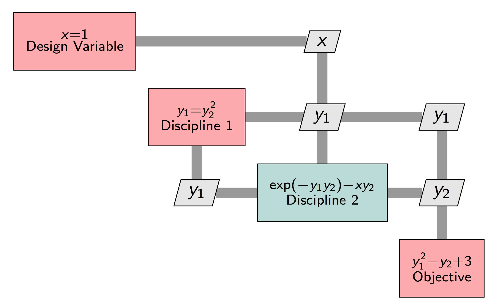

.. _theory_total_derivatives:

**********************************
How Total Derivatives are Computed
**********************************

This is a comprehensive document that explains the various techniques that can be used to compute total derivatives, along with each technique's strengths and weaknesses.
The goal of this document is to help you understand how the underlying methods work, and when they are appropriate to apply to your model.
It is designed to be read in the order it's presented, with later sections assuming understanding of earlier ones.

Partial vs. Total Derivatives
-----------------------------
Before diving into how OpenMDAO solves for total derivatives, it is important that we clearly define a pair of key terms.

    * Partial Derivative: Derivatives of the outputs or residuals of a single component with respect to that component's inputs.
    * Total Derivative: Derivative of an objective or constraint with respect to design variables.

If you are numerically approximating the total derivatives, using finite-difference or complex-step, then you do not need to worry about partial derivatives.
However, analytic-derivative methods achieve better accuracy and lower computational cost by leveraging partial derivatives to compute total derivatives.

Numerical Approximation for Total Derivatives
---------------------------------------------

Numerical approximation of total derivatives involves treating the overall model as a single function and approximating its total derivatives by examining the change in outputs as inputs are varied.
These methods involve taking successive steps in each design variable and then computing derivatives based on changes to the output value.
Generally speaking each design variable must be examined separately, meaning that the computational cost of these approaches scale linearly with the increasing size of the design space.
The primary attraction the numerical approach is that it is relatively simple to implement since no knowledge of the internal workings of the model you are trying to differentiate is required.

The most common numerical approach is to use first-order finite differences to compute the approximations:

.. math::

    \frac{d f}{d x} = \frac{f(x+\Delta x) - f(x)}{\Delta x} + \mathcal{O}(\Delta x)

While this approach is the simplest possible method, it is also the least accurate.
The error of the approximation scales linearly with the step size, :math:`\Delta x`, which encourages the use of very small values for the step size.
However, for very small :math:`\Delta x`, two challenges arise.
First, subtractive cancellation, a problem with floating point arithmetic in computers, fundamentally limits the accuracy of the method for very small steps.
Second, if the model includes nonlinear solvers, then noise in the nonlinear convergence for very small steps also introduces error.

To achieve better accuracy, the `complex-step <http://mdolab.engin.umich.edu/content/complex-step-derivative-approximation-0>`_ method can be used:

.. math::

    \frac{d f}{d x} = \frac{\text{Im}[f(x+ i h)]}{h} + \mathcal{O}(h^2)

This offers second-order convergence with the size of the step in the complex plane :math:`h`, but more importantly, avoids the issue with subtractive cancellation so that :math:`h` can be chosen to be arbitrarily small, and then essentially-perfect accuracy can be achieved.
The improved accuracy does come at the expense of greater computational cost and implementation complexity, however.
In most cases, changes are required to the underlying model, including any nonlinear solvers, to handle the complex arithmetic which is roughly 2.5 times more expensive than basic real arithmetic.

Basic Approach for Analytic Total Derivatives
---------------------------------------------

While the numerical approach to computing total derivatives is conceptually simpler, analytic approaches are more accurate and less computationally expensive.
The analytic approaches all follow a two-step recipe for computing total derivatives.

    #. Directly compute the partial derivatives for each component.
    #. Solve a linear system to compute the total derivatives.

Partial derivatives are simpler and less costly to compute directly, as compared to total derivatives, because in the context of OpenMDAO they only involve a single component and never require re-converging of the nonlinear analysis.
OpenMDAO offers several different ways to compute partial derivatives,
but for now we'll assume that the partials are simply known quantities and focus on how to execute step two of the process above.

Consider a function :math:`f=F(x,y)` where :math:`x` is a design variable vector of length :math:`n` and :math:`y` is an implicit variable vector of length :math:`m`.
Any evaluation of :math:`F` must include the convergence of the nonlinear system :math:`R(x,y)=0`.
We can expand the total derivative as follows:

.. math::
    \frac{d f}{d x} = \frac{\partial F}{\partial x} + \frac{\partial F}{\partial y}\frac{d y}{d x}

:math:`\partial F/\partial x` and :math:`\partial F/\partial y` are partial-derivative terms, which we have assumed are known quantities.
We need a way to compute :math:`d y/d x`, which represents the change in the converged values of :math:`y` for a change in :math:`x`.
There are two methods available to compute this term: direct or adjoint.

Direct Method
*************

The direct method can be derived by recognizing that is always the case that :math:`R(x,y)=0` when the model is converged, and differentiating :math:`R` with respect to :math:`x`:

.. math::
    \frac{d R}{d x} = \frac{\partial R}{\partial x} + \frac{\partial R}{\partial y}\frac{d y}{d x} = 0

Then re-arrange the terms to get:

.. math::
     \frac{\partial R}{\partial y}\frac{d y}{d x} =  - \frac{\partial R}{\partial x},

     \overbrace{\frac{d y}{d x}}^{m \times n} =  \underbrace{-\left[\frac{\partial R}{\partial y}\right]^{-1}}_{m \times m} \overbrace{\frac{\partial R}{\partial x}}^{m \times n}.

Hence, :math:`d y/d x` can be computed by solving the above matrix equation consisting of only partial derivatives.
Noting that :math:`\partial R/\partial x` and :math:`d y/d x` are both matrices of size :math:`m \times n`, we see that the direct method requires us to solve :math:`n` linear systems in order to compute all columns of :math:`d y/d x`.
Noting that :math:`n` is the length of the design vector, :math:`x`, we see that the compute cost of the direct method scales linearly with the number of design variables.

Adjoint Method
**************

The adjoint approach is derived by first substituting the expression for :math:`d y/ d x` back into the original equation for :math:`d f/d x`.

.. math::
    \frac{d f}{d x} = \frac{\partial F}{\partial x} - \underbrace{\overbrace{\frac{\partial F}{\partial y}}^{1 \times m} \overbrace{\left[\frac{\partial R}{\partial y}\right]^{-1}}^{m \times m}}_{ \psi^T }\frac{\partial R}{\partial x}.

By grouping :math:`\partial f/\partial y` and :math:`\left[\partial R / \partial y \right]^{-1}` into a single term we get a :math:`(1 \times m)` row vector.
This row vector, denoted as :math:`\psi^T`, is called the adjoint vector.
As long as :math:`\psi` can be computed efficiently, then the total derivative can be computable as:

.. math::
    \frac{d f}{d x} = \frac{\partial F}{\partial x} - \psi^T \frac{\partial R}{\partial x}.

Through a bit of manipulation, we find that :math:`\psi` can be solved for via the linear system

.. math::
    \underbrace{\left[ \frac{\partial R}{\partial y}  \right]^T}_{m \times m} \overbrace{\psi}^{m \times 1} =  \underbrace{\frac{\partial f}{\partial y}^T}_{m \times 1}.

This gives us :math:`\psi` for the cost of a single linear solve.
For a problem with more than one output, you would perform one linear solve and compute one adjoint vector for each output.
For example, if you have one objective and two constraints, then you would perform three linear solves to compute all the total derivatives you needed.

The compute cost of the adjoint method scales linearly with the number objectives and constraints you have, but is independent of the number of design variables in your problem.

Unified Derivatives Equations
-----------------------------

The analytic equations (direct or adjoint) above can be combined with the chain rule to compute total derivatives for any arbitrary model.
This would achieve the goal of computing total derivatives, knowing only partial derivatives.
The only problem is that each new model, composed of different combinations of components connected in different ways, would require you to re-derive a new combination of chain-rule and direct or forward solves to get the totals you need.

To simplify this process, OpenMDAO provides functionality that automatically handles all of that work for you, so that you never actually need to assemble linear systems by hand or propagate derivatives with the chain rule.
In order to understand how it automates the task for an arbitrary model, read on!

OpenMDAO relies on a generalization of the various analytic methods for computing total derivatives called the `MAUD architecture`_., developed by Hwang and Martins.
For a highly-detailed account of how MAUD can be used to compute total derivatives, we refer you to the paper that describes the math and basic algorithms.
In this document, we will simply describe the practical application of the central theoretical contribution of MAUD, the `Unified Derivative Equations`_ (UDE):

.. math::

    \left[\frac{\partial \mathcal{R}}{\partial o}\right] \left[\frac{do}{dr}\right] = \left[ I \right] = \left[\frac{\partial \mathcal{R}}{\partial o}\right]^T \left[\frac{do}{dr}\right]^T,

Where :math:`o` denotes the vector of all the variables within the model (i.e. every output of every component), :math:`\mathcal{R}` denotes the vector of residual functions, :math:`r` is the vector of residual values,
:math:`\left[\frac{\partial \mathcal{R}}{\partial o}\right]` is the Jacobian matrix of all the partial derivatives,
and :math:`\left[\frac{do}{dr}\right]` is the matrix of total derivatives of :math:`o` with respect to :math:`r`.

The left side of the UDE represents the forward (direct) form, which is solved once per design variable to compute one column of :math:`\left[\frac{do}{dr}\right]`.
The right side of this equation represents the reverse (adjoint) form, which requires one solve per objective and constraint to compute one row of :math:`\left[\frac{do}{dr}\right]`.

It may look a bit odd to take derivatives of output values with respect to residual values, but Hwang and Martins showed that if you adopt a specific mathematical representation for the equations, then :math:`\left[\frac{do}{dr}\right]` contains all the total derivatives you actually want.
Again we refer you to the paper on the `MAUD architecture`_ for the details, but lets work through an illustrative example.

.. math::

    x = 1,

    y_1 = y_2^2,

    e^{-y_1 y_2} - x y_1 = 0,

    f = y_1^2 - y_2 + 3.

In an OpenMDAO model, each single equation would be represented by components, and the components would be connected as shown in the XDSM diagram below.
:code:`Discipline 2` is a different color, because it would be implemented using an :ref:`ImplicitComponent <comp-type-3-implicitcomp>`.
All of the red boxes would be built using :ref:`ExplicitComponents <comp-type-2-explicitcomp>`.

    XDSM for the simple example model used to explain total derivative computation

Even though the model is made up of both explicit and implicit calculations, OpenMDAO internally transforms all variables into an implicit form as follows:

.. math::

    r_{x} &= R_x(x) = x - 1 = 0,

    r_{y_1} &= R_{y_1}(y_1, y_2) = y_1-y_2^2 = 0,

    r_{y_2} &= R_{y_2}(x, y_1, y_2) = e^{-y_1 y_2} - x y_1 = 0,

    r_{f} &= R_{f}(f, y_1, y_2) = f - y_1^2 - y_2 + 3 = 0.

Now we can use the fully-implicit form with the UDE to compute :math:`\left[\frac{do}{dr}\right]`, which would end up being:

.. math::

    \left[ \frac{do}{dr}\right] =
    \left[ \begin{array}{cccc}\frac{d x}{d r_{x}} &  \frac{d x}{d r_{y_1}} & \frac{d x}{d r_{y_2}} & \frac{d x}{d r_{f}} \\
                              \frac{d y_1}{d r_{x}} &  \frac{d y_1}{d r_{y_1}} & \frac{d y_1}{d r_{y_2}} & \frac{d y_1}{d r_{f}} \\
                              \frac{d y_2}{d r_{x}} &  \frac{d y_2}{d r_{y_1}} & \frac{d y_2}{d r_{y_2}} & \frac{d y_2}{d r_{f}} \\
                              \frac{d f}{d r_{x}} &  \frac{d f}{d r_{y_1}} & \frac{d f}{d r_{y_2}} & \frac{d f}{d r_{f}} \end{array} \right] =
    \left[ \begin{array}{ccc} I & 0 & 0 & 0\\
                              \frac{d y_1}{d x} & \frac{d y_1}{d r_{y_1}} & \frac{d y_1}{d r_{y_2}} & 0\\
                              \frac{d y_2}{d x} & \frac{d y_2}{d r_{y_1}} & \frac{d y_2}{d r_{y_2}} & 0 \\
                              \frac{d f}{d x} & \frac{d f}{d r_{y_1}} & \frac{d f}{d r_{y_2}} & I \end{array} \right].

Note that the total derivative an optimizer would need, :math:`\frac{d f}{d x}`, is contained in the last row of :math:`\left[\frac{do}{dr}\right]`.
Since, for this simple one-variable problem, that is the only derivative we actually need, then we don't need to compute all of :math:`\left[\frac{do}{dr}\right]`.
Rather, we can just compute either the first column or the first row using a single linear solve of the forward and reverse forms of the UDE, respectively.
In practice, you would never need to compute all of :math:`\left[\frac{do}{dr}\right]`, because the variable vector :math:`o` contains not just your design variables and objective and constraints, but also all of the intermediate model variables as well.
Instead, OpenMDAO will just solve for whichever rows or columns of :math:`\left[\frac{do}{dr}\right]` are needed for your particular problem based on the design variables, objectives, and constraints you declared.

.. _Unified Derivative Equations: http://mdolab.engin.umich.edu/content/review-and-unification-discrete-methods-computing-derivatives-single-and-multi-disciplinary

.. _MAUD architecture: http://mdolab.engin.umich.edu/content/computational-architecture-coupling-heterogeneous-numerical-models-and-computing-coupled

Next Steps
----------

Above, we went over the theory behind how OpenMDAO solves for total derivatives via the Unified Derivative Equations.
In the end, it all boils down to performing multiple linear solves to compute rows or columns of the total-derivative Jacobian.

In the next chapters of this theory manual, we will discuss how to structure your model to make sure that the linear solves happen efficiently, and when to apply certain advanced algorithms to dramatically reduce compute cost for derivatives.

