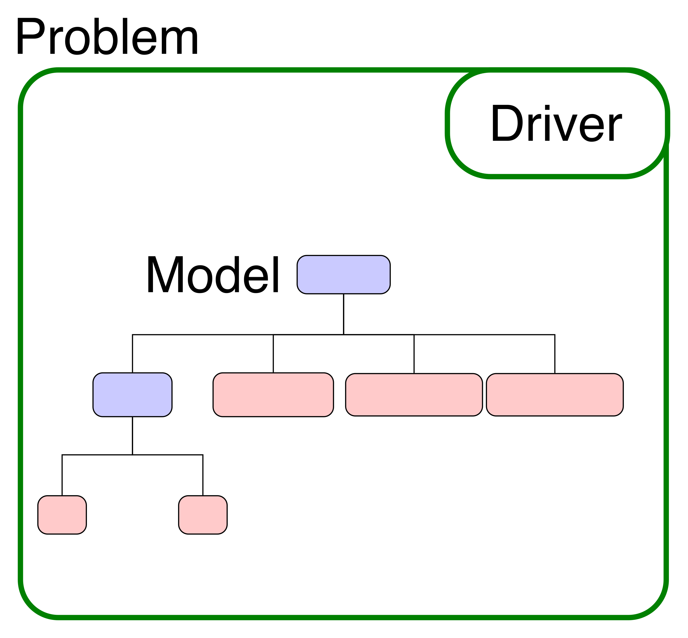

This tutorial will show you how to setup and run an unconstrained optimization using a component you've already defined.
The organization of this run-script and its use of the :code:`Problem` class is the basis for executing all models in OpenMDAO.

*****************************************
Unconstrained Optimization of Paraboloid
*****************************************

To start out we'll re-use the :code:`Paraboloid` component that we defined in the previous tutorial.
We'll add that component, along with and :ref:`IndepVarComp <comp-type-1-indepvarcomp>`, to construct our model
inside a :ref:`Problem <feature_run_your_model>`.
You've already used the :code:`Problem` in the run file from the previous tutorial on the :ref:`paraboloid analysis <tutorial_paraboloid_analysis>`,
but well take a closer look now.

All analyses and optimizations in OpenMDAO are executed with the a :code:`Problem` class.
This class serves as a container for your model and the driver you've chosen,
and provides methods for you to :ref:`run the model <run-model>` and :ref:`run the driver <setup-and-run>`.
It also provides a :ref:`interface for setting and getting variable values <set-and-get-variables>`.
Every problem has one single driver associated with it. Similarly, it has one single model in it.

The Run Script
***********************************

.. embed-test::
    openmdao.test_suite.test_examples.basic_opt_paraboloid.BasicOptParaboloid.test_unconstrainted

Setting a Driver
---------------------

Telling OpenMDAO to use a specific optimizer is done by setting the :code:`driver` attribute of the problem.
Here we'll use the :ref:`ScipyOptimizer <scipyoptimizer>`, and tell it to use the *SLSQP* algorithm.

.. code::

    prob.driver = ScipyOptimizer()
    prob.driver.options['optimizer'] = 'SLSQP'

Defining the Design Variables and Objective
---------------------------------------------------------------

Next we setup the problem formulation so the optimizer knows what to vary and what objective to optimize.
In these calls, you are always going to be specifying a specific variable. For :ref:`add_design_var <feature_add_design_var>`
the variable will always be the output of an :ref:`IndepVarComp <comp-type-1-indepvarcomp>`.
For :ref:`add_objective <feature_add_objective>` and :ref:`add_constraint <feature_add_constraint>`
the variable can be the output of any component (including an :code:`IndepVarComp`).

.. code::

        prob.model.add_design_var('indeps.x', lower=-50, upper=50)
        prob.model.add_design_var('indeps.y', lower=-50, upper=50)
        prob.model.add_objective('paraboloid.f_xy')

.. note::

    Although these calls always point to a specific variable, that variable doesn't have to be a scalar value.
    See the feature docs for :ref:`adding design variables, objectives, and constraints <feature_adding_des_vars_obj_con>` for more details.

Finally, we call :ref:`setup <setup>` and then :ref:`run_driver() <setup-and-run>` to actually execute the model and use some print statements
to interrogate the final values.

